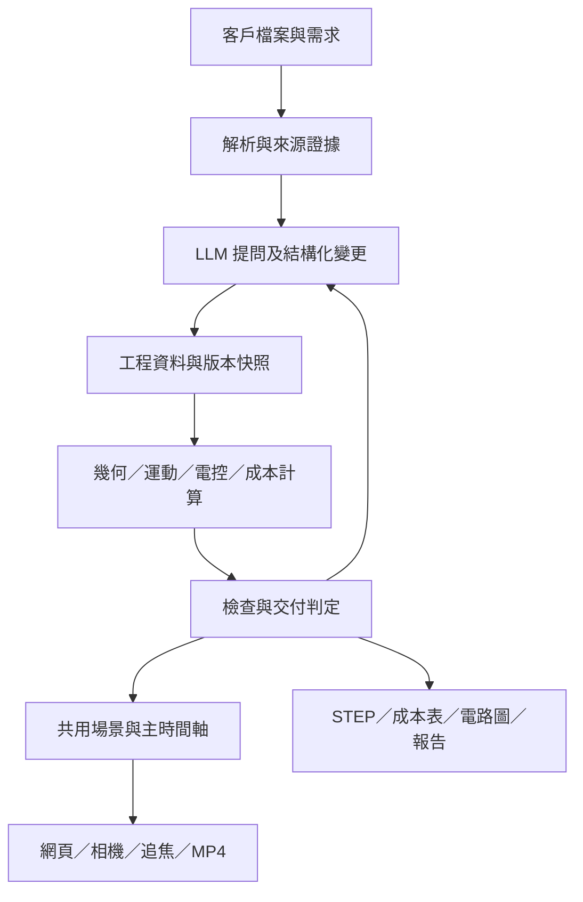

# CellForge 平台擴充開發書 v2.0

日期：2026-09-27  
開發目錄：`D:\Working Space\Python\PseudoPhysicsEngine`  
基準提交：`86cf152`（實作前必須重新確認分支與 HEAD）  
狀態：開發規劃；本文件中的新增功能、端點與資料格式尚未實作。  
對象：平台開發者、AI 開發代理、自動化設備方案工程師。

> 目標：將現有 CellForge 延伸成以同一份工程資料產生自動化流程、可檢查的 3D 動畫、成本表、電控規劃、電路圖及展示影片的平台。先完成可重現的本機內部版本，再擴充多人服務。保留現有引擎與專案成果，逐階段開發及驗收。

## 1. 文件範圍與既有規格的關係

### 1.1 本次交付與後續開發

本次交付只有這份 Markdown 開發書，不代表已修改引擎、完成下列功能或啟動部署。文件提供可直接拆成開發任務的範圍、依賴、資料契約及驗收要求。

2026-09-27 的現況判斷來自程式碼、測試內容與既有驗收紀錄的唯讀檢查；當次沒有重新執行測試或真實代理驗收。「存在實作」與「本次已驗證通過」必須區分。

### 1.2 必讀文件與衝突處理

開發前閱讀：

1. 根目錄 `AGENTS.md` 與實際修改路徑下適用的工作規範。
2. `docs/CellForge_WP-A-C_規格_v1.2.md` 全文。
3. `docs/DECISIONS.md`，尤其 D-011、D-016、D-018、D-020、D-026、D-028。
4. `docs/ENGINE_REWORK_PLAN.md` 第 1 節及與本次修改相關的章節。
5. `docs/CellForge_開發書_v1.0.md` 的資料與流程定義。

本文件新增後續平台工作，不改寫歷史驗收結論，也不自動取代既有座標、ID、schema 或工作規範。先收尾 WP-A／WP-C 真實驗收，再展開後續工作；廠商模型與光學檢查分別承接原規格 WP-B、WP-D。既有 WP-A／WP-C 的「不在本次範圍」只限制該工作包，不表示本平台永不支援。

若實作需要調整既有規則，先在 `docs/DECISIONS.md` 新增決策，寫明影響、相容方式及測試。本文件不授權直接修改不可變的既有建置快照。

## 2. 產品目標與邊界

### 2.1 使用者完成一案的流程

1. 建立專案，上傳照片、影片、PDF、工程圖、規範與表格，補充產品和製程需求。
2. 系統整理來源證據，區分已知條件、推估值、衝突與待確認問題。
3. LLM 提出站別、設備、工件、動作與電控需求，寫入可驗證的結構化資料。
4. 程式建置模型、展開主時間軸，執行幾何、運動、支撐、整線及資料一致性檢查。
5. 使用者在網頁看全景、產品追焦、相機畫面及電盤細節，點擊檢查結果跳到問題位置與時間。
6. 使用者以文字要求修改；系統呈現變更內容、受影響的輸出與重新檢查結果。
7. 從指定版本輸出模型、展示網頁、成本表、電路圖、工程報告與完整 MP4。

### 2.2 首版應涵蓋的專案

| 專案 | 平台必須能表達的重點 | 驗收定位 |
|---|---|---|
| 軍規電腦檢測／MilitaryGradePC | 搬運、翻面、護蓋動作、相機檢測、檢查結果 | 先完成既有 Getac 案，再與 TestCode 展示需求對照 |
| RobotArmPressSSD | 載盤、PCB、USB 銀腳、壓頭接近與接觸、相機貼合檢查 | 第一個跨製程案例 |
| shutter assembly | 本體、多片葉片、上蓋、工具切換、裝配順序 | 多零件裝配驗證 |
| PCB-CopperAssembly | 350×350 mm 基板、不同孔洞與散熱板、取放與嵌入 | 尺寸變體與配合關係驗證 |
| AutomaticAcid-BaseTitration | 容器、移液／加液、量測、管路、流程事件 | 非純剛體動作驗證 |

盤點其他可運行 3D 專案後再加入案例清單；不要把工具類目錄或單純視覺示範自動當成完整設備案例。

### 2.3 工程能力的邊界

平台首版定位為方案規劃、可行性檢查與交付輔助。每項檢查必須標出模型、取樣方式、容差、來源與未涵蓋條件。

- 幾何不干涉不能直接推論結構強度、實際精度、可靠度或安全功能合格。
- SSD 翹曲與壓合可先採受限行程及接觸狀態模型；未有材料與試驗資料時，不宣稱預測真實變形或接觸力。
- 滴定先實作物料量、量測事件與流程狀態；未建立經驗證的化學模型前，示意曲線須明確標示。
- 相機可計算幾何視野、遮蔽與取樣解析度；合成畫面上的檢測結果不等於真實影像演算法準確率。
- 電控圖面首版為設計草案；缺少設備手冊、供電及負載資料時列出待確認事項，不能以裝飾線條或預設值冒充完成設計。

## 3. 現況基線與優先缺口

| 項目 | 現有實作／證據 | 開發缺口 |
|---|---|---|
| 工程資料 | `cellforge/schema/`，專案、工件、設備、流程等 YAML | 多工件、電控連接、成本、相機、整線資料未形成完整共通模型 |
| 幾何與運動 | CadQuery、具名 STEP、GLB、FK／IK、FCL、timeline | 檢查範圍仍有限；不能直接視為全物理驗證 |
| 模組庫 | 17 個目錄項目，其中 16 個標為 production，box 保持 draft | production 是目錄品質狀態，不是設備認證；不為湊數升級 box |
| 廠商模型 | URDF 解析能力存在；`build/modules.py` 主流程仍會載入 `robot_stub.py` | 真實機型、關節鏈、幾何及限制尚未完整串接 |
| 版本輸出 | `versioning.py` 保存部分來源；`exports.py` 接受版本 | STEP 與部分文件可能讀取不同版本；依賴與影片未完整凍結 |
| 成本 | `exports.py::_bom` 產生模組清單 | 採購 BOM、單價、工時、成本公式及報價來源待補 |
| 電控 | `library/control_cabinet.py` 為外廓用途 | 電器、I/O、線號、端子、netlist、盤內配置與電路圖待補 |
| 影片 | `agents/astra.py::render_video` 輪播最多三張截圖 | 未依主時間軸輸出全製程動畫 |
| 真實代理 | D-028 記錄連線與逾時失敗；最新提交修正內插超界 | 需取得修正後的完整成功證據，不能用 local 模式代替 |
| 任務系統 | `server/jobs.py` 有記憶體 job 表及日誌 | 重啟恢復、持久化狀態、並行與失敗恢復待補 |

以上是指定基準提交的觀察。實作前重新核對，若已修正則增加回歸證據，不重做已完成工作。

## 4. 架構與不可破壞的約定



1. 延續 Python、FastAPI、React、TypeScript、Three.js、CadQuery 與現有運動學，不另建平行引擎。
2. 工程座標使用 mm、度、右手系、Z 向上，`R = Rz · Ry · Rx`；URDF 公尺與弧度在邊界換算。
3. 保留既有 ID 與欄位。擴充 Pydantic 後同步輸出 `docs/schema/*.json`；新增 schema 版本與遷移測試。
4. `pose` 的世界座標及 `mount` 的支撐宣告延續 D-018；新增裝配關係時不得靜默重解釋舊資料。
5. LLM 提出設計與結構化變更；公式、幾何、時間軸、成本加總及電氣連通性由程式計算。
6. 推估值維持 `trust: inferred` 並連回 assumption；只有有紀錄的確認行為能升級可信度。
7. 呈現層可改材質、曝光、鏡頭；不得用視覺位移、緩動或刪除物件掩蓋碰撞，或改變工程事件先後。
8. 網頁、離線 HTML、相機子視窗及影片共用場景與時間取樣核心，不複製另一套動作邏輯。
9. 所有檢查量值來自計算；不得寫死通過結果。功能未支援時回報「未評估」，不能算作通過。
10. 保留 Windows 原生相依載入順序與崩潰隔離，使用專案 `.venv`。

## 5. 資料模型擴充

以下檔案名稱是建議新增契約，尚非現有支援格式。以相容性擴充實作，必要時可調整檔案拆分並記錄決策。跨檔案關係全部使用穩定 ID，不以中文顯示名稱連接。

| 資料 | 建議位置 | 必要內容 |
|---|---|---|
| 來源證據 | 擴充 `inputs/manifest.yaml` | SHA-256、來源 ID、PDF 頁碼／影片時間、擷取方式及來源檔引用 |
| 多零件產品 | 擴充 `workpiece.yaml` | instance、SKU、數量、裝配父子關係、抓取 frame、配合與狀態 |
| 製程狀態 | 擴充 `process.yaml` | 動作對象、前置條件、資源占用、接觸窗口、結果事件 |
| 電控設計 | 新增 `electrical.yaml` | 器件、供電域、負載、I/O、端子、連接、線號、盤面位置 |
| 線材／管路 | 新增 `routing.yaml` | 端點、固定點、穿孔、載具、路徑、彎曲半徑、動態餘長 |
| 成本 | 新增 `costing.yaml` | 採購項、報價、工時、加工外包、計算政策及來源 |
| 機器視覺 | 新增 `vision.yaml` | 相機／鏡頭、光學 frame、ROI、照明、檢查項、結果來源 |
| 展示設定 | 擴充 `animation/` | 鏡頭段落、追焦目標、資訊顯示時間、影片配置 |
| 圖面樣板 | 新增 `drawing_templates/` | 紙張、圖框、欄位、字型、符號及合法使用的 LOGO 資產 |
| 版本索引 | 新增快照 manifest | 來源、模組與資產雜湊、引擎版本、schema 版本、檢查及輸出關聯 |

### 5.1 共通證據與檢查結果

工程量值應保留 `value`、`unit`、`trust`、`source_refs`、`assumption_id`。來源引用包含檔案雜湊及頁碼、圖框區域或時間區間；不得只填「依照片」而無法定位。

檢查結果至少包含：`check_id`、`rule_id`、`evaluated_version`、`status`、`severity`、`object_ids`、時間區間、數值與單位、門檻依據、演算法／fallback、中文說明與證據。

新增 `status: pass | fail | not_evaluated | error` 與現有嚴重度並存。缺少額定值、無相機校正或演算法不支援時使用 `not_evaluated`，不可填零值冒充量測。

### 5.2 電控與整線關聯示意

下例只示範 ID 關係，不是可直接載入現有引擎的 schema，也不指定真實器件額定值。

```yaml
# electrical.yaml：新增契約示意
schema_version: "2.0"
devices:
  - id: cam_01
    module_ref: camera_1
    catalog_ref: null
    trust: inferred
    terminals:
      - id: power_in
        signal_type: dc_power
connections:
  - id: conn_cam_power
    from: {device: terminal_block_01, terminal: out_01}
    to: {device: cam_01, terminal: power_in}
    cable_ref: cable_cam_power
    wire_numbers: [W101, W102]

# routing.yaml：實際資料另存此檔
routes:
  - id: cable_cam_power
    connection_ref: conn_cam_power
    through: [clamp_cam_01, feedthrough_table_01, duct_panel_01]
    min_bend_radius_mm: null
    assumption_ref: A-CABLE-001
```

未定義的器件與端子在正式資料驗證時必須失敗；缺少彎曲半徑時列為未評估，不採用此例中的空值宣告整線合格。

## 6. 工作包與開發順序

命名使用 P0～P7，避免與既有 WP1～WP4、WP-A～WP-E 混淆。每個工作包可拆成數個小提交，但不得用完成 UI 取代後端語意與驗收。

| 工作包 | 主題 | 前置條件 | 交付結果 |
|---|---|---|---|
| P0 | 版本一致性與真實驗收 | 盤點基準 | 可追溯且不混版的 Getac 完整案例 |
| P1 | 廠商設備、多工件與接觸 | P0 | SSD 可行性案例及真實機型適配 |
| P2 | 成本與採購 BOM | P0；使用 P1 的穩定 ID | 可重算成本表 |
| P3 | 電控、盤面與電路圖 | P0；與 P2 共用器件型錄 | 同源電路、盤面、I/O、BOM |
| P4 | 整線與物理檢查擴充 | P1、P3 | 可檢查的線材、固定、穿孔與支撐 |
| P5 | 相機、追焦、行動版與影片 | P1；影片細節驗收依賴 P3、P4 | 同步且完整的網頁與 MP4 |
| P6 | 五案遷移與整體回歸 | P1～P5 | 跨製程案例庫與交付套件 |
| P7 | 多人部署與營運 | P6 本機版本驗收 | 有權限及任務恢復能力的服務 |

### P0：可信建置、版本與真實資料驗收

**主要修改位置**：`cellforge/versioning.py`、`cellforge/exports.py`、`cellforge/build/pipeline.py`、`server/jobs.py`、`server/routes/api.py`、代理 runner、相關測試。

工作內容：

- 建立版本來源解析器，例如 `VersionContext`，所有匯出器只透過它讀取指定版本。
- 快照納入 YAML、案內 `parts/`、實際使用的庫模組、廠商檔案或可取得的內容定址資產、動畫與圖面樣板、假設、問題、來源證據及執行環境資訊。大型資產可按 SHA-256 共用，但只能引用不可變且可取得的內容。
- 記錄實際展開參數，避免 library 更新後讓舊版本重新建置成不同幾何。
- 工作區輸入先凍結至 staging 再建置。完成後驗證輸出及雜湊，以原子方式發布版本；並行建置不得搶同一 vN。
- 版本完成狀態、工程檢查結論與匯出完成狀態分開：建置成功不代表工程全數通過。
- 舊快照資料不足時明示「版本資料不完整」並停止需要缺失來源的輸出；不得悄悄讀目前工作區補齊。
- 匯出影片與其他晚產生資產保存為該版本的獨立衍生 artifact，記錄來源雜湊與 render 設定，不覆寫已封存快照。缺該版本影片時明確要求產生，不能複製最新版影片冒充。
- 對 intake → first_build 設前置狀態；失敗或過期 intake 不得誤當成功。保留獨立手寫資料建置入口，明確標出不是代理驗收。
- 任務成功必須確認本次 job 的新版本、完整 artifact manifest、schema 與幾何回讀；不能只因已有 v1 或有輸出檔就成功。
- 重試要有次數與總期限；取消可終止子程序。網路失敗可重試，幾何失敗須回報具體原因，不無限盲試。

驗收：

- 建立 v1 後修改工件、模組、價格／假設或展示設定產生 v2；再匯出 v1，內容與雜湊仍對應 v1。
- 刻意移除舊版本必要資產後，輸出得到可理解的缺件錯誤，不混用新資料。
- 建置中斷不產生可被當成成功版本的半成品；同案並行提交不混寫資料。
- 以現有真實 Getac 輸入重跑正式代理驗收，保留輸入雜湊、環境、job ID、新版本 ID、截圖、完整日誌與結果表。
- 依既有 WP-A／WP-C 要求驗證缺模組時能自建；測試使用隔離副本，不能刪除正式共用庫來製造情境。
- 遵守 D-026 的 production 數量決策；不升級佔位盒湊數。
- 內插修正新增或保留回歸測試，不把已修正問題重新描述成待修。

### P1：真實設備與跨製程工件模型

**主要修改位置**：`cellforge/vendor.py`、`cellforge/build/modules.py`、`cellforge/kinematics/`、`cellforge/schema/`、`cellforge/sim/`、`library/`。

- 讓 vendor adapter 實際讀取 URDF、STEP／mesh、frame、關節限制及碰撞幾何；支援 revolute、prismatic、fixed 組合，避免把 SCARA 當成通用六軸。
- URDF 提供運動鏈，STEP／mesh 提供形狀；只有 STEP 時不能自動宣稱已知關節軸及運動限制。
- 原廠資料缺失時明確使用 approximated stub，UI、檢查及報告均標記；不得因廠商品牌名稱存在便視為真機驗證。
- 將單一工件狀態擴充成多 instance；每個零件有唯一持有者、初始位置、安裝關係和組裝狀態。舊單工件案例透過相容載入維持原行為。
- 提供可重用的取料、夾持、放置、插入、壓合、檢測動作契約。每個動作明確宣告對象、前置條件、工具、路徑、完成事件及失敗原因。
- 合法接觸以物件對、接觸區域、方向、時間窗口及容差宣告，不能將壓頭或工件永久從碰撞檢查排除。

SSD 驗收：載盤承載 → 壓頭接近 → 受限壓合 → 撤離 → 相機取像 → 結果展示。PCB、USB 銀腳及壓頭均有獨立可辨識幾何；相機圖中必須看得到檢查目標。故意增加壓入量、移錯治具、抬高相機支架時，對應檢查必須發現問題。

### P2：成本估算與採購 BOM

**建議新增**：`cellforge/costing/`；擴充 schema、exporter 及前端成本面板。

- 區分模組、採購件、加工件與耗材；BOM 支援展開、合併同料、單位及重複計數檢查。組件總價與子件成本不可同時計入。
- 項目包含數量、單價、幣別、供應商、來源、報價日期、有效期、可信度與適用版本。
- 缺價格以 `null`／待報價呈現，另列已知成本小計及估算覆蓋率，不能把缺價當免費。
- 工時按機構、電控、軟體、裝配、配線、調試等分類，保留時數、費率與估算依據。
- 金額使用十進位計算，明確規定各階段捨入；匯率保存日期及來源。
- 分開輸出設備成本、專案開發成本、稅額與銷售報價；管理費、預備金、加價率或毛利率的基底與公式須明示。
- 公式示例：材料成本 = Σ(數量 × 單價 × 匯率)；人工成本 = Σ(工時 × 費率)。若採毛利率定價，售價 = 成本 ÷ (1 − 毛利率)，不得與成本加價率混用。
- 匯出 XLSX、CSV、網頁摘要；XLSX 保存公式或可追溯計算明細，增加缺價清單與版本頁。

驗收：加一台相機會同步增加設備、採購數量及成本；移除該設備不留下重複成本；更改單價會依明確公式更新。以獨立小型人工核算案例驗證總額，不以程式自己產生的答案作唯一測試依據。

### P3：電控資料、盤面配置與電路圖

**建議新增**：`cellforge/electrical/`、`cellforge/drawings/`；擴充 `library/control_cabinet.py`、schema 及前端。

資料與計算：

- 建立器件、端子、供電域、保護器件、負載、I/O、通訊節點及網路拓樸的連接圖。
- 製程使用的感測器、致動器、相機、光源、馬達及控制器必須連到電控設備 ID。
- 根據輸入供電、功率、啟動需求、設備手冊及使用條件提出電源與 I/O 規劃。資料不足時記問題，不自行宣稱容量或保護配合合格。
- 定義電位、端子型別、電壓及訊號相容性檢查；區分導線連接點、交叉不連接、端子排及跨頁引用。
- 盤面以具名實體表示 DIN 軌、線槽、PLC、電源、端子、驅動器、繼電器、風扇、濾網與接地端。器件尺寸及散熱／維護淨空有來源。
- 緊急停止、門互鎖等以完整需求及回路呈現；未驗證安全架構時不得宣稱安全等級已達標。

圖面與交付：

- 產出封面／目錄、電源、控制、I/O、通訊、端子接線、盤面配置及器件清單；依專案使用情形決定頁面，不產生假填滿頁。
- 首版輸出 PDF 與 SVG；可編輯 DXF 為後續能力，僅在完成符號與連接語意映射後宣稱支援。
- 圖框、LOGO、日期、作者、專案名稱、圖號、版次及頁碼均為樣板欄位。
- 參考使用者指定的 `台全-壓鑄件檢測設備_V1.00_20260714.pdf`。實作時必須實際讀取並渲染參考 PDF，確認紙張方向、圖框、文字、符號及線型；本文件未宣稱已完成該 PDF 的版式分析。
- 該參考目前位於使用者提供的 G 槽共用雲端路徑；若不可讀，明列樣板驗收未完成，先完成資料與通用出圖，不捏造相同風格已完成。
- 電路連接、3D 器件、BOM、I/O 表及線材共用 ID；點擊圖面器件可定位到 3D，反向亦可。

驗收：刪除電源連接會產生斷路／缺接線檢查；重複 I/O 地址、錯誤電壓域及不存在的端子均能被識別。全部 PDF 頁面渲染檢查，無裁字、符號重疊、斷線、錯誤跨頁參照；以人工追線核對代表性回路。

### P4：線材、管路、固定及支撐檢查

**建議新增**：`cellforge/routing/`；擴充 `cellforge/checks/`、模組庫與場景匯出。

- 線材路徑由端點、固定夾、線槽、拖鏈與穿板孔建立，不以任意裝飾曲線取代。
- 桌板穿線孔必須為真實幾何開孔，碰撞模型亦反映開孔；畫黑色圓片或將線材碰撞關閉不算完成。
- 繪製護線環／固定頭、必要的接頭、應力釋放與盤內落點；電纜及管路分型，依使用條件選擇檢查規則。
- 靜態段檢查端點貼合、支撐跨度、彎曲半徑、表面穿透及維護空間；動態段檢查行程、長度餘量、拖鏈範圍及全流程碰撞。
- 門板線束在開關門時仍有合理路徑；電盤特寫可看見端子與進出線，透視模式保持工程幾何不變。
- 延伸 mount 檢查，驗證支撐幾何或連接介面確實存在，不能只因 target ID 存在便判定不懸空。
- 高速或接近接觸時採自適應細分、掃掠或適用的連續檢查；明列仍使用離散取樣的限制。保留既有 FCL fallback 來源資訊。

驗收：以缺固定夾、移走支架、封閉穿線孔、縮短線纜、縮小彎曲半徑及門板拉扯等反例測試；修正後對應項目改善。接觸容差不可用來掩蓋線材穿過桌板或機構。

### P5：相機畫面、行動版、追焦與完整影片

**主要修改位置**：`web/src/viewer-core.ts`、`web/src/components/Viewer.tsx`、`MainWorkspace.tsx`、`web/src/offline.ts`、樣式；替換靜態輪播錄影實作。

相機與視覺：

- 區分「使用者觀看場景的鏡頭」與「設備上的機器視覺相機」。設備相機使用光學 frame、感測器尺寸、焦距、影像解析度及必要的校正參數。
- 從同一份幾何和時間狀態渲染設備相機畫面，檢查 FOV、目標占像素、遮蔽與取像時刻。不能另畫一張沒有 USB 銀腳的示意圖。
- ROI、框線、量測、OK／NG 必須綁定對象、時間及結果來源；來源明分實際演算法、幾何模擬或示意結果。

觀看介面：

- 每個相機窗可隱藏、拖曳、調整大小及開成獨立視窗；彈出視窗被瀏覽器阻擋時保留內嵌使用方式。
- 主視窗是唯一播放控制來源，傳遞版本、seek、播放速率及時間戳；子視窗不能自行累加另一個時間軸。重新連線後重新同步。
- 產品追焦可啟閉，平順追蹤指定零件或組件，依遮蔽物退讓或使用預定可視角度；解除後恢復可操作視角。
- 桌面資訊面板可收合；手機預設收合側欄、相機窗與長說明，只保留動畫、精簡播放控制及切換圖示。
- 以直向 360×800、390×844，橫向 844×390，以及桌面 1920×1080 作驗收尺寸。預設畫面不得橫向溢出，動畫可視區至少占可用 viewport 的 60%，操作區約 44 CSS px 起。
- 支援 safe-area、觸控及螢幕旋轉；設定不得使不同專案或重新開啟手機頁面時永久留在遮擋狀態。

影片輸出：

- 預設 1920×1080、30 fps、H.264 MP4，開場／階段資訊約 2 秒後隱藏。這是輸出預設，不是工程檢查量值。
- 以固定時間步進呼叫共用取樣核心，等場景、字型及資產就緒再擷取畫面；不以電腦即時播放速度決定是否跳過製程。
- 時間映射明確記錄。完整製程每個 step 均有可辨識畫面；另加整機環視、電盤特寫／剖視、整線與桌板開孔段落。
- 導覽片段可暫停主製程或重訪指定時間，但須在 shot list 標明；不能偷偷裁掉難以展示的動作。
- 先探測 GPU 渲染與硬體編碼可用性，實際試編碼；不具備時使用可重現的軟體備案，記錄實際 renderer、encoder、fps、影格數與時長。
- MP4、影格與中間檔輸出至所屬工作區的 `TEMP/videos`／`TEMP/frames` 等忽略目錄；TestCode 案例使用 `D:\Working Space\Python\TestCode\TEMP\videos`。不得自動加入 Git 或網站發布包。
- 快照只保存來源及錄影設定，影片在 artifact registry 記錄版本與雜湊；清除暫存後若影片已不存在，顯示可重新產生，不能顯示仍可下載。

驗收：以 ffprobe／解碼器檢查影片可解碼、解析度、codec、時長及影格數；將 shot list 對應所有 process step。抽查開場、每站關鍵動作、相機、電盤與整線；自動檢查黑畫面及長時間意外靜止後再目視確認，允許有原因的製程等待。

### P6：TestCode 成果遷移與五案回歸

來源：`D:\Working Space\Python\TestCode`。將現有成果視為需求、範例、素材與可抽取工具，不能把每案 JavaScript 座標硬寫進 CellForge 核心。

| 已存在的來源 | 可複用內容 | 遷移限制 |
|---|---|---|
| `tools/viewer-workspace.js`、`.css` | 視窗、面板、追焦及行動版互動經驗 | 改接 CellForge 主時間軸及 ID |
| `tools/electrical-components.js`、`electrical-cabinet.js` | 電控器件外觀與電盤展示 | 尺寸、型號及連接轉入共同資料 |
| `tools/cable-routing.js`、`geometry-clearance.mjs` | 整線及幾何檢查經驗 | 不形成第二套工程判定來源 |
| `tools/circuit-drawings/` | 圖面渲染、樣板及檢查流程 | renderer 改讀 netlist／盤面資料，先核對參考 PDF |
| `tools/movie-export/` | 錄影流程與影片驗證 | 改用版本快照及共用取樣核心 |
| 各案 `docs/` | 照片、規範、成本與電路資料 | 保留來源、日期、可信度，不能當成已核定製造資料 |
| `tools/review/` | 既有檢查項與反例 | 舊結果不是新平台驗收，必須重新計算 |

先盤點版本與可用性，再抽取獨立模組；不要直接搬走或覆蓋 TestCode 原檔。新案例置於 CellForge `examples/` 的獨立子目錄；客戶原始大檔保留於忽略的 runtime 或受控資產儲存，公開測試只使用可公開的固定資料。

每案交付：來源清單、工程資料、可建置模組、工程檢查、版本化網頁、成本表、電路與盤面圖、完整 MP4、驗收紀錄。文件可整理在案例 `docs/`，但檔名及頁面須記版本，避免五案互相覆蓋。

### P7：任務持久化與多人服務

本機完整流程穩定後才進入本階段；不以「已能啟動 FastAPI」宣稱多人平台完成。

- 將任務狀態與 artifact 索引持久化。初期可採單機資料庫，跨主機需求出現時再遷移；工程設計仍以版本化來源為準，避免兩套可編輯真相。
- 任務狀態至少有 queued、running、cancel_requested、cancelled、failed、interrupted、succeeded；服務重啟後復原狀態並允許明確重試。
- 以 idempotency key、專案鎖及原子發布防止重複提交、混版及重複成本。重試時區分恢復既有成果與重新執行非冪等操作。
- 加入登入、專案成員、角色、檔案與匯出權限、變更稽核及儲存配額。
- LLM 產生的 Python／建模程式放隔離 worker 執行，限制可讀寫路徑、時間及資源；不繼承整台主機的憑證與任意檔案存取。
- 代理供應方式包成 adapter，不把桌面 CLI 登入狀態當成所有線上用戶共用的授權方案；部署時另驗證供應商使用條件與憑證管理。
- 靜態展示頁與工程後端分開：GitHub Pages 僅承接經篩選的 HTML／JS／公開資產；運算、上傳、代理與任務服務放可執行後端的環境。
- 發布採白名單，排除客戶原始資料、TEMP、LOGS、憑證、runtime 和錄影中間檔；新平台的發布操作仍需依當次使用者授權。

驗收：重啟任務不假成功；取消會停止 worker；兩人修改同一案有版本衝突處理；無權限者無法取得其他專案資料；備份可還原指定設計與 artifact 索引。

## 7. API 與前端契約

以下為待新增的介面方向。開發時先比對現有路由並重用，不能直接假設這些端點已可呼叫。

| 能力 | 建議介面 | 行為 |
|---|---|---|
| 版本資料 | `GET /api/projects/{p}/versions/{v}/manifest` | 回傳來源雜湊、artifact、檢查範圍與可用性 |
| 成本 | `GET /api/projects/{p}/versions/{v}/costing` | 回傳該版本總額、缺價與來源 |
| 電控 | `GET /api/projects/{p}/versions/{v}/electrical` | 回傳連接圖、I/O、器件與檢查 |
| 整線 | `GET /api/projects/{p}/versions/{v}/routing` | 回傳端點、路徑、孔位及檢查 |
| 相機 | `GET /api/projects/{p}/versions/{v}/vision` | 回傳光學與 ROI 資料，不另建時間軸 |
| 版本匯出 | 擴充現有 export job，指定版本、格式及樣板 | 非同步回 job ID，結果附 source hash |
| 影片 | `POST /api/projects/{p}/versions/{v}/video-jobs` | 接受 shot plan、解析度、fps 及 encoder preference |

耗時計算使用 job，不讓 GET 隱含修改工程資料。所有寫入帶基準版本或 revision，過期變更回傳衝突資訊；使用者須能看見變更 diff 與受影響的輸出。

## 8. 驗收矩陣與交付判定

| ID | 可重現情境 | 通過條件 |
|---|---|---|
| ACC-01 | v1 建立後改成 v2，再匯出 v1 | 所有資料與資產屬 v1；缺件不偷讀 v2 |
| ACC-02 | 真實輸入經正式代理 intake → first_build | 新版本、完整結果與實際場景存在；不以 local 或人工代填替代 |
| ACC-03 | 同一幾何改用真實 URDF，再移動關節 | 視覺、FK、碰撞與 frame 一致；stub 明示近似 |
| ACC-04 | SSD 壓合及撤離取像 | USB、PCB、壓頭可辨識；接觸窗口外碰撞仍被檢出 |
| ACC-05 | 改數量、單價、工時及缺價 | 成本依公式更新，缺價單獨列出，不重複計價 |
| ACC-06 | 加相機、改 I/O、刪供電連接 | 3D、BOM、圖面與連接檢查同步變更 |
| ACC-07 | 線材穿實心桌板／無固定夾 | 檢查失敗；加實際孔位與固定後正確改善 |
| ACC-08 | 相機目標被遮擋或解析度不足 | 結果可定位原因，不固定顯示 OK |
| ACC-09 | 主時間軸 seek、暫停、改速、子窗重連 | 同版本畫面在同步完成後對應同一取樣時刻 |
| ACC-10 | 手機直向、橫向與側欄切換 | 預設無大片面板遮擋，符合 P5 尺寸及操作要求 |
| ACC-11 | 每案錄影輸出 | 完整 step coverage、可解碼、實際 codec 與本機路徑可查 |
| ACC-12 | shutter 與 PCB 多零件流程 | 無零件重複持有、瞬移或錯誤裝配順序 |
| ACC-13 | 滴定動作及管路流程 | 流程事件、容器狀態與示意／量測來源明確 |
| ACC-14 | 工作中斷、重試與並行 | 不產生半完成版本或假成功，不重複發布 |
| ACC-15 | 全部案例回歸 | 五案獨立、來源可追溯、共同引擎無專案名稱分支 |

每筆驗收保存：環境、引擎 commit、輸入與來源 hash、版本／job ID、操作步驟、實際結果、截圖／圖面／影片證據及限制。

檢查為紅色或未評估時仍可匯出清楚標記的「草案」供討論；不可標記為工程驗收完成。正式交付必須處理必需檢查的失敗、錯誤及未評估項。人工接受的風險以獨立紀錄顯示，不將原始紅色結果改成綠色。

## 9. 測試與開發紀律

### 9.1 測試類型

- **資料測試**：舊 schema 相容、新欄位驗證、來源引用、循環裝配及不存在的端子。
- **計算測試**：FK／IK、單位換算、成本公式、光學投影、彎曲半徑、連接圖。
- **因果測試**：移走支架變懸空、縮短線材產生拉扯、移開障礙後碰撞改善；不得只斷言固定成功數字。
- **整合測試**：版本凍結、匯出一致、job 中止、恢復及隔離。
- **瀏覽器測試**：追焦、相機同步、離線 HTML、手機面板及圖面定位。
- **真實代理驗收**：與離線測試分開報告；網路不可用記失敗或未完成，不能切 local 後宣稱正式通過。

### 9.2 品質閘門

依根目錄 AGENTS，每個實作步驟執行以下檢查，命令為開發時使用，本文件新增時不代表已執行：

```powershell
# 工作目錄：D:\Working Space\Python\PseudoPhysicsEngine
.\.venv\Scripts\python -m pytest
.\.venv\Scripts\python -m ruff check .
.\.venv\Scripts\python -m ruff format --check .

# 前端有改動時，於 web 目錄執行
npm run lint
npx tsc --noEmit
npm run build
```

schema 變更須呼叫既有 `cellforge/schema/export.py` 的輸出流程，確認 `docs/schema/` 同步。測試後重新檢查 Git diff，排除 TEMP、LOGS、錄影、客戶原始大檔與環境相依檔。每個通過的實作步驟以繁體中文提交，保留使用者原有未提交修改；push 與網站部署依當次指示執行。

文件變更只做連結、結構與內容一致性檢查，不為新增開發書啟動完整建置或真實代理。

## 10. 開發拆分與首批任務

狀態目前全部為未開始；完成時填入 commit、測試與證據連結，不能只勾選沒有依據的清單。

- [x] DEV-001：重新盤點 HEAD、既有修改、工具環境與當前驗收結果；建立 baseline 記錄。（commit `7254944`；證據 `docs/P0_BASELINE.md`；pytest 117 項、ruff、前端三項閘門全綠）
- [x] DEV-002：建立版本資料解析器與「v1 匯出不得讀 v2」回歸測試。（commit `958f999`；`cellforge/versioning.py::VersionContext`、`tests/test_version_exports.py`、D-029；修正前重現：v1 匯出檔名取 v2 案名、BOM 與 DXF 含 v2 新增模組）
- [x] DEV-003：完整來源與相依資產 manifest、不可變 staging、原子快照發布。（commit `0f28edf`；`cellforge/version_store.py`、`docs/schema/version-manifest.schema.json`、`tests/test_version_store.py`、D-030；含建置中改工作區不外洩、失敗與驗證失敗不發布、崩潰保留回收、兩個 CLI 建置並行取得 v1／v2、案內 parts 模組可建置的回歸測試）
- [x] DEV-004：修正所有 exporter 的資料來源，處理舊版本缺件及版本化影片 artifact。（commit `1e6bda4`；`cellforge/derived.py`、`cellforge/exports.py`、`GET /versions/{v}/manifest`、D-031；測試：舊快照缺件列舉並清除殘檔、舊版快照警告、影片只取該版本且清暫存後顯示可重新產生、竄改產物被擋、API 匯出綁定版本；另修正匯出端點同步函式必定失敗的既有缺陷）
- [x] DEV-005：修正 intake／first_build 前置狀態與成功判定，驗證取消及失敗流程。（commit `3eda602`；`cellforge/workflow.py`、`cellforge/version_verify.py`、`cellforge/procutil.py`、`POST /builds/manual`、D-032；測試：失敗與過期 intake 擋下 first_build、既有版本不算本次成功、手寫建置標示非代理驗收、網路錯誤才重試且受總期限約束、取消與逾時整族終止、git 失敗改記警告）
- [x] DEV-006：完成既有 WP-A／WP-C 的真實 Getac 驗收並記錄結果。（`docs/P0_DEV006_ACCEPTANCE.md`；ACC-02 通過：intake `466b6ece1c7a` → first_build `221d03581473` 發布 v17 並回讀驗證，工程檢查 fail 為草案；缺模組自建以隔離副本驗證通過；WP-A/C 第 1、5 項未達成、懸空 mount 未被偵測列入 P4；驗收中修正 D-033～D-035）
- [x] DEV-007：導入實際廠商模型與鏈；stub 保留且清楚標示。（`docs/DEV007_ACCEPTANCE.md`；ACC-03 通過：同一 Getac 配置 robot_1 改用公開 VS-060 URDF，關節移動時 GLB、取樣、碰撞與 frame 皆與 FK 一致，robot_2 近似 stub 於警告、manifest、GLB、檢查、前端與報告標示；VS-087 無公開 URDF，Getac 維持近似；D-036）
- [x] DEV-008：建立多工件、持有及接觸語意，完成 SSD 案例。（`docs/DEV008_ACCEPTANCE.md`；ACC-04 通過：usb-2x8 案例載盤承載→壓合→撤離→取像→補壓複檢全部完成、red 0；加壓入量、移錯治具、抬高相機支架三個反例都由對應檢查抓到；多零件唯一持有者、取放插入壓合檢測動作契約、合法接觸宣告；Getac 單工件輸出前後一致；D-037～D-039）
- [x] DEV-009：新增採購 BOM、成本模型、計算與 XLSX／CSV 匯出。（`docs/DEV009_ACCEPTANCE.md`；ACC-05 通過：增刪設備、改單價、工時與缺價依公式更新，缺價單列、不重複計價；人工核算案例與 TestCode 試算表兩種獨立核對一致，Excel 重算 XLSX 公式 0 差異；成本資料由代理產生留待後續；D-040）
- [ ] DEV-010：新增電控連接、I/O、盤面與圖面樣板，完成 PDF／SVG。（進行中：第一段電控資料模型、設備樣板與點位池配置、連接檢查已完成（D-041）；圖面引擎與前端電控分頁、ACC-06 待續，交接見 `docs/DEV010_PROGRESS.md`）
- [ ] DEV-011：建立線材、固定與穿孔資料，完成動態整線及支撐反例檢查。
- [ ] DEV-012：完成設備相機、追焦、多視窗同步與手機顯示。
- [ ] DEV-013：以主時間軸產生完整 MP4，驗證全製程與細節段落。
- [ ] DEV-014：完成其餘案例遷移與五案回歸，建立交付 manifest。
- [ ] DEV-015：依實際多人需求完成持久化、權限、隔離及部署驗收。

DEV-006 前不將 Getac 宣稱為已完成的真實代理成功案例；DEV-014 前不將單一案例成功宣稱為已支援全部五案。

## 11. 可直接交付開發代理的第一階段指令

```text
請在 D:\Working Space\Python\PseudoPhysicsEngine 開發 CellForge。
先讀根目錄 AGENTS.md、docs/CellForge_平台擴充開發書_v2.0.md，
以及其中要求的既有規格和決策。

本輪限定 DEV-001～DEV-004：完成基準盤點、版本來源解析器、
完整快照與匯出一致性，保留既有程式和案例。
先重現「匯出 v1 卻讀到目前工作區資料」的問題，建立有因果的回歸測試。
將全部匯出資料綁定指定快照；舊快照缺資料時明確報錯，不能偷讀最新版。
影片以不可變版本來源建立衍生 artifact，不複製最新版影片冒充舊版本。

不重寫引擎，不修改既有快照，不為了通過測試寫死工程量值。
依需要同步 schema、文件與決策，執行適用的品質閘門後分步提交。
本輪不擴充成本、電路、手機 UI 或雲端功能，不自動 push 或部署。
最後回報完成項目、修改檔案、測試結果、相容性限制及下一項任務。
```

後續每輪以本清單中下一個可驗收工作包為範圍，先核對前輪證據與現有程式再動工；不把「代理執行結束」「檔案已產生」或「動畫看起來合理」當作平台完成的唯一依據。
