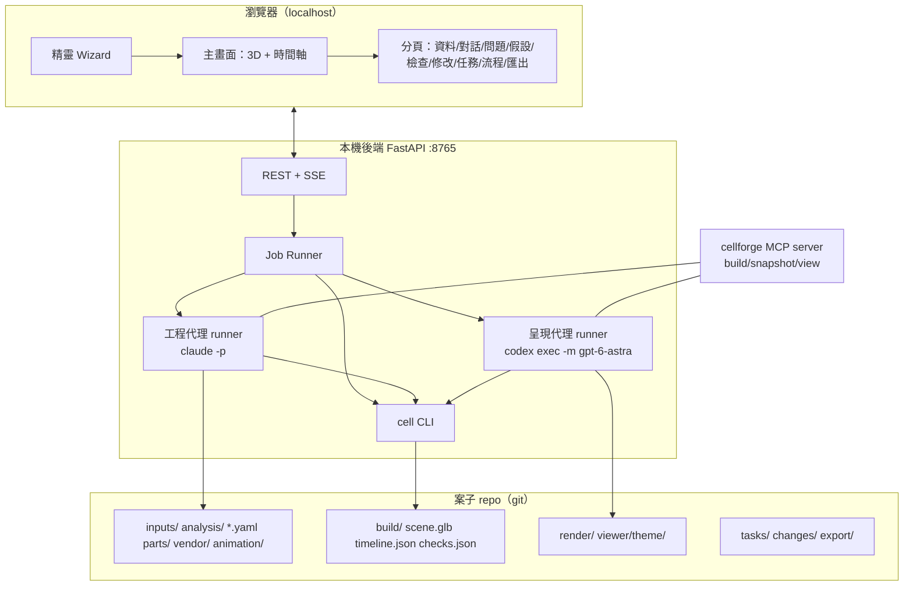

# CellForge 開發書 v1.0

自動化機台可行性評估平台 — 交付給 AI 開發代理的完整規格
日期：2026-09-13　作者：Kevin（正奇資訊）　狀態：可開工

> 本文件是自足的。開發代理不需要先前的對話紀錄，只需本文件、`examples/getac_qc/` 的測試資料，以及本文件指名的外部工具。凡本文件寫「必須」即為驗收條件；寫「建議」可由開發代理自行判斷。若實作時發現本文件內部矛盾或技術上不可行，在 `docs/DECISIONS.md` 記錄偏離原因後繼續，不要停下來等待。

---

## 0. 一頁摘要

CellForge 讓使用者（自動化設備方案工程師）把客戶給的零散資料（照片、PDF 檢驗規範、Check List、需求文字、CAD、工程圖）丟進去，由 AI 工程代理提問補全、依掌握的資訊設計出一條自動化產線的 3D 模型與依流程動作的動畫，並自動檢查路徑干涉、手臂可達性、硬體能力與節拍。使用者看動畫後用文字或補充資料要求修改，代理反覆優化。呈現品質（材質、光照、運鏡、影片）由第二個 AI 代理（GPT-6 Astra，經 Codex CLI）負責。客戶同意後，一鍵匯出 SolidWorks 可開啟的 STEP 組件、DXF 佈局、Word 報告與簡報。

平台定位是**可行性評估**，不是嚴謹工程設計。精度目標是「盡量貼近實體機構，足以判斷干涉與可達性」。

核心原則只有三條：
1. **所有東西都是文字**：座標、流程、零件、動畫、任務、變更全部是 YAML／Python／JSON，放在 git repo 裡。AI 代理靠 diff 修改。
2. **工程真相只有工程代理能改**：幾何、座標、關節角、時間軸屬工程代理；呈現代理只能疊加材質、光照、運鏡、緩動。
3. **資料不全不可以停**：代理提問，使用者可回答或「跳過」；跳過就用合理預設繼續，每個預設記入假設清單，隨時可改。

---

## 1. 系統架構



三個程序：瀏覽器前端、本機後端、以及後端按需啟動的子程序（`cell` CLI、兩個代理）。所有狀態都在案子 repo 的檔案裡，後端本身無狀態（只保留執行中的 job 表）。

### 1.1 平台 repo 結構

```
cellforge/
  pyproject.toml
  cellforge/                 # Python 套件
    cli.py                   # typer 入口：cell ...
    schema/                  # pydantic 模型（本文件第 3 節）
    intake/                  # PDF/圖片解析輔助（供代理呼叫）
    build/                   # parts → assembly → glb/step；timeline 展開
    kinematics/              # URDF 載入、FK/IK、關節極限
    checks/                  # 干涉、可達、硬體、節拍
    export/                  # STEP、DXF、BOM、報告、單檔 HTML
    agents/                  # 兩個代理的 runner 與 prompt 組裝
    mcp_server.py            # 把 build/snapshot/view 包成 MCP 工具
  server/                    # FastAPI
    main.py  routes/  jobs.py  sse.py
  web/                       # Vite + React + TypeScript + Three.js
  templates/project/         # cell init 用的案子骨架（含 AGENTS.md/CLAUDE.md）
  library/                   # 跨案共用參數化模組
  skills/                    # 工程代理的 skills（第 6.3 節）
  examples/getac_qc/         # 驗收用真實案例資料
  tests/
  docs/DECISIONS.md
```

### 1.2 案子 repo 結構（`cell init` 產生）

```
<案名>/
  AGENTS.md  CLAUDE.md       # 內容相同；兩代理共用規範
  project.yaml               # 精靈第 1、3 步的內容
  inputs/                    # 使用者上傳；manifest.yaml 記類型標籤、備註、SHA-256
  analysis/
    intake.md                # 代理對資料的解讀摘要
    questions.yaml           # 問題與回答/跳過狀態
    assumptions.yaml         # 代理的每個預設決定與理由
    checklist_map.md         # 檢測項目 → 可自動化分級 → 站別（QC 類案子）
  workpiece.yaml             # 工件定義（SKU、外形、可動件、檢測面）
  cell.yaml                  # 座標樹、設備與模組位姿
  process.yaml               # 站→步驟→動作
  parts/                     # 自製參數化模組（CadQuery）
  vendor/                    # 廠商件 STEP/URDF + manifest.yaml
  animation/
    sequence.py              # 工程真相：由 process.yaml 展開關節/位移曲線
    camera.yaml  easing.yaml # 呈現層
  build/                     # 工程代理產出（唯讀給其他人）
  render/  viewer/theme/     # 呈現代理產出
  tasks/  changes/  export/
  .cellforge/                # 版本快照（每次 build 的 build/ 複本，含 checks）
```

---

## 2. 技術選型（固定）

| 層 | 選用 | 版本／備註 |
|---|---|---|
| 語言 | Python 3.11+、TypeScript 5 | |
| CAD 核心 | CadQuery 2.4+（OCP） | `cq.Assembly` 匯出 STEP AP214/242，須保留裝配樹與名稱 |
| Schema | pydantic v2 ＋ YAML（ruamel.yaml 保留註解） | |
| 網格 | trimesh、pygltflib；簡化用 `fast-simplification` 或 open3d | GLB 節點名稱 = YAML id |
| 運動學 | 自寫 6 軸解析或數值 IK；URDF 用 `yourdfpy` 載入 | 不引入 ROS |
| 碰撞 | `python-fcl`（trimesh 內建整合） | 掃掠取樣 20 ms |
| 2D | ezdxf | |
| 報告 | python-docx、python-pptx | 簡報套 Kevin 的 zq-work-deck 樣板（skills 內附） |
| 後端 | FastAPI ＋ uvicorn，SSE 用 `sse-starlette` | 只綁 127.0.0.1 |
| 前端 | Vite、React 18、TypeScript、Three.js（r16x）、@react-three/fiber 可選 | 不用 UI 框架也可，建議 Tailwind |
| 截圖 | Playwright（Chromium） | `cell snapshot` |
| 影片 | Blender 4.x headless（選配，呈現代理用） | |
| 工程代理 | Claude Code CLI，`claude -p` 非互動 | |
| 呈現代理 | Codex CLI，`codex exec -m gpt-6-astra --json`，ChatGPT Pro 登入 | 不用 API key |
| 版控 | git；`build/` 進 `.gitignore`，`.cellforge/` 快照進版控（或 git-lfs） | |

程式風格：Python 用 ruff ＋ type hints；前端 eslint ＋ prettier。錯誤訊息一律繁體中文，因為會直接顯示給使用者與代理。

---

## 3. 資料層 Schema

所有 schema 以 pydantic 定義於 `cellforge/schema/`，並同步輸出 JSON Schema 到 `docs/schema/*.json` 供前端與代理使用。以下為必要欄位；開發代理可加欄位但不可刪。

### 3.1 project.yaml

```yaml
name: 軍規筆電 QC 線
customer: （客戶名）
product: Getac V110 系列 rugged notebook
description: |
  依現有品管 Check List 找出可自動化項目，規劃手臂＋工業相機自動化 QC 線。
constraints:
  robot_brand: DENSO
  takt_target_s: 45
  footprint_mm: [8000, 4000]      # 可為 null
  stations_max: 6
  safety_notes: "不可撞刮產品；護蓋逐門開關"
  free_text: ""
created: 2026-09-13
```

### 3.2 inputs/manifest.yaml

```yaml
files:
  - path: inputs/PXL_20260912_073020583.jpg
    kind: product_photo          # product_photo | inspection_spec | checklist | layout | cad | drawing | text | other
    note: "背面，護蓋全關"
    sha256: ...
    added: 2026-09-13T10:00:00+08:00
```

### 3.3 analysis/questions.yaml

```yaml
questions:
  - id: Q-001
    topic: workpiece              # workpiece | process | equipment | site | constraint
    text: 護蓋的開啟角度上限是多少？（影響力覺末端的進入路徑）
    why: 決定第 3 站手臂的進入姿態與是否需要翻面
    status: open                  # open | answered | skipped
    answer: null                  # 文字；或 {file: inputs/xxx}
    default_if_skipped: "110°，依照片鉸鏈型式推估"
```

### 3.4 analysis/assumptions.yaml

```yaml
assumptions:
  - id: A-001
    from_question: Q-001          # 可為 null（代理自行決定）
    text: 護蓋開啟角度上限 110°
    basis: 照片鉸鏈型式推估
    affects: [workpiece.covers.*.open_angle_deg, process.S3]
    status: active                # active | overridden
    overridden_by: null           # 使用者改值時填 CR id
```

### 3.5 workpiece.yaml

```yaml
units: mm
skus:
  - id: V110_std
    size: {x: 312, y: 292, z: 39, trust: confirmed, source: "Getac 官網規格"}
    mass_kg: 2.1
    covers:
      - id: cover_lan
        face: rear                # front | rear | left | right | top | bottom
        rect: {u: 40, v: 120, w: 60, h: 20}     # 在該面上的 2D 位置與大小
        hinge: {edge: bottom, open_angle_deg: 110, trust: inferred}
        latch: friction
    ports: [...]
    inspect_regions:
      - id: rear_print
        face: bottom
        rect: {u: 20, v: 30, w: 200, h: 60}
        requires: {min_px_per_mm: 8, lighting: diffuse}
variants_note: "護蓋位置與連接口數量依 SKU 不同"
```

### 3.6 cell.yaml

```yaml
units: mm
plant_frame:
  description: "廠房 A 區柱位 A1 地面角點，X 沿走道，Y 指向產線"
  trust: inferred                 # inferred | confirmed
  source: "尚無廠務量測，暫以機台原點為準"
survey_points: []                 # 有量測時填 {id, xyz, method, date}
machines:
  - id: qc_line_01
    pose: {xyz: [0, 0, 0], rpy_deg: [0, 0, 0], trust: inferred}
    modules:
      - id: infeed_rack
        part: parts/lift_rack.py     # 或 vendor: denso_vs087
        params: {levels: 6, pitch_mm: 80}
        pose: {xyz: [-1300, 0, 0], rpy_deg: [0, 0, 0], trust: inferred}
      - id: robot_1
        vendor: denso_vs087
        pose: {xyz: [1200, -700, 0], rpy_deg: [0, 0, 0], trust: inferred}
        mount: floor
```

位姿語意：`xyz` 為子 frame 原點在父 frame 的位置，`rpy_deg` 為繞父 frame X→Y→Z 的固定軸旋轉。build 時轉 4×4 矩陣。所有 id 一旦建立不得更名（GLB 節點、timeline、checks 都靠它）。

### 3.7 vendor/manifest.yaml 與模組定義

```yaml
vendors:
  - id: denso_vs087
    kind: robot                   # robot | actuator | sensor | frame | gripper | other
    files: {step: vendor/denso_vs087.step, urdf: vendor/denso_vs087.urdf}
    source_url: "..."
    downloaded: 2026-09-13
    sha256: ...
    units_in_file: mm             # 驗證後填；inch 時 build 自動換算
    up_axis: z
    approximated: false           # 找不到原廠檔、用型錄尺寸自建時為 true
    frames:
      base: {xyz: [0,0,0], rpy_deg: [0,0,0]}
      flange: {link: link6}       # URDF link 名
    limits:
      joints_deg: [[-170,170],[-120,120],[-140,140],[-270,270],[-120,120],[-360,360]]
      max_joint_speed_dps: [...]
      payload_kg: 7
      reach_mm: 905
```

自製模組（`parts/*.py`）必須匯出兩個東西：

```python
from cellforge.schema import ModuleDef, Frame


def build(params: dict) -> cq.Assembly: ...


MODULE = ModuleDef(
    id="lift_rack",
    params_schema={...},  # JSON Schema
    frames={"mount": Frame(...), "slot_0": Frame(...)},
    axes=[{"id": "lift", "type": "prismatic", "range_mm": [0, 480], "max_speed_mm_s": 200}],
    collision="hull",  # hull | box | mesh
    payload_kg=None,
    vendor=None,
    part_no=None,
)
```

### 3.8 process.yaml

```yaml
stations:
  - id: S1
    name: 進料
    modules: [infeed_rack, conveyor_1]
    inputs: "堆料架滿載 6 台，全部蓋好未通電"
    outputs: "單台工件在 conveyor_1 定位點"
  - id: S3
    name: 護蓋開啟＋連接口檢測
    modules: [robot_1, eoat_force, cam_3, light_3]
steps:
  - id: S3.1
    station: S3
    actor: robot_1
    action: move_to                # move_to | move_joint | grip | release | actuate | wait | capture | flip | transfer
    target: {frame: "workpiece.cover_lan.hinge", offset: {xyz: [0, -60, 40], rpy_deg: [0, 0, 0]}}
    duration_s: 1.8                # 可為 null，由速度計算
    requires: ["S2.done"]          # 握手事件
    emits: ["S3.1.done"]
  - id: S3.2
    station: S3
    actor: workpiece.cover_lan
    action: actuate
    value: {open_angle_deg: 110}
    driven_by: robot_1             # 由誰帶動（干涉檢查用）
takt:
  target_s: 45
  parallel_workpieces: 1
```

### 3.9 build/timeline.json（工程真相，唯讀）

```json
{
  "fps": 50, "duration_s": 152.0, "stations": [{"id":"S1","t0":0,"t1":22.4}, ...],
  "nodes": {
    "robot_1": {"type":"robot","joints_deg":[[t, q1..q6], ...]},
    "infeed_rack.lift": {"type":"prismatic","value_mm":[[t, v], ...]},
    "workpiece_001": {"type":"pose","attached_to":[[t,"conveyor_1"],[t2,"robot_1.flange"]],"pose":[[t, x,y,z,rx,ry,rz], ...]}
  },
  "events": [{"t": 42.5, "id":"S3.1.done"}]
}
```

### 3.10 build/checks.json

```json
{
  "version": 7, "generated": "...",
  "summary": {"red": 1, "yellow": 1, "green": 3},
  "items": [
    {"id":"C-001","type":"interference","severity":"red","t":42.5,"objects":["robot_1.tool","workpiece_001.cover_lan"],"min_dist_mm":-3.2,"suggestion":"法蘭沿 -Y 退 20 mm 或護蓋先開到 110° 再進入"},
    {"id":"C-002","type":"joint_limit","severity":"yellow","t":48.0,"objects":["robot_1.j5"],"value":112,"limit":120},
    {"id":"C-003","type":"reachability","severity":"green","detail":"34/34 目標點可達"},
    {"id":"C-004","type":"hardware","severity":"green","detail":"負載 3.1/7 kg；行程 OK"},
    {"id":"C-005","type":"takt","severity":"green","value_s":38,"target_s":45}
  ]
}
```

### 3.11 tasks/T-xxx.yaml

```yaml
id: T-031
owner: astra                  # engineering | astra
created_by: user              # user | engineering | astra | system
status: open                  # open | running | done | failed | blocked
depends_on: [T-030]
instruction: |
  第三站護蓋開啟加緩動與近景運鏡；干涉點 t=42.5 s 用紅色閃爍標出；輸出 1080p 影片。
inputs: [build/scene.glb, build/timeline.json, build/render_brief.md]
outputs: [render/v7_station3.mp4, viewer/theme/camera.yaml]
log: tasks/logs/T-031.jsonl
result: null
```

### 3.12 changes/CR-xxx.md（固定模板）

```markdown
# CR-018
- 來源：使用者 / 3D 右鍵 robot_1.flange @ t=42.5
- 原始指令：第三站手臂進護蓋時太靠近筆電邊框，法蘭往外退 20 mm，護蓋開到底再拍。
- 代理解讀：S3.1 target offset y: -60 → -80；S3.3 capture 改為 requires S3.2.done
- 影響：process.yaml S3.1/S3.3；timeline 42.0–49.5 s；checks C-001 預期消失
- 差異：（由 cell diff 自動填入）
- 需重跑：build ✔  模擬 ✔  渲染 ✔
- 結果：v8 checks red 0 / yellow 1
- 狀態：applied
```

---

## 4. `cell` CLI 規格

所有指令在案子目錄執行，輸出人類可讀文字，加 `--json` 時輸出 JSON（後端與代理都用 JSON）。回傳碼：0 成功、2 驗證失敗、3 建置失敗。

| 指令 | 行為 |
|---|---|
| `cell init <dir> [--from-wizard project.yaml]` | 由 `templates/project/` 建骨架，`git init`，首次 commit |
| `cell validate` | schema、id 唯一性與引用、單位、hash、module params 對 schema、URDF 關節數對 limits |
| `cell build [--level L0\|L1] [--no-checks]` | 1) 載入 parts/vendor → `cq.Assembly`；2) 匯出 `build/scene.step`（含裝配樹）與 `build/scene.glb`（節點名 = id，含 `collision` 子節點與 `trust` extras）；3) 執行 `animation/sequence.py` 產 `timeline.json`；4) L1 時跑 checks 產 `checks.json`；5) 寫 `build/render_brief.md`；6) 快照到 `.cellforge/v<N>/` 並 `git commit -m "build v<N>"` |
| `cell view [--port 5173]` | 只開檢視器（開發用；正式由後端提供） |
| `cell snapshot --t <s> [--cam iso\|top\|<name>] [--out png]` | Playwright headless 開檢視器，擷取指定時刻畫面 |
| `cell diff <vA> <vB> [--md]` | 比較兩快照：模組增減、位姿差、params 差、步驟時序差、checks 差；`--md` 輸出可貼進 CR 的表格 |
| `cell vendor add <url\|file> --id <id> --kind robot` | 下載或複製到 `vendor/`；偵測單位（bbox 長度啟發式＋ STEP header）、up axis；有 URDF 時對照關節數；寫 manifest；找不到檔案時報錯並提示「用 `cell vendor stub` 建簡化模型」 |
| `cell vendor stub --id <id> --kind robot --reach 905 --payload 7 ...` | 依型錄數字建簡化幾何與近似 URDF，`approximated: true` |
| `cell question answer <Q-id> "<text>"` / `cell question skip <Q-id>` / `cell question skip-all` | 更新 questions.yaml；skip 時把 `default_if_skipped` 寫進 assumptions.yaml |
| `cell cr new --source user --text "..." [--object id --t s]` | 建立 CR 檔並回傳 id |
| `cell task new --owner astra --text "..." [--depends T-030]` | 建立任務 |
| `cell export step\|dxf\|bom\|report\|deck\|pack\|all` | 到 `export/v<N>/`；`report` 為 Word，`deck` 為 pptx，`pack` 為單檔 HTML 檢視器 |
| `cell agent run --owner engineering\|astra --task <T-id>` | 後端呼叫；見第 6 節 |

### 4.1 build 細節（必須）

STEP 匯出後**必須**用 OCP 重新讀回，驗證頂層零件數與 assembly 節點數一致，否則回傳碼 3。GLB 每個模組節點下固定兩個子節點：`visual`（簡化後網格，目標每模組 ≤ 50k 三角形）與 `collision`（hull 或 box，預設隱藏）。GLB `extras` 帶 `trust`、`station`、`vendor`。

timeline 展開：`sequence.py` 只允許用 `cellforge.build.seq` 提供的 API（`move_to`, `move_joint`, `actuate`, `attach`, `detach`, `wait_for`, `emit`, `capture`），API 內部呼叫 IK 並在不可達時記錄 check 而非拋例外。時間軸以事件（requires/emits）解析先後，同站內依序、跨站可平行。

### 4.2 checks 細節（必須）

`interference`：每 20 ms 取樣，所有 collision 幾何兩兩 fcl 距離；同一模組相鄰 link 除外；`driven_by` 關係的物件對（手臂帶動護蓋）允許接觸，但仍報最近距離。`min_dist_mm < 0` 紅、`< 10` 黃。
`reachability`：每個 move_to 目標 IK 是否有解；無解為紅並附最近可達距離。
`joint_limit`：任一時刻關節角超過限位為紅，達 90% 為黃。
`hardware`：負載（工件＋末端質量 vs payload）、行程（prismatic 範圍）、速度（關節與軸速度 vs max）。
`takt`：時間軸總長 ÷ 並行工件數 vs `takt.target_s`。

### 4.3 render_brief.md（build 自動產）

列出本版重點站別、所有紅黃 check 的時刻與物件、與上一版的差異摘要、以及 `project.yaml.description`。呈現代理以此決定運鏡與標註。

---

## 5. 後端 API（FastAPI，127.0.0.1:8765）

前端只透過此 API 與檔案系統互動。所有寫入都轉成 `cell` 指令或直接寫 YAML 後 `git commit`。

```
GET  /api/projects                       # 列出 ~/CellForge/projects/*（可設定根目錄）
POST /api/projects                       # 精靈完成：body = project.yaml + files 已上傳 → cell init
GET  /api/projects/{p}                   # project.yaml + 版本清單 + 代理狀態
POST /api/projects/{p}/files             # multipart 上傳；body 含 kind/note；更新 inputs/manifest.yaml
GET  /api/projects/{p}/files
POST /api/projects/{p}/intake            # 啟動工程代理「解析與提問」job → 回 job id
GET  /api/projects/{p}/questions
POST /api/projects/{p}/questions/{q}     # {answer} | {skip:true} | {skip_all:true}
GET  /api/projects/{p}/assumptions
PUT  /api/projects/{p}/assumptions/{a}   # 使用者改值 → 自動建 CR 並派工程代理
POST /api/projects/{p}/build             # cell build → job
GET  /api/projects/{p}/versions          # .cellforge/v*/ 清單（含 checks summary）
GET  /api/projects/{p}/versions/{v}/scene.glb | timeline.json | checks.json | render_brief.md
GET  /api/projects/{p}/versions/{v}/diff/{v2}
POST /api/projects/{p}/changes           # {text, object?, t?} → cell cr new → 派工程代理 → job
GET  /api/projects/{p}/changes
POST /api/projects/{p}/tasks             # {owner, text, depends?}
GET  /api/projects/{p}/tasks
POST /api/projects/{p}/tasks/{t}/run
GET  /api/projects/{p}/process           # process.yaml 轉成表格 JSON
GET  /api/projects/{p}/analysis/checklist_map   # markdown
POST /api/projects/{p}/export            # {kinds:[...]} → job；完成後回檔案清單
GET  /api/projects/{p}/export/{file}
GET  /api/jobs/{id}                      # 狀態
GET  /api/jobs/{id}/events               # SSE：log 行、進度、完成
POST /api/jobs/{id}/cancel
GET  /api/settings  PUT /api/settings    # 專案根目錄、代理指令路徑、模型名、Blender 路徑
```

Job Runner：單一佇列，同一案子同時只跑一個工程代理 job；呈現代理 job 可與工程代理平行，但工程代理 build 進行中時呈現代理任務等待（`depends_on` 自動加上最近的 build 任務）。每個 job 的 stdout/stderr 逐行寫 `tasks/logs/` 並透過 SSE 推到前端。

---

## 6. AI 代理整合

### 6.1 工程代理（Claude Code）

啟動：在案子目錄執行
```
claude -p "<prompt>" --output-format stream-json --permission-mode acceptEdits \
       --allowedTools "Read,Write,Edit,Bash(cell *),Bash(git *),Bash(python *)"
```
（開發代理須以當時 `claude --help` 確認參數名稱。）`CLAUDE.md` 由 `templates/project/` 提供，內容見 6.4。prompt 由 `cellforge/agents/prompts/` 的模板組成，依任務類型帶入：

- **intake**：讀 `inputs/manifest.yaml` 全部檔案（PDF 用 `cellforge.intake.pdf_pages` 逐頁轉文字＋圖；照片直接讀）→ 寫 `analysis/intake.md`、`analysis/checklist_map.md`（若有 checklist 類檔案）、`analysis/questions.yaml`（5～15 題，每題必有 `default_if_skipped`）→ 產 `workpiece.yaml`、`cell.yaml`、`process.yaml` 初版（全部 trust: inferred）→ 不 build。
- **first_build**：讀 questions（answered/skipped）→ 更新 assumptions → 補齊 parts（優先 `library/`，其次 `cell vendor add`，再其次 `cell vendor stub`）→ `cell validate` → `cell build --level L0` → `cell snapshot` 三個視角 → 檢視截圖 → 若明顯錯誤（物件重疊、懸空、比例錯）自行修正再 build，最多 3 輪 → 回報。
- **apply_cr**：讀 CR → 修改對應檔 → validate → build --level L1 → snapshot（CR 指定的 t 與前後 1 s）→ 比對 checks 前後 → 填 CR 的差異、結果、狀態 → 回報。
- **assumption_override**：同 apply_cr。

代理回報格式：最後一則輸出必須是 JSON `{"status":"ok|failed","version":N,"summary":"...","checks":{"red":0,"yellow":1}}`，後端解析後顯示。

### 6.2 呈現代理（GPT-6 Astra via Codex CLI）

啟動：
```
codex exec -m gpt-6-astra --json -C <案子目錄> --sandbox workspace-write -a never "<prompt>"
```
（參數以當時 `codex exec --help` 為準；ChatGPT Pro 帳號登入，不用 API key。）`AGENTS.md` 與 `CLAUDE.md` 同內容。`~/.codex/config.toml` 由平台在設定頁一鍵寫入：

```toml
model = "gpt-6-astra"
model_reasoning_effort = "high"
[mcp_servers.cellforge]
command = "python"
args = ["-m", "cellforge.mcp_server"]
```

可寫範圍：`render/`、`viewer/theme/`、`animation/camera.yaml`、`animation/easing.yaml`。後端在啟動前記錄 `build/` 的 hash，任務結束後比對，若被改動則任務標 failed 並 `git checkout -- build/`。

任務類型：**refresh_theme**（每次 build 後系統自動建：更新材質、光照、相機路徑，跑 `cell snapshot` 自檢）、**render_video**（Blender headless 或檢視器逐格擷取合成，輸出 `render/v<N>_<name>.mp4`）、**user_polish**（使用者在對話分頁按「請 Astra 美化」）。

### 6.3 MCP server（`cellforge.mcp_server`）

工具：`cell_build(level)`, `cell_snapshot(t, cam)`（回傳 PNG 路徑與 base64）, `cell_validate()`, `cell_checks()`（回 checks.json）, `cell_timeline_summary()`, `cell_diff(vA, vB)`。兩個代理都可掛；工程代理也可以直接跑 CLI。

### 6.4 AGENTS.md / CLAUDE.md（templates 內容要點）

單位 mm、右手系、Z 向上；id 不可更名；工程真相檔案清單與呈現層檔案清單；各代理可寫範圍；每次修改後必跑 `cell validate && cell build && cell snapshot`；推估內容必標 `trust: inferred` 並寫入 assumptions；無法確認的資訊列入 questions 不可當事實；不可自行把 inferred 改成 confirmed；回報 JSON 格式；截圖看到明顯錯誤要自行修正（最多 3 輪）。

### 6.5 skills（`skills/`，安裝到工程代理）

`cell-intake`（PDF 檢驗規範與 Check List 的擷取方法、照片辨識工件特徵的步驟、問題清單的寫法與數量上限）、`cell-process-planning`（從 checklist_map 產 process.yaml；站別切分原則；握手事件命名）、`cell-modeling`（CadQuery 模組規範；ModuleDef；常見機構模板：升降堆料架、輸送段、力覺末端、翻面機構、相機與光源支架、鋁擠機架、安全圍籬）、`cell-vendor-sourcing`（DENSO／YAMAHA／MISUMI／TraceParts 搜尋路徑；ROS-Industrial URDF 來源；單位與軸向驗證；stub 規則）、`cell-review`（看截圖找錯的檢查清單；CR 逐條核對）。

---

## 7. 使用介面規格

瀏覽器開啟 `http://127.0.0.1:8765`。單頁應用，兩個大區域：**精靈**（建案）與**主畫面**（工作）。深色主題，繁體中文。所有面板寬度可拖曳。

### 7.1 精靈（新建案子）

進入平台若無案子則直接進精靈；有案子則先顯示案子清單（卡片：案名、客戶、最新版本、紅黃綠計數、上次修改時間、「開啟」「新建」）。精靈每步一頁，頂部有步驟指示器（1 基本資料 → 2 上傳資料 → 3 限制與偏好 → 4 代理解析 → 5 回答問題 → 6 產生初版），可回上一步，第 4 步之後不可回到 1～3（改用主畫面的分頁修改）。

**步驟 1 基本資料**：案名、客戶、產品名稱、需求敘述（多行）。只有案名必填。
**步驟 2 上傳資料**：大面積拖放區；每個檔案一列：縮圖／圖示、檔名、類型下拉（產品照片／檢驗規範／Check List／廠房佈局／CAD／工程圖／文字／其他，依副檔名預設）、備註輸入框、刪除。底部顯示「已上傳 N 個檔案」。允許零檔案繼續（純文字需求也可）。
**步驟 3 限制與偏好**：手臂品牌（下拉＋自填）、節拍目標（秒）、佔地（長×寬 mm，可留空）、站別上限、安全需求（多行）、其他（多行）。全部選填。
**步驟 4 代理解析**：按「開始解析」→ 顯示進度面板（代理 log 串流，摘要式：「讀取檢驗規範 第 3/12 頁」「辨識到 4 個護蓋」），完成後顯示 `intake.md` 摘要與 `checklist_map` 表格預覽，按「下一步」。
**步驟 5 回答問題**：問題卡片列表，每張：問題、為什麼問、「跳過時代理會假設：…」、回答框（文字，或拖檔）、「跳過」按鈕。頂部有「全部跳過，直接產生」。答完或跳過的卡片收合到底部。
**步驟 6 產生初版**：按「產生」→ 進度面板（build log、代理自檢截圖即時顯示）→ 完成後自動進主畫面。

### 7.2 主畫面

```
┌───────────────────────────────────────────────────────────────────────────┐
│ ☰ 案名 ▾  │ 版本 v7 ▾ [疊圖比較 v6] │ ●工程代理 閒置  ●Astra 執行中 │ 匯出 ⚙ │
├──────────────────────────────────────────────┬────────────────────────────┤
│                                              │ 資料│對話│問題│假設│檢查│修改│任務│流程│
│                                              ├────────────────────────────┤
│               3D 場景（Three.js）              │                            │
│   點物件 → 名稱/廠務座標/來源/所屬站            │   （分頁內容）              │
│   右鍵 → 修改這個 / 這裡有問題 / 顯示座標系 / 隱藏│                            │
│   右上：ISO 俯視 站別近景  信賴著色  碰撞幾何    │                            │
│                                              │                            │
├──────────────────────────────────────────────┤                            │
│ ◀ ▶ ■  ├S1─┼S2─┼S3●─┼S4─┼S5┤  t=42.5/152 s   ├────────────────────────────┤
│  紅黃點 = checks；點了跳時刻    節拍 38 s/台     │ [對代理說話……] [送工程][Astra]│
└──────────────────────────────────────────────┴────────────────────────────┘
```

中央永遠是 3D 與時間軸。右側面板是分頁；**進入主畫面時預設開「資料」分頁**，面板底部固定一個指令輸入列（所有分頁都看得到），兩個送出鍵分別派給工程代理與 Astra。

**分頁內容：**

| 分頁 | 內容 | 互動 |
|---|---|---|
| 資料 | 已上傳檔案的縮圖網格（類型標籤、備註）；頂部大按鈕「＋ 補充資料」（拖放或選檔，附類型與備註） | 補充後出現提示「要請工程代理依新資料更新嗎？」→ 是則建 CR 並派工 |
| 對話 | 與代理的往來紀錄（使用者指令、代理回報摘要、截圖縮圖）；依版本分段 | 點截圖放大；點版本號切換 3D |
| 問題 | 與精靈第 5 步同樣的卡片，含已回答／已跳過；代理新增的問題以「新」標記 | 回答或改答 → 自動建 CR 派工 |
| 假設 | 表格：id、內容、依據、影響、狀態；可搜尋 | 點一列可改值 → 建 CR 派工；被覆寫的假設灰掉 |
| 檢查 | 本版 checks 列表，紅黃綠分組；每筆顯示類型、物件、時刻、數值、建議 | 點一筆 → 3D 跳到該時刻並高亮物件；「請代理修正」按鈕直接以建議建 CR |
| 修改 | CR 清單（狀態、來源、摘要、版本前後）；點開看完整模板與 diff | 「重新套用」「撤銷（建反向 CR）」 |
| 任務 | 兩個代理的任務佇列與狀態；點開看 log 串流 | 取消、重跑、手動新增任務 |
| 流程 | process.yaml 轉成的站別／步驟表；checklist_map 對照表（QC 類案子）；節拍甘特圖 | 點步驟 → 時間軸跳到該步驟；表格不可直接編輯（改由指令） |

頂列「匯出」開對話框：勾選 STEP／DXF／BOM／Word 報告／簡報／影片／單檔 HTML，顯示本版仍為推估的項目數並提示會附在報告首頁，按「產生」→ 任務分頁顯示進度 → 完成後列出檔案下載連結。

「⚙」設定：專案根目錄、`claude` 與 `codex` 指令路徑與模型名、Blender 路徑、一鍵寫入 `~/.codex/config.toml`、以及「打開專案資料夾」與「終端機（顯示指令提示，不內嵌）」。

**3D 場景必要功能**：載入 GLB 與 timeline 播放（依 fps 內插）；OrbitControls；點選高亮與資訊卡；右鍵選單；預設相機（ISO、俯視、每站近景，相機位置由 `viewer/theme/camera.yaml` 提供，缺省時自動計算）；信賴著色（inferred 物件淡色描邊）；碰撞幾何顯示切換；版本疊圖（第二版以半透明藍色疊上）；時間軸上 checks 的紅黃點；站別分段與拖曳；播放速度 0.25～4×；套用 `viewer/theme/` 的材質與光照（若存在）。

### 7.3 使用者可見的狀態與錯誤

代理執行中，頂列狀態燈閃爍並顯示目前任務名；3D 不鎖定，可以繼續看舊版。任何失敗（validate 不過、build 失敗、代理逾時）在任務分頁顯示紅色卡片，附最後 30 行 log 與「請代理修正」按鈕（把 log 當 CR 內容派工）。

---

## 8. 開發步驟與驗收

每步結束必須：`tests/` 通過、`examples/getac_qc/` 走得通、在 `docs/DECISIONS.md` 記錄偏離。步驟順序固定，不可跳。

**步驟 0：骨架。** 套件結構、schema 與 JSON Schema 輸出、`cell init/validate/build/snapshot`、方塊層級模組（`library/box.py`, `conveyor.py`, `lift_rack.py`, `robot_stub.py`）、CadQuery Assembly → STEP（含重讀驗證）＋ GLB、`sequence.py` API 與 timeline 展開（無 IK，關節直接內插）、最小檢視器（載 GLB、播 timeline、OrbitControls）。
驗收：用 `examples/getac_qc/handwritten/` 的手寫 YAML 描述五站，`cell build --level L0` 產出動畫；STEP 用 OCP 重讀零件數正確；`cell snapshot --t 40 --cam iso` 產 PNG。

**步驟 1：後端與精靈。** FastAPI 全部端點（代理端點可先回 stub）、Job Runner 與 SSE、精靈六步（第 4、5 步先用假資料）、案子清單、主畫面骨架（3D＋時間軸＋分頁框架＋資料分頁可補充檔案）。
驗收：從精靈建案、上傳 `examples/getac_qc/inputs/` 全部檔案、跳到主畫面看到步驟 0 的動畫與資料縮圖。

**步驟 2：工程代理 intake 與 first_build。** 代理 runner（`claude -p`）、prompt 模板、`cell-intake`／`cell-process-planning` skills、`cellforge.intake.pdf_pages`、questions／assumptions 機制與 CLI、精靈第 4～6 步接真實代理、問題與假設分頁。
驗收：丟入 Getac 驗規 PDF、Check List、9 張照片與需求文字，代理產出 checklist_map（至少涵蓋 Check List 80% 項目）與 5～15 題問題；全部跳過後 first_build 成功產出動畫，assumptions 至少含每題的預設。

**步驟 3：貼近實體的建模與 L1 檢查。** `cell vendor add/stub`、URDF 載入與 IK、`cell-modeling`／`cell-vendor-sourcing` skills、工件模型含可動護蓋、五項 checks、checks.json、時間軸紅黃點、檢查分頁、apply_cr 流程與修改分頁、右鍵修改、`cell diff`。
驗收：DENSO 手臂（原廠 STEP 或 stub）＋力覺末端逐門開護蓋的動畫中，checks 抓出至少一個真實干涉；在 3D 右鍵下「法蘭退 20 mm」指令後代理套用、新版干涉消失、CR 填寫完整。

**步驟 4：呈現代理。** Codex runner、任務佇列與 owner 認領、`build/` hash 保護、MCP server、`viewer/theme/` 疊層、`camera.yaml`／`easing.yaml` 套用、refresh_theme 自動任務、render_video、任務分頁、對話分頁。
驗收：build 完成後 Astra 自動更新主題並產出 1080p 影片；`build/` hash 不變；使用者按「請 Astra 美化」可下自由指令。

**步驟 5：交付。** `cell export` 全部種類、Word 報告（含假設清單首頁、checklist_map、checks、關鍵截圖）、簡報（zq-work-deck 樣板）、DXF 佈局、BOM、單檔 HTML、匯出對話框、流程分頁。
驗收：一鍵產出 Getac 案完整交付包；STEP 在 SolidWorks 開啟為含子組件的組合件且座標與 cell.yaml 一致（開發代理以 OCP 重讀驗證；SolidWorks 實開由 Kevin 驗）。

**步驟 6：收尾。** 版本疊圖、設定頁、錯誤卡片與「請代理修正」、library 收錄 Getac 案可重用模組、README 與安裝腳本（Windows 優先：`pipx install`、`npm run build` 後由後端靜態服務前端）。

---

## 9. 測試資料：`examples/getac_qc/`

```
inputs/
  QII-RSBU-P5-V110系列_R00-002.pdf        # 外觀檢驗規範（kind: inspection_spec）
  RMK12608372LFF126071920.pdf            # 品管 Check List（kind: checklist）
  PXL_20260903_030641421.jpg             # 產品照片（kind: product_photo）
  PXL_20260912_07*.jpg ×9                # 產品照片，各面與護蓋
  requirement.md                         # 需求敘述（見下）
handwritten/                             # 步驟 0 用：手寫 cell/process/workpiece.yaml
expected/                                # 各步驟驗收的期望值（checklist 項目數、問題數範圍等）
```

`requirement.md` 內容：依現有品管 Check List 找出可行性較高的項目與自動化方法；產品所有連接器有防水防塵護蓋，進線時全部蓋好、未接電；自動化線涵蓋進料、檢測到出料；護蓋開關採六軸手臂＋力覺末端逐門開關，不可撞刮產品；產品多規格，外形相近但護蓋位置與連接口數量不同；背面印刷字體也要檢測，需翻面；進出料用升降式堆料架一次多台；手臂限用 DENSO；交付 Word 報告、3D 模擬、對照 Check List 標出第一階段可做項目與各站分工的簡報。

（上述檔案 Kevin 會放入 repo；開發代理不得自行生成假的檢驗規範。）

---

## 10. 非目標（明確不做）

原生 SLDPRT／SLDASM 特徵樹；剛體物理、感測器模擬、ROS 2、PLC 虛擬調試；OpenUSD；多使用者、權限、雲端部署；資料庫（一切以檔案與 git）；從照片一鍵產生可製造 CAD；手臂控制器級的軌跡精度。

---

## 11. 已知風險與預設處置

DENSO 原廠 STEP 多需帳號登入，開發代理用 `cell vendor stub` 完成驗收，Kevin 之後手動放檔。STEP 裝配樹若 CadQuery 匯出不保留名稱，改用 OCP XCAF 直接寫。大型 STEP 網格化需簡化到每模組 ≤ 50k 三角形。`claude`／`codex` 參數名稱可能隨版本變動，runner 啟動前先跑 `--help` 解析並在設定頁顯示偵測到的版本。Windows 上 Playwright 與 Blender 路徑以設定頁為準。

---

## 12. 交付給 Kevin 的物件

可 `pipx install` 的 `cellforge` 套件、建置好的前端靜態檔、`templates/`、`library/`、`skills/`、`examples/getac_qc/` 驗收紀錄（截圖與 checks.json）、`docs/DECISIONS.md`、README（安裝、啟動 `cellforge serve`、設定 Claude Code 與 Codex 登入）。
