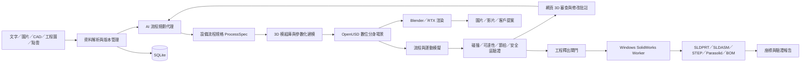

# AI 自動化設備數位分身與可行性評估平台規劃書

> 文件用途：作為新專案的產品規格、系統架構基準，以及後續 AI 代理的主要工作上下文。
>
> 文件狀態：初始規劃版
>
> 主要資料庫：SQLite

## 1. 專案目標

建立一套「AI 輔助的自動化設備數位分身與可行性提案平台」，協助自動化設備供應商快速完成以下工作：

1. 接收文字、圖片、CAD、工程圖及現場量測資料。
2. 由 AI 產生初步設備流程與模組配置方案。
3. 快速建立或選用 3D 設備模組。
4. 將模組組裝成完整設備或產線。
5. 依製程流程產生設備動作模擬與提案動畫。
6. 驗證可達性、碰撞、間距、流程與預估節拍。
7. 接收客戶回饋並持續增量修改模型、流程及動畫。
8. 依現場校正結果維持正確的廠務座標。
9. 方案確認後輸出 SolidWorks 可使用的工程檔案。

平台不是要重新開發一套 SolidWorks 或物理引擎，而是以統一的專案資料、座標、版本與 AI 工作流程，整合既有 CAD、模擬及渲染工具。

## 2. 核心產品原則

### 2.1 快速提案與工程交付分流

平台必須同時支援兩種工作模式，但兩者的精度與驗證門檻不同。

#### 快速提案模式

- 使用既有模組庫或簡化參數模型。
- 快速完成配置、流程動畫及初步碰撞檢查。
- 允許使用尚未確認的尺寸，但必須清楚標示為推估值。
- 主要輸出為瀏覽器 3D 場景、圖片、影片及可行性報告。

#### 工程交付模式

- 使用已確認的精確尺寸與 B-Rep 幾何。
- 套用現場量測及廠務座標校正。
- 執行工程釋出檢查。
- 產生 STEP、Parasolid、SLDPRT、SLDASM、BOM 及座標報告。

不得把從圖片或自然語言推測出的模型，直接標示為可製造工程模型。

### 2.2 單一數位主線

每個設備物件必須以永久 UUID 串聯下列資料：

- 精確 CAD 幾何
- 輕量化顯示 Mesh
- 模組參數
- 組裝關係
- 運動關節
- 廠務座標
- 流程動作
- BOM 資訊
- 檔案來源
- 修改歷史
- 驗證結果

### 2.3 AI 不直接任意操作二進位 CAD

AI 應先產生結構化變更指令，再由受控工具執行：

```text
使用者需求
→ AI 產生結構化 ChangeSet
→ Schema 與權限驗證
→ CAD／場景／模擬工具執行
→ 自動驗證
→ 顯示差異
→ 人員核准
→ 建立新版本
```

## 3. 系統總體架構



## 4. 建議使用流程

### 4.1 建立專案

使用者建立專案並輸入：

- 客戶與案件資訊
- 廠房或產線範圍
- 單位及座標方向
- 廠務原點與控制點
- 工件資料
- 製程步驟
- 目標產能及 Cycle time
- 可用 Robot、設備與品牌限制
- 安全、空間及維修需求

### 4.2 匯入資料

支援資料類型：

- 自然語言需求
- 圖片與現場照片
- PDF 工程圖
- DXF／DWG 平面配置圖
- STEP AP242
- Parasolid X_T／X_B
- SLDPRT／SLDASM
- STL／OBJ／FBX／GLB
- 點雲或現場量測控制點
- Excel／CSV 設備清單及 BOM

所有輸入都必須保留原始檔、檔案雜湊、來源、匯入時間及對應版本。

### 4.3 AI 產生初步方案

AI 不直接輸出自由格式程式碼，而是產生符合 Schema 的 `ProcessSpec`，至少包含：

- 製程步驟與先後關係
- 每站輸入與輸出條件
- 工件流向
- 設備模組需求
- Robot 或機構動作需求
- 感測器與致動器需求
- I/O 及握手事件
- 初步節拍估計
- 安全區域需求
- 已知限制
- AI 假設
- 尚未確認的資料
- 建議向客戶詢問的問題

### 4.4 選型、建模與組裝

建模優先順序：

1. 公司既有且已驗證的模組庫。
2. 供應商提供的精確 CAD。
3. 公司參數化模板。
4. AI 產生的概念佔位模型。

常用參數化模組包括：

- 鋁擠型機架
- 輸送機
- 氣缸與滑台
- Robot 與夾爪
- 安全門與圍籬
- 工作桌與電控箱
- 治具、定位銷及托盤
- 感測器、相機與光源
- 線性軸及旋轉軸

每個模組應定義：

- 幾何參數
- 安裝接口
- 定位基準
- 運動軸
- 軸限位
- 速度及加速度上限
- 碰撞幾何
- 安全包絡
- 質量與慣量（如有）
- 供應商與料號
- CAD 與 Mesh 檔案

### 4.5 模擬與驗證

平台應分成三個模擬等級。

#### L0：提案動畫

- 依時間軸播放設備動作。
- 顯示工件在站點間移動。
- 顯示流程順序、相機運鏡及基本干涉。
- 適合快速提案，不代表工程驗證完成。

#### L1：運動學可行性

- Robot 可達性
- 軸限位
- TCP 路徑
- 速度與加速度限制
- 碰撞檢查
- 最小間距
- 輸送與氣缸時序
- 設備互鎖及等待時間
- Cycle time 與產能估計

L1 是 MVP 的主要驗證層。

#### L2：物理與控制驗證

- 剛體物理
- 摩擦、質量與慣量
- 接觸及掉落
- 感測器模擬
- ROS 2 整合
- PLC／Robot controller SIL 或 HIL
- 相機、光學與點雲模擬

L2 可按專案需求選配 Isaac Sim、PhysX、ROS 2 或特定 Robot 模擬器。

### 4.6 審查與增量修改

使用者及客戶可在瀏覽器中：

- 播放、暫停及拖曳動畫時間軸
- 選取或隱藏設備
- 量測距離
- 顯示座標與安裝基準
- 查看剖面或透明模式
- 查看碰撞及安全包絡
- 留下文字或圖片批註
- 比較兩個版本

自然語言修改範例：

```text
將 CV-01 輸送機沿 Line-X 正方向加長 300 mm。
Robot R-01 沿 Plant-Y 負方向移動 150 mm。
保持 RobotBase 與夾治具的相對位置不變。
重新計算碰撞、可達性及 Cycle time，然後重新渲染提案影片。
```

AI 必須把請求轉成可檢查的 ChangeSet，顯示受影響物件和驗證結果後再建立新版本。

## 5. 廠務座標與校正規範

### 5.1 統一座標約定

- 右手座標系
- Z 軸向上
- 內部長度單位統一為毫米
- 角度的交換格式必須明確標示 degree 或 radian
- 平移與旋轉使用 4×4 齊次轉換矩陣保存
- 不允許只保存畫面上的 XYZ 而遺失父座標系

### 5.2 座標樹

```text
Plant
 ├─ Line
 │   ├─ Machine
 │   │   ├─ RobotBase
 │   │   │   └─ Tool/TCP
 │   │   ├─ Fixture
 │   │   └─ Conveyor
 └─ SurveyControlPoints
```

座標轉換範例：

```text
PlantPoint = T_Plant_Line
           × T_Line_Machine
           × T_Machine_Asset
           × AssetLocalPoint
```

### 5.3 校正資料

每筆座標轉換必須保存：

- 父座標系與子座標系
- 4×4 transformation matrix
- 單位及軸向
- 資料來源
- 校正日期
- 校正人員或設備
- 使用的控制點
- 演算法版本
- RMS 殘差
- 最大殘差
- 使用者設定的允收公差
- 適用的專案版本

座標信賴狀態：

- `INFERRED`：AI 或照片推估，不可工程釋出。
- `DRAWING_CONFIRMED`：已由工程圖或客戶尺寸確認。
- `CAD_CONFIRMED`：來自可信任 CAD。
- `SURVEY_CALIBRATED`：由現場控制點或量測設備校正。
- `RELEASED`：完成驗證並核准釋出。

### 5.4 大範圍場景精度

資料庫及工程輸出保存絕對廠務座標；3D 顯示及 GPU 模擬則使用工作站局部原點。局部座標與 Plant 座標間必須有明確轉換，以避免物件距離世界原點過遠造成浮點誤差。

## 6. 3D 與 CAD 資料策略

| 用途 | 建議格式 | 說明 |
|---|---|---|
| 精確工程幾何 | STEP AP242、Parasolid | 保存 B-Rep，供 CAD 交換 |
| 場景主檔 | OpenUSD | 組裝、圖層、版本、動畫及物理資料 |
| 網頁預覽 | GLB／glTF | 輕量化顯示與審查 |
| 渲染 | USD、Blender | 高品質圖片與影片 |
| SolidWorks 交付 | SLDPRT、SLDASM | 由 Windows SolidWorks Worker 建立 |
| 客戶提案 | MP4、PNG、PDF | 簡報與審查 |

### 6.1 重要限制

- STEP 或 Parasolid 可以提供精確實體，但匯入 SolidWorks 後通常是 Imported Body。
- Imported Body 不等於具有完整孔、擠出、鈑金及 Mate 歷史的原生特徵樹。
- 完整可編輯的 SolidWorks 特徵必須由參數化模板或 SolidWorks API 重建。
- 第一階段只對受控模組家族承諾原生 SLDPRT／SLDASM 產生能力。
- 從照片產生的模型只可作為概念模型，除非尺寸已由圖面、CAD 或現場量測確認。

## 7. AI 代理設計

### 7.1 規劃代理

職責：

- 解析使用者需求。
- 建立 ProcessSpec。
- 列出設備模組需求。
- 提出多個方案與取捨。
- 明確記錄假設及缺少資料。

### 7.2 CAD 代理

職責：

- 搜尋模組庫。
- 選用供應商 CAD。
- 設定參數化模板。
- 建立組裝約束及定位接口。
- 產生精確幾何與輕量 Mesh。

### 7.3 模擬代理

職責：

- 建立狀態機與時間軸。
- 設定 Joint、軸限位及運動曲線。
- 建立工件轉移及設備握手事件。
- 執行 L0、L1 或 L2 模擬。

### 7.4 驗證代理

職責：

- 確認 Schema 完整性。
- 檢查座標及單位。
- 檢查碰撞、可達性及最小間距。
- 驗證 Cycle time 與流程死鎖。
- 阻止含推估座標的版本進入工程釋出。

### 7.5 交付代理

職責：

- 產生客戶提案影片與圖片。
- 建立 BOM、假設清單及驗證報告。
- 將受控模組交給 SolidWorks Worker 重建。
- 驗證輸出檔案是否能重新開啟。
- 打包並產生交付 Manifest。

## 8. 資料庫與檔案儲存

### 8.1 SQLite 使用原則

SQLite 作為 MVP 及單機／地端部署的主要結構化資料庫。

建議設定：

- 啟用 foreign keys：`PRAGMA foreign_keys = ON`
- 使用 WAL 模式：`PRAGMA journal_mode = WAL`
- 設定 busy timeout，避免短時間寫入競爭直接失敗
- 所有 Schema 變更必須透過 migration
- 使用交易包住每一次版本建立及 ChangeSet 套用
- 重要表格保留 `created_at`、`updated_at` 及 `revision_id`
- 禁止直接由多個程序任意寫入資料庫檔案，所有寫入經由單一 Backend API

SQLite 不儲存大型 CAD、Mesh、影片、圖片或 PDF 二進位內容，只保存路徑、URI、檔案雜湊、大小、MIME type、來源及版本關係。

大型檔案在 MVP 可保存於專案資料目錄；日後部署成多節點平台時再切換至 MinIO 或 S3 相容物件儲存。

### 8.2 建議核心資料表

```text
projects
project_revisions
users
assets
asset_versions
asset_files
module_templates
module_parameters
scene_nodes
coordinate_frames
frame_transforms
survey_control_points
assemblies
assembly_constraints
joints
process_specs
process_steps
scenarios
motion_tracks
simulation_jobs
validation_results
change_sets
review_comments
render_jobs
deliverables
bom_items
audit_logs
```

### 8.3 建議資料關係

```text
Project
 └─ ProjectRevision
     ├─ ProcessSpec
     ├─ Scenario
     ├─ SceneNode
     │   ├─ AssetVersion
     │   ├─ CoordinateFrame
     │   ├─ Joint
     │   └─ AssemblyConstraint
     ├─ MotionTrack
     ├─ ValidationResult
     ├─ ReviewComment
     └─ Deliverable
```

### 8.4 SQLite 擴充性邊界

SQLite 適合：

- 單機應用
- 小型地端伺服器
- 少量同時使用者
- 工作站與 AI Worker 透過同一 Backend API 排隊執行

若未來需要大量同時寫入、多台 Backend、跨廠區協作或高可用叢集，應保留 Repository／ORM 抽象層，使資料庫可遷移到 PostgreSQL，而不改變核心領域模型。

## 9. 建議技術組合

| 層級 | 建議技術 |
|---|---|
| 前端 | React、TypeScript、Three.js 或 React Three Fiber |
| Backend API | Python、FastAPI |
| 資料庫 | SQLite、WAL mode、migration 管理 |
| 工作排程 | 初期使用單機 Job Queue；介面保留可替換性 |
| 專案檔案 | 本機或 NAS 專案目錄；未來可切換 MinIO／S3 |
| 場景格式 | OpenUSD |
| 精確幾何 | Open Cascade／CadQuery，必要時接商用 CAD Translator |
| Mesh 轉換 | CAD Tessellation Service，輸出 GLB／USD |
| 渲染 | Blender headless；進階可使用 RTX Renderer |
| 運動學 | Python 運動學服務及碰撞函式庫 |
| 高階模擬 | Isaac Sim、PhysX、ROS 2，按需求選配 |
| SolidWorks | 獨立 Windows Worker、SolidWorks Desktop API、合法授權席次 |
| AI | 支援 Structured Output、Tool Calling 及檔案理解的語言模型 |

## 10. 建議專案目錄

```text
project-root/
├─ README.md
├─ docs/
│  ├─ architecture.md
│  ├─ coordinate-system.md
│  ├─ data-model.md
│  └─ api-spec.md
├─ apps/
│  ├─ web/
│  ├─ api/
│  └─ desktop-worker/
├─ services/
│  ├─ ai-orchestrator/
│  ├─ cad-service/
│  ├─ simulation-service/
│  ├─ render-service/
│  └─ solidworks-worker/
├─ packages/
│  ├─ domain-models/
│  ├─ schemas/
│  └─ coordinate-utils/
├─ module-library/
├─ migrations/
├─ tests/
├─ storage/
│  ├─ projects/
│  ├─ assets/
│  ├─ renders/
│  └─ deliverables/
└─ platform.sqlite3
```

正式部署時，`platform.sqlite3` 和 `storage` 應放在可設定的資料目錄，不應提交到 Git。

## 11. API 與結構化規格

至少需要下列主要 API：

```text
POST   /projects
GET    /projects/{project_id}
POST   /projects/{project_id}/files
POST   /projects/{project_id}/plan
POST   /projects/{project_id}/revisions
GET    /revisions/{revision_id}/scene
POST   /revisions/{revision_id}/changesets
POST   /revisions/{revision_id}/simulate
POST   /revisions/{revision_id}/validate
POST   /revisions/{revision_id}/render
POST   /revisions/{revision_id}/calibrate
POST   /revisions/{revision_id}/release
GET    /jobs/{job_id}
GET    /deliverables/{deliverable_id}
```

所有 AI 輸出至少必須符合下列其中一種 Schema：

- `ProcessSpec`
- `ModuleSelection`
- `SceneAssemblySpec`
- `MotionSpec`
- `ChangeSet`
- `ValidationReport`
- `ReleaseManifest`

Schema 應使用 JSON Schema 定義並進行版本管理。

## 12. 版本與變更管理

每次修改建立不可變更的 ProjectRevision，不直接覆寫已核准版本。

ChangeSet 至少包含：

- 修改原因
- 使用者原始指令
- AI 解讀結果
- 新增、修改及刪除的物件
- 參數前後差異
- 座標前後差異
- 受影響的流程與模擬
- 是否需要重新 Tessellation
- 是否需要重新模擬
- 是否需要重新渲染
- 驗證結果
- 核准者

## 13. SolidWorks 工程輸出流程

1. 確認版本通過工程釋出閘門。
2. 確認所有釋出物件皆有可信任尺寸與座標。
3. 將精確幾何、參數、組裝樹及 Mate 規格送入 Windows Worker。
4. 使用 SolidWorks Desktop API 開啟模板或建立新文件。
5. 對支援的模組家族建立原生特徵。
6. 對其他模型匯入 STEP／Parasolid 實體。
7. 建立 SLDASM 組立及必要 Mate。
8. 以指定廠務輸出座標產生 STEP／Parasolid。
9. 重新開啟輸出檔並檢查遺失參考、錯誤實體及組立狀態。
10. 產生 BOM、座標報告、驗證報告及 Release Manifest。

## 14. 安全、權限與智慧財產

- 客戶 CAD、工程圖及現場照片視為機密資料。
- 預設採地端或私有雲部署。
- 檔案上傳需做類型、大小與惡意內容檢查。
- CAD、渲染及 AI 工具在隔離 Worker 中執行。
- 使用角色權限控制專案、下載與工程釋出。
- 所有下載、修改、AI 操作與工程釋出寫入 audit log。
- 原始檔及交付檔保存 SHA-256 雜湊。
- 不允許 AI 在未經核准時覆寫已釋出的工程資料。

## 15. MVP 範圍

第一版建議選擇單一典型應用，例如：

```text
Robot 取放 + 輸送機 + 治具 + 安全圍籬
```

MVP 功能：

- 10～20 種常用參數化模組
- STEP／Parasolid／SolidWorks 檔案上傳
- 網頁 3D 組裝、量測及座標顯示
- 流程時間軸及狀態機
- Robot 可達性與基本碰撞
- Cycle time 初步估算
- MP4 自動渲染
- 版本比較與審查批註
- 廠務控制點校正
- STEP／Parasolid 交付
- 對受控模組產生 SLDPRT／SLDASM

暫不納入 MVP：

- 任意照片一鍵產生可製造 CAD
- 任意機構完整原生 SolidWorks 特徵樹
- 全品牌 Robot controller 精確模擬
- 完整 PLC 虛擬調試
- 高精度柔體、流體或電纜物理
- 多節點高可用部署

## 16. 建議開發階段

以約 4 人團隊及單一示範設備類型估算：

### Phase 0：規格與示範案件，約 2 週

- 確認使用情境與檔案來源。
- 定義 ProcessSpec、Scene、Frame 及 ChangeSet Schema。
- 確定座標與單位規範。
- 選定一個真實示範案件。

### Phase 1：3D 基礎平台，約 4 週

- FastAPI、SQLite 與專案檔案儲存。
- 模組庫與 CAD 上傳。
- CAD Tessellation。
- 瀏覽器 3D 顯示、組裝、量測及座標工具。

### Phase 2：AI、流程與動畫，約 4 週

- AI ProcessSpec 產生。
- 流程狀態機。
- 動作時間軸。
- 基本碰撞、可達性及 Cycle time。
- Blender 自動渲染。

### Phase 3：校正與工程交付，約 4～6 週

- 現場控制點及座標校正。
- 工程釋出閘門。
- SolidWorks Windows Worker。
- STEP／Parasolid／SLDPRT／SLDASM 輸出與重開驗證。

聚焦 MVP 的總工期預估約為 12～16 週；實際時間取決於模組複雜度、SolidWorks API 範圍及 Robot 品牌。

## 17. 驗收條件

每個方案版本至少能產生：

- 可在瀏覽器操作的 3D 場景
- 可播放的設備流程動畫
- MP4 提案影片
- Cycle time 與產能估計
- Robot 或機構可達性結果
- 碰撞清單與最小間距
- 安全區域干涉結果
- 未確認尺寸及假設清單
- 每個物件的資料來源與信賴狀態
- 廠務座標與校正殘差
- 設備版本及 BOM
- 版本差異及修改歷史
- STEP 或 Parasolid 工程檔
- 適用範圍內的 SLDPRT／SLDASM
- Release Manifest 與驗證報告

工程釋出不得通過的條件：

- 存在 `INFERRED` 的關鍵尺寸或安裝座標。
- 座標單位或軸向不明。
- 校正殘差超過專案允收值。
- 存在未處理的碰撞或不可達動作。
- SolidWorks 或中性 CAD 檔無法重新開啟。
- 場景版本、BOM 及 CAD 版本不一致。

## 18. AI 代理執行規則

後續 AI 代理進入本專案時，必須遵守以下規則：

1. 先閱讀本文件及專案內的 `AGENTS.md`、README 和相關 Schema。
2. 不得擅自改變座標、單位、永久 UUID 或版本模型。
3. 優先使用模組庫，不任意生成無尺寸依據的工程模型。
4. AI 推估內容必須標記來源及信賴狀態。
5. 所有跨模組資料交換使用版本化 Schema。
6. 場景、模擬、BOM 與 CAD 必須對應同一 ProjectRevision。
7. 修改應以 ChangeSet 實作，避免直接覆寫已核准資料。
8. 大型二進位檔案不得存入 SQLite。
9. 所有 SQLite 寫入應經 Backend API 及 transaction。
10. 任何工程釋出都必須先執行自動驗證及人工核准。
11. 無法確認的工程資訊必須列為待辦或問題，不可自行猜測後當成事實。
12. 新增功能時，優先維持可測試、可替換及可追蹤，而不是與單一工具深度耦合。

## 19. 第一個開發迭代建議

第一個迭代只完成一條最短可運作路徑：

```text
建立專案
→ 上傳一個 Robot STEP 和一個輸送機模組
→ 設定 Plant／Machine／RobotBase 座標
→ 在瀏覽器組裝
→ 建立 Robot 取放時間軸
→ 執行基本碰撞檢查
→ 渲染 MP4
→ 匯出組立 STEP
```

此路徑完成後，再加入 AI 自動規劃、更多模組及 SolidWorks 原生特徵重建。這可以先驗證最重要的數位主線與座標一致性，避免一開始同時開發過多高風險功能。

## 20. 參考資料

- [OpenUSD 單位與座標軸 API](https://openusd.org/release/api/usd_geom_2metrics_8h_source.html)
- [NVIDIA Isaac Sim Reference Architecture](https://docs.omniverse.nvidia.com/isaacsim/latest/isaac_sim_reference_architecture.html)
- [ROS 2 tf2 座標轉換概念](https://docs.ros.org/en/galactic/Concepts/About-Tf2.html)
- [SOLIDWORKS STEP 匯入說明](https://help.solidworks.com/2026/english/SolidWorks/sldworks/t_reading_step_iges_acis_sw.htm)
- [SOLIDWORKS Parasolid 匯入與輸出說明](https://help.solidworks.com/2026/English/SolidWorks/sldworks/c_parasolid_files.htm)
- [Blender 背景批次渲染](https://docs.blender.org/manual/en/5.1/advanced/command_line/render.html)

