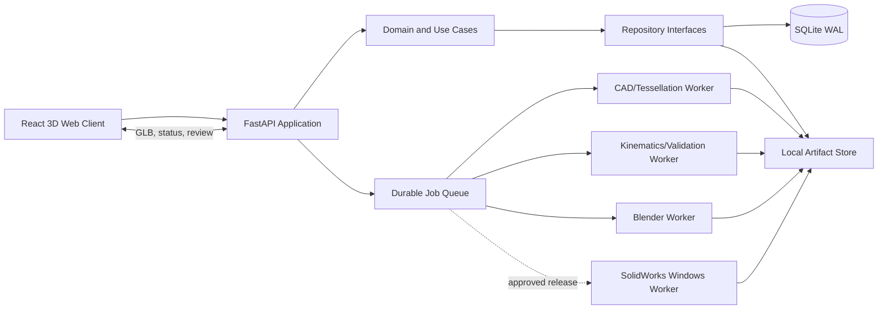

# 自動化設備數位分身平台—開發規劃書

> 狀態：已核准，Phase 0／Sprint 1 開發中  
> 日期：2026-09-12  
> 依據：`automation-digital-twin-platform-plan.md`

## 1. 決策摘要

建議以「模組化單體 Backend + 隔離 Worker」完成 MVP，而不是一開始拆成多個微服務：

- React／TypeScript 網頁負責 3D 審查、組裝、時間軸、量測與批註。
- FastAPI 是唯一寫入 SQLite 的入口，負責專案、版本、ChangeSet、Job 與釋出閘門。
- CAD、模擬、渲染、SolidWorks 透過明確的 Job／Artifact contract 隔離；前期可同機執行，介面保留日後拆服務的能力。
- 精確 B-Rep、OpenUSD 場景、GLB 預覽與 SolidWorks 輸出各司其職，不宣稱彼此可無損互換。
- 第一條端到端路徑不含 AI 自動規劃與原生 SolidWorks 特徵重建；先證明版本、座標、幾何、動畫與輸出一致。

這個切法可降低部署與分散式交易成本，同時保留 CAD／GPU／SolidWorks 必須獨立執行的工程邊界。

## 2. MVP 目標與界線

### 2.1 必須完成的最短路徑

```text
建立專案
→ 上傳 Robot STEP 與一個受控輸送機模組
→ 建立 Plant／Machine／RobotBase frame
→ 產生 GLB 並在瀏覽器組裝、量測
→ 建立 Robot 取放時間軸
→ 執行基本碰撞與規則式可達性檢查
→ 估算 Cycle time
→ 以 Blender 渲染 MP4
→ 匯出組立 STEP 與 Release Manifest
```

### 2.2 MVP 內

- 一個已指定的 Robot 取放示範案例。
- 10～20 個受控參數化模組；每個模組具安裝介面、碰撞幾何與資料來源。
- STEP 優先；Parasolid 與 SolidWorks 檔先作「能力驗證」後才承諾正式支援範圍。
- L0 時間軸與 L1 基本碰撞、軸限位、規則式可達性、最小間距及節拍估算。
- 不可變 ProjectRevision、結構化 ChangeSet、版本比較、審查批註。
- 控制點校正、殘差紀錄、信賴狀態與工程釋出閘門。

### 2.3 明確不在 MVP

- 從照片或自然語言直接產生可製造 CAD。
- 任意零件的完整 SolidWorks 原生特徵樹。
- 全品牌 Robot 精準求解器、完整 PLC 虛擬調試、ROS 2／HIL。
- 柔體、流體、電纜與高擬真接觸物理。
- 多節點高可用、跨廠區同步與即時多人共同編輯。

## 3. 建議架構



### 3.1 Backend 邊界

採 Clean/Hexagonal 分層，但避免為分層而製造空殼：

```text
API route
→ application use case + transaction
→ domain rules
→ repository / worker port
→ SQLite / filesystem / external-tool adapter
```

核心 domain 不匯入 FastAPI、SQLAlchemy、CadQuery、Blender 或 SolidWorks API。這使資料庫、CAD 核心及 Worker 可替換，也能在不啟動外部工具的情況下測試釋出規則。

### 3.2 資料與檔案

- SQLite 僅保存結構化 metadata、關係、狀態、雜湊與相對 artifact URI。
- 每次建立 ProjectRevision 與套用 ChangeSet 都在單一 transaction 中完成。
- 原始與生成檔案採 content-addressed 命名（SHA-256）並另存 logical manifest，避免重複及無聲覆寫。
- DB 內時間使用 UTC ISO-8601；顯示時才轉使用者時區。
- 刪除採 tombstone／retention policy；核准版本及其交付 artifact 不就地修改。

### 3.3 Schema 邊界

第一批版本化 JSON Schema：

1. `ProcessSpec@1`
2. `SceneAssemblySpec@1`
3. `CoordinateFrame@1`／`FrameTransform@1`
4. `MotionSpec@1`
5. `ChangeSet@1`
6. `ValidationReport@1`
7. `ReleaseManifest@1`

Pydantic model 是 Schema 實作，不與 SQLAlchemy ORM 共用同一 class。所有角度欄位要在名稱或 metadata 指明 radian／degree；所有長度輸入在邊界轉成 mm。

### 3.4 工作排程

MVP 使用 SQLite-backed durable job table 與單機 worker process：

- 狀態：`PENDING → RUNNING → SUCCEEDED | FAILED | CANCELLED`。
- Job 具 idempotency key、輸入 revision、工具版本、重試次數與 heartbeat。
- Worker 只能透過 API／job result contract 回報，不直接寫 SQLite。
- CAD、render 等重工作不能佔住 HTTP request；API 回傳 `202 + job_id`。

## 4. 技術選型

| 項目 | MVP 建議 | 決策理由／限制 |
|---|---|---|
| Python | 3.12 | 已建立環境；CadQuery 官方支援 3.9+，仍須做 Windows wheel smoke test。 |
| Python 套件管理 | 審查後採 uv + `uv.lock` | 可重現跨機器依賴；目前先保留標準 `.venv` 與 pip。 |
| API | FastAPI + Pydantic v2 | Typed contract 與 OpenAPI 適合 Schema-first 工作。FastAPI 仍為 0.x，必須 minor pin。 |
| ORM／migration | SQLAlchemy 2 + Alembic | Repository abstraction、SQLite pragmas 與 migration 路徑成熟。 |
| Frontend | React + TypeScript + Vite | Node 24.21 已符合 Vite 目前最低版本要求。 |
| 3D Web | Three.js + React Three Fiber | 適合 GLB 場景、selection、gizmo、量測與時間軸 UI。 |
| 精確 CAD | Open Cascade／CadQuery spike 後定案 | STEP/B-Rep 可行，但 Windows 相依、tessellation 品質與授權需實測。 |
| 場景主檔 | OpenUSD | 組裝、layer、variant 與動畫；Python `usd-core` 不含完整 imaging 工具。 |
| 預覽格式 | GLB／glTF | 網頁傳輸與渲染；不是工程真實來源。 |
| L1 驗證 | 初期規則式 + 專用碰撞／運動學 adapter | 先限制 Robot 型號；避免宣稱通用 reachability。 |
| 渲染 | Blender headless | 尚未安裝；先驗證 USD/GLB 匯入、材質與固定版本 CLI。 |
| SolidWorks | 獨立 Windows Worker | 需要實際版本、合法席次、Desktop API 與可重開測試。 |

## 5. 建議程式庫結構

只有在本規劃核准後才建立下列 product scaffold：

```text
apps/
  api/                    # composition root, routes, auth, config
  web/                    # React client
services/
  cad-worker/
  simulation-worker/
  render-worker/
  solidworks-worker/
packages/
  domain-models/          # pure Python domain
  schemas/                # versioned JSON Schema + generated types
  coordinate-utils/       # transforms, units, calibration
module-library/
migrations/
tests/
  unit/
  integration/
  contract/
  e2e/
storage/                  # runtime only; ignored
```

名稱採一致的 kebab-case 目錄，但 Python import package 使用 snake_case。若採單一 Python workspace，`apps/api` 與各 Python package 必須有明確的 `pyproject.toml` 或 workspace membership，不能依賴修改 `PYTHONPATH`。

## 6. 開發階段、產出與關卡

估算基準：4 人小組、單一示範設備、既有 CAD 可合法提供。週數是 elapsed time，不是人週。

### Phase 0 — 規格封版與技術尖峰（2 週）

工作：

- 選定示範設備、Robot 型號、兩份可公開於測試環境的 STEP。
- 定義座標、單位、UUID、Revision、ChangeSet 與信賴狀態不變條件。
- 產生七個 `@1` Schema、API error envelope、job contract。
- 尖峰測試 STEP → B-Rep → GLB、OpenUSD round-trip、Blender headless。
- 在目標 SolidWorks 版本做輸入／輸出與重開驗證，不做大量自動化。
- 以 3 個以上控制點驗證 rigid calibration 與殘差計算。

退出條件：

- Schema examples 可驗證，座標 golden tests 通過。
- 實際 sample CAD 能產出可接受的 GLB，UUID 對應不遺失。
- 所有高風險工具有 Go／No-Go 結論及替代方案。

若 Phase 0 失敗，不進入完整 UI 開發。

### Phase 1 — 數位主線與 3D 基礎（4 週）

工作：

- Project、Revision、Asset、Artifact、SceneNode、Frame API。
- SQLite migration、foreign keys、WAL、busy timeout 與 transaction tests。
- chunked upload、SHA-256、MIME／大小限制、artifact manifest。
- STEP tessellation job、GLB viewer、場景樹、gizmo、量測與座標顯示。
- ProjectRevision 只讀快照與基本版本比較。

退出條件：建立專案至瀏覽器組裝的端到端流程可重複執行；重新載入後座標與 UUID 完全一致。

### Phase 2 — 流程、模擬與提案輸出（4 週）

工作：

- ProcessSpec、MotionSpec、狀態機與時間軸 editor/player。
- 指定 Robot 的基本 reachability adapter、碰撞、最小間距與軸限位。
- Cycle time event model，將動作、等待與握手時間分開計算。
- ValidationReport、問題定位與場景標示。
- Blender render job、MP4 與提案圖片。

退出條件：相同 revision 與 tool version 可重現相同驗證結果；示範流程可播放並輸出 MP4。

### Phase 3 — ChangeSet、審查與 AI 輔助（3～4 週）

工作：

- 結構化 ChangeSet preview、impact analysis、核准與套用。
- 版本 diff、文字／圖片批註與 audit log。
- AI 僅產生 ProcessSpec／ChangeSet；Schema 不合法或影響不明時拒絕執行。
- Prompt、model、tool、輸入檔與輸出 Schema 版本追蹤。

退出條件：自然語言範例可轉成可檢視 diff，未經核准不改 revision；相同 request 可用 idempotency key 防重複執行。

### Phase 4 — 校正與工程交付（4～6 週）

工作：

- 控制點匯入、剛體配準、RMS／最大殘差與允收公差。
- Release Gate、BOM、座標報告、ValidationReport、ReleaseManifest。
- STEP／Parasolid 能力範圍確認。
- 對少數受控模組建立 SolidWorks 原生 template；其餘以 imported body 清楚標記。
- Worker 重開輸出檔並檢查 reference、body 與 assembly 狀態。

退出條件：含 `INFERRED` 關鍵值、超差或未處理碰撞的 revision 必定無法釋出；合格示範案可重開並核對 manifest hash。

### 時程判讀

- 不含 SolidWorks 原生模板的可展示 MVP：約 10～12 週。
- 含 AI ChangeSet、校正與有限 SolidWorks 工程交付：約 17～20 週。
- 原規劃的 12～16 週屬積極估算，前提是 sample CAD、Robot 模型、SolidWorks 環境與四人角色在第一週到位。

## 7. 第一個 Sprint（核准後才執行）

1. 維持父層 Git repository，但所有操作嚴格限定在本專案目錄；採 uv 管理 Python dependency。
2. 建立 API、Web、schemas、coordinate-utils 最小 scaffold 與 CI。
3. 完成 `CoordinateFrame@1`、`FrameTransform@1`、`ProjectRevision@1`、`ChangeSet@1`。
4. 實作 mm、右手 Z-up、4×4 transform、frame composition 及反矩陣 golden tests。
5. 建立 SQLite 初始 migration 與 pragmas connection test。
6. 完成一個 Project create/get vertical slice；不含 CAD。
7. 建立 STEP→GLB spike，記錄幾何偏差、面數、耗時與 UUID mapping 結果。

Sprint demo 應展示「建立 project/revision、保存 frame tree、重新讀取且結果一致」，而不是只展示 Swagger UI。

## 8. 測試與品質策略

### 8.1 自動測試層級

- Unit：domain invariants、單位轉換、frame composition、狀態機、release rules。
- Property-based：隨機 rigid transform 的 compose/inverse、序列化 round-trip、單位不變性。
- Integration：SQLite migration、foreign key、WAL、rollback、job claim、artifact transaction。
- Contract：JSON Schema compatibility、API/worker payload、generated TypeScript type。
- Geometry golden test：固定 STEP 的 bounding box、體積、面數容許區間與 GLB transform。
- E2E：上傳、組裝、播放、驗證、批註、釋出拒絕／通過。
- External-tool smoke：固定 Blender、CadQuery/OpenUSD、SolidWorks 版本的啟動與重開檢查。

### 8.2 合併門檻

- Ruff check/format、mypy strict、pytest 必須通過。
- Schema 或 migration 修改需附 compatibility test。
- 座標與 release gate code 需至少一名不同作者審查。
- 不以單純 code coverage 百分比代替核心不變條件測試；仍追蹤 branch coverage 趨勢。

## 9. 安全與資料治理

- 預設地端開發；未確認 AI 資料政策前，不把客戶 CAD、照片或圖面送至外部模型。
- 檔名不作為信任依據；以 magic/MIME、大小、壓縮炸彈與解析 sandbox 檢查上傳。
- Worker 採最低權限、專屬工作目錄、timeout、CPU／RAM／GPU quota 與 allowlisted command。
- 下載使用 artifact id 經權限檢查，不接受任意 filesystem path。
- Secrets 只放 `.env`／secret store；log 不記 token、原始機密檔內容。
- 所有 AI、下載、修改、核准與釋出事件寫 audit log；交付檔保存 SHA-256。

## 10. 主要風險與預先處置

| 風險 | 等級 | 預先處置 |
|---|---:|---|
| STEP／Parasolid／SolidWorks 轉換失真或語意遺失 | 高 | Phase 0 用真實檔建立 format matrix；B-Rep 與原生特徵承諾分開。 |
| Robot 可達性被誤解為品牌控制器精準結果 | 高 | 限定型號與求解器版本，報告標示精度；正式交付需品牌工具覆核。 |
| 大場景浮點精度／座標方向錯誤 | 高 | DB 保存 Plant double precision；viewer 用 local origin；建立 golden transforms。 |
| SQLite 被多 Worker 同時寫入 | 高 | API 單一 writer、短 transaction、job claim protocol、busy timeout；壓測遷移門檻。 |
| CAD／Blender native dependency 不穩定 | 中高 | Worker 固定版本、啟動 smoke test、artifact 記錄 tool version。 |
| AI 產生合法但危險的 ChangeSet | 高 | allowlist operation、impact preview、domain validation、人工核准、不可變 revision。 |
| 4 人同時跨 Web、CAD、Robot、SolidWorks 專業 | 高 | 先確定技術 owner；缺少 CAD/SW owner 時移除原生輸出承諾。 |
| 專案位於父層 Git repo，可能誤操作同層專案 | 中 | 所有 Git 指令從本專案執行並以 `-- .` 限定；不在父層操作。 |

## 11. 開發前需要你的決策／資料

以下項目會實質改變時程或架構，建議在核准時一併回答：

1. 第一個示範案件及成功畫面；最好提供可合法用於測試的 Robot、輸送機 STEP。
2. Robot 品牌、型號、軸數及是否有 URDF／DH parameters／官方 simulator。
3. SolidWorks 年版、API 可用性、授權席次，以及輸出優先順序（STEP、Parasolid、SLDPRT、SLDASM）。
4. 首版部署是單一 Windows 工作站、Windows Server、地端 Linux + Windows worker，或 NAS 協作。
5. 客戶機密資料是否允許送往外部 AI API；若允許，資料保留與區域要求為何。
6. 廠務座標控制點格式、長度／角度公差、校正 RMS 與最大殘差門檻。
7. 預計團隊人數及 CAD、Robot、前端、Backend 各自 owner。
8. Git 決策已確認：繼續屬於父層 `Python` repository，但操作範圍只限本目錄。

## 12. 已完成的環境準備

- `.venv`：Python 3.12.10。
- Node.js 24.21.0、npm 11.19.0、Git 2.55.0 已可用。
- 已安裝並記錄 Ruff、pytest、mypy、pre-commit；尚未安裝 Git hook。
- 已加入 `.python-version`、`.editorconfig`、`.gitignore`、`.env.example`、品質工具設定及環境檢查腳本。
- Blender、Docker、CMake 尚未找到；它們不是規劃審查前的阻塞項。
- 未安裝任何 runtime／CAD／AI 套件，也未建立資料庫或產品程式碼。

執行環境檢查：

```powershell
.\scripts\check-environment.ps1
```

## 13. 核准建議

建議先核准 **Phase 0（2 週）**，而不是一次承諾全案。Phase 0 的採購／授權前提、真實 CAD 轉換結果、Robot 可達性方法與 SolidWorks 重開驗證完成後，再對 Phase 1～4 的成本與日期封版。

若只想先驗證產品價值，可核准不含 AI 與 SolidWorks 原生特徵的 10～12 週展示 MVP；若工程交付是成交必要條件，必須保留 Phase 4 且在第一週提供 SolidWorks 環境。

## 14. 官方技術依據

- FastAPI 官方建議固定已驗證的 minor version，並以測試支持升級：<https://fastapi.tiangolo.com/deployment/versions/>
- FastAPI 官方虛擬環境與 uv 專案流程：<https://fastapi.tiangolo.com/virtual-environments/>
- uv 的 `pyproject.toml`、`.python-version`、`.venv` 與 lockfile 說明：<https://docs.astral.sh/uv/guides/projects/>
- Vite 的 Node 版本條件與 React TypeScript scaffold：<https://vite.dev/guide/>
- CadQuery 官方安裝與 Python 支援範圍：<https://cadquery.readthedocs.io/en/latest/installation.html>
- OpenUSD 官方 quickstart（`usd-core` 不含 imaging/usdView 與部分 plug-in）：<https://openusd.org/files/USD_Quickstart_Guide.pdf>
