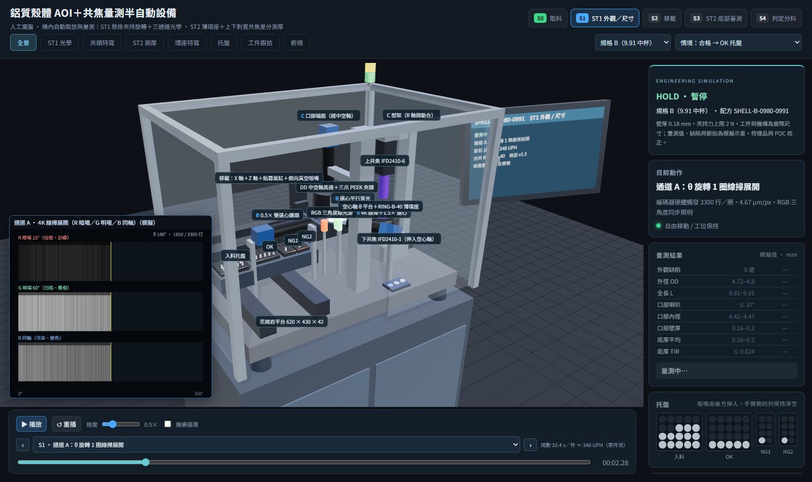

# 鋁質殼體 AOI＋共焦量測半自動設備：3D 設備模擬

依 `docs/20260825_…AOI 光學檢測.docx`（Rev. A）與三張殼體圖面，把規格書的半自動機做成可播放、可逐步檢視的 3D 模擬。三種深引伸鋁質殼體（Ø4.8～Ø4.9，長 4.2／9.91／13.8 mm）在同一台機上完成外觀、外形尺寸與底部厚度量測。

- **半自動**：人工擺托盤，機內移載模組自動取放與量測。
- **ST1** 由 DD 中空軸馬達＋三爪 PEEK 夾頭懸掛夾持，三個光學通道共用一次裝夾。
- **ST2** 工件落在鎢鋼薄環座上，上下對置的兩支共焦感測器做螺旋掃描，差分求底厚。
- 規劃節拍約 **10.4 秒／件（約 348 UPH）**。所有 Three.js 依賴在 `web/vendor`，可離線執行。



文件：[成本估算](docs/cost-estimate.md)（[試算表](docs/cost-estimate.xlsx)）。規格書與圖面在 `docs/`。

## 決策紀錄（選項對話）

| 題目 | 決定 |
|---|---|
| 整機架構 | 照規格書半自動（不改 SCARA 全自動或分度盤） |
| 工件範圍 | 三種殼體 A／B／C；`docs/` 內的沖壓板件與帶齒管件不納入 |
| 判定情境 | OK、NG-D、NG-A、NG-T、ERR 五種 |
| 配套 | 取像模擬子畫面、驗證腳本、成本估算表 |

## 流程

| 站別 | 動作 |
|---|---|
| S0 取料 | 入料托盤對列 → Z 下降 → 側向真空吸嘴貼靠外壁 → 建立真空 → 上升 → 沿低位走廊到 ST1 → 杯口送入夾頭 |
| S1 ST1 | 三爪夾持 1.5 N → 破真空、吸嘴退開並下降 → **A** θ 轉 1 圈線掃展開 → **B** 0／90／180／270° 遠心剪影 → **C** 口部端面 → θ 回原點 → 吸嘴吸附 → 夾頭鬆開 |
| S2 移載 | 下降到走廊 → 到升降點 → 上升 → 進 ST2 → 落座薄環座 → 破真空、吸嘴退開 |
| S3 ST2 | 落座穩定 0.3 s → 螺旋掃描 5 圈（120 rpm，上下共焦由同一個編碼器觸發）→ R 軸回起點 |
| S4 判定分料 | 判定＋資料寫入（出料托盤同時對列）→ 吸附 → 回走廊 → 到目標托盤 → 放料 → 回待命位 |

交接一律先取得新的約束再解除舊的：先夾緊才破真空，先吸住才鬆夾。

### 情境

| 情境 | 內容 | 去向 |
|---|---|---|
| OK | 全部項目在規格內 | OK 托盤 |
| NG-D | 外徑超出上限（通道 B） | NG1 |
| NG-A | 外壁拉傷 0.86 mm（通道 A 紅光暗場） | NG2 |
| NG-T | 底厚低於下限（ST2） | NG1 |
| ERR | 上感測器訊號不足、有效點 62 % → 重新落座重測一次 → 仍異常 | 退回入料原穴，黃燈通知人工 |

NG 件仍走完全部量測，資料才完整。ERR 不當成 NG。

## 啟動

```powershell
python serve.py
# 或不自動開外部瀏覽器
python serve.py --no-open
```

開啟 [本地模擬](http://127.0.0.1:8774/)，也可雙擊 `run.bat`。ES module 需要 HTTP，不能直接用 `file://` 開 HTML。

## 操作

- 右上兩個選單切換**規格**（A／B／C）與**情境**，切換後重新載入。
- 站別按鈕跳到 S0～S4 最有代表性的一刻並切到對應視角；下拉選單可選任一步驟，搭配前後步與時間滑桿。
- 預設以 0.5× 播放（實際節拍只有 10 秒）；可調 0.05～2×，可勾「連續循環」。
- 視角：全景、ST1 光學、夾頭特寫、ST2 測厚、環座特寫、托盤、工件跟拍、俯視；滑鼠可自由旋轉縮放。
- **左下子畫面**是取像模擬：通道 A 三張展開圖逐行長出來、通道 B 剪影與量測值、通道 C 端面與擬合圓、ST2 螺旋厚度圖、判定結果。這是繪製的示意影像，不是實拍。
- 右側顯示量測結果（取像完成才出現數值）、托盤佔用、設備訊號、站別項目。
- 「匯出紀錄」產生 JSON：情境、量測值、缺陷、取像事件、版本欄位。**沒有實拍影像、沒有實測值、未接 MES。**

網址參數：
- `?spec=C&result=ERR`：規格與情境。
- `?pause&st=3&view=st2`：停在 ST2 掃描；`?pause&step=7&view=chuck`：停在夾持；`?pause&time=6.2`：指定秒數。
- `?hood=0`、`?pip=0`、`?labels`、`?speed=1`、`cam=x,y,z,tx,ty,tz`。

主控台：`window.sim.seekTo(sec)`、`pause()`、`play()`、`setView(name)`、`steps`、`measurement`。

## 機構配置

座標 X 向右（托盤 → ST1 → ST2）、Y 向上、Z 向操作者。工件與機構都是實際尺寸。

- **移載在後側**：X 軸＋Z 軸電動滑台＋貼靠氣缸（6 mm）＋薄片側向真空吸嘴。吸嘴由後方伸入，貼靠中心距工件底面 1.8 mm，落在托盤穴口與夾持帶之間。
- **低位走廊**：吸附中的工件底面高於托盤穴底 16 mm，沿 z = 0 從通道 B 鏡頭與背光下方通過。
- **ST1 光學都由前側立柱懸臂**：通道 B 鏡頭在左、平行背光在右；通道 A 在前右 60°；紅光暗場與綠光明場在前方；**通道 C 在 DD 馬達上方，經中空軸向下看杯口**。
- **ST2**：橋板架高空心軸 θ 平台，下感測器由下方伸入通孔；**R 軸微動台承載整個 C 型架**，上下感測器一起做徑向進給。
- **托盤**：入料與出料各一支梭台。吸嘴從後方伸入，所以手臂側的列必須是空的：入料從最後一列取起，出料從最前一列放起。

## 與規格書不同的地方

| 項目 | 規格書 | 模擬 | 原因 |
|---|---|---|---|
| 移載 X 行程 | Y 軸 250 mm | X 軸約 520 mm | 250 mm 到不了四個托盤的 20 穴與兩個工位 |
| 移載 Z | 氣缸 | 電動滑台 | 三種規格的夾持、落座高度都不同 |
| 吸嘴貼靠 | 未提 | 加 6 mm 貼靠氣缸 | 側向吸外壁需要水平接近 |
| 托盤 | 固定 | 梭台對列 | 移載只有 X／Z，列方向要由托盤移動 |
| 通道 C | 圖 4-2 畫在工件下方 | DD 馬達上方經中空軸 | 杯口朝上，由下方看不到端面 |
| R 軸 | 只載上感測器 | 載整個 C 型架 | 差分測厚要量同一點的上下兩面，只動上感測器會錯位 |
| 三支柱 | 高 70 mm | 高 20 mm＋轉接板 | 支柱要在下感測器鏡頭（Ø27）外側，薄環座（Ø30）放不下 |
| 節拍 | 9.4 s | 10.2～10.4 s | 進 ST2 前要先繞過背光與平台，多一個升降點 |
| 移載位置 | 圖 4-1 在上方 | 後側低位 | ST1 上方是夾頭與通道 C |

## 圖面判讀與規格書不一致，待確認

| 規格 | 規格書 | 依圖面判讀（模擬採用） | 影響 |
|---|---|---|---|
| A | 底部 Ø2.60 為「中心特徵」，環座內孔 Ø2.0 | Ø2.60 是貫穿孔 | 孔內沒有材料可量；改成環座內孔 Ø4.0，量測區是 r 1.45～1.85 mm 的環帶 |
| A | 底厚 0.30 | 0.297 −0.076（0.221～0.297） | 判定門檻 |
| C | 內徑 Ø4.3、壁厚 0.3、階梯內孔 | 口部是**外徑** Ø4.3 的縮頸（長 1.8、45°），內孔 Ø3.72 直通，壁厚約 0.57 | 夾頭夾縮頸；口部壁厚門檻改為 0.19～0.29 |
| C | 底孔是否貫穿未定（R-02） | 視為貫穿 | 量測區是 r 1.30～1.62 mm 的環帶 |

這四項是我讀圖的結果，沒有實物佐證。

## 驗證

需要 Node.js 22 以上，不需 npm 套件：

```powershell
node tools/verify.mjs
```

三種規格 × 五種情境共 15 個組合，每 20 ms 取樣：

- 結束狀態與分流正確，必要步驟全部完成，吸嘴與夾頭回到安全狀態。
- 任意跳站與倒退，同一時刻的狀態相同。
- 工件位置在所有交接點連續（不跳位）。
- X 軸 ≤ 1200 mm/s、Z 軸 ≤ 400 mm/s。
- 吸附中真空必須存在；工件掛在夾頭時夾頭必須夾緊；ST2 掃描時移載不動；θ 旋轉時吸嘴已下降避讓。
- 移載（吸嘴、手臂、Z 滑台、吸附中的工件）對固定機構、夾爪、托盤與盤內工件的最小間隙 ≥ 0.2 mm。
- 上感測器光錐在杯口的直徑小於內徑。

最近一次結果（`review/verification.json`）：全部通過。最小間隙：對托盤 0.30 mm（吸嘴底面到托盤上表面）、對夾爪 0.55 mm（規格 A）、對固定機構 0.68 mm（落座前）。光錐單邊餘裕：A 1.42、B 0.45、C 0.59 mm（規格 C 用推估的 NA 0.10）。

這是離散取樣的模型檢查，不是實機安全或公差認證。3D 畫面與干涉檢查用同一份機構資料（`web/js/spec.js`）。底櫃、外罩、HMI、光束示意不在檢查範圍內。

## 檔案

| 檔案 | 用途 |
|---|---|
| `web/js/spec.js` | 規格、判定門檻、機構尺寸、托盤規則、模擬量測值 |
| `web/js/sequence.js` | 逐步流程、限速反推時間、由時間取樣狀態 |
| `web/js/collision.js` | 間隙計算 |
| `web/js/product.js` | 工件（依剖面車出） |
| `web/js/machine.js` | 機台、托盤、移載、光束示意 |
| `web/js/camera-sim.js` | 取像模擬子畫面 |
| `web/js/main.js` | 場景、控制、介面、紀錄匯出 |
| `tools/verify.mjs` | 流程／幾何／運動驗證 |
| `tools/build_cost_estimate.py` | 產生成本試算表 |

## 限制

- 量測值、缺陷、有效點數都是寫在 `spec.js` 的示意值，用來展示判定與分流，不是演算法輸出。
- 外觀允收基準、底部平整度規格、夾持力與夾持變形都還沒有實測依據（規格書 R-04、R-05）。
- 感測器與鏡頭外形是概略尺寸，工作距離（上共焦 30 mm、光纖探頭 45 mm）是假設值。
- 吸嘴貼靠帶很窄：規格 A 全長 4.2 mm，扣掉托盤穴深 1 mm 與夾持帶 1.5 mm，只剩 1.7 mm。薄片吸嘴的剛性與吸附力要做實物確認。
- 本設計以待檢件為未裝填的空殼為前提（規格書 R-03）。
- 沒有做電盤配線檢視與 MP4 匯出。
