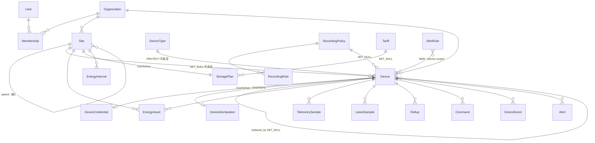

# 程式碼導覽

給要接手維護這個專案的人。目標是讓你**不必逐檔案讀原始碼**，就能知道「要改某
個東西該去哪裡改」。

內容反映的是**現在的程式碼**，不是理想狀態；還沒實作的東西會明講。行號會隨改
動漂移，所以優先用函式／類別名稱定位，行號只當粗略指引。

---

## 0. 文件地圖：先看哪一份

| 文件 | 用途 | 什麼時候看 |
| --- | --- | --- |
| [README.md](../README.md) | 專案是什麼、快速啟動、API 端點總表 | 第一次接觸 |
| [running-locally.md](running-locally.md) | 怎麼在本機跑起來、三種模式、疑難排解 | 要開始動手時 |
| **codebase-guide.md**（本文） | 資料夾結構、架構、該去哪裡改 | 要維護程式時 |
| [system-logic.md](system-logic.md) | 系統**行為規則**：分類怎麼判定、命令什麼時候被擋、哪些情況記 null | 要理解「為什麼是這樣」時 |
| [device-protocol.md](device-protocol.md) | MQTT 通訊契約：topic、payload schema | 要寫設備端韌體時 |
| [device-test-harness.md](device-test-harness.md) | 設備連線測試工具：`scripts\test-device.ps1` 一鍵自我驗證＋設備驗收 | 要測設備端連線時 |
| [device-classification.md](device-classification.md) | 設備分類與成本模型的**設計提案**（部分尚未實作） | 要做 session／成本模型時 |
| [labview-integration.md](labview-integration.md) | LabVIEW 透過 Python Node 啟停服務 | 要從 LabVIEW 控制服務時 |

**建議順序**：README → running-locally → 本文 → system-logic。

---

## 1. 專案概觀

Django 5.1 + django-ninja 後端、React 19 + Vite 前端，資料從 MQTT 進來、存成
時序資料、彙總成能源報表、由 React console 呈現。

### 1.1 四個行程

| 行程 | 進入點 | 職責 | 可否多副本 |
| --- | --- | --- | --- |
| **api** | `manage.py runserver` / `gunicorn config.wsgi` | REST API、下行命令、EMQX webhook | 可（無狀態） |
| **ingestor** | `manage.py run_ingestor` | 訂閱 MQTT、驗證 payload、丟進 queue | 可（EMQX shared subscription） |
| **worker** | `manage.py run_worker` | 從 queue 取出、批次寫 DB、跑告警規則、發通知 | 可（同一 consumer group） |
| **scheduler** | `manage.py run_scheduler` | 週期性彙總：能源區間、rollup、資料清理 | **只能一個** |

### 1.2 為什麼要分開

**ingestor 完全不碰資料庫。** 這是整個架構最重要的一條線。資料庫變慢或被鎖住
時，MQTT 消費不會停下來，queue 會吸收突發流量——否則訊息會在 broker 端被丟棄。

ingestor 只做「解析 topic、驗證 payload、丟進 queue」，worker 才做「寫入、算
規則、發通知」。兩者是不同的行程，所以中間**必須**有真的 broker：
`BUS_BACKEND=memory` 是行程內的 queue，兩個行程看不到彼此的訊息。

---

## 2. 資料從設備到畫面


### 2.1 上行（設備 → 畫面）逐步

| 步驟 | 檔案 | 做什麼 |
| --- | --- | --- |
| 1 | `services/mqtt/topics.py` | `parse()` 把 topic 拆成 `(device_id, kind)` |
| 2 | `services/ingestor/protocol.py` | 驗證 payload：時間戳、metric key、數值範圍、大小上限 |
| 3 | `apps/devices/registry.py` | TTL 快取查 `device_id` → `DeviceRef`；未註冊或 `is_enabled=False` 就丟棄 |
| 4 | `services/ingestor/main.py` | 組成 envelope，`bus.publish()` |
| 5 | `services/bus/redis_streams.py` | 寫進 Redis Stream |
| 6 | `services/worker/main.py` | `_consume_loop` 取批次，依 kind 分派 |
| 7 | `services/worker/processors.py` | 四個類別：`TelemetryProcessor` / `StatusProcessor` / `EventProcessor` / `CommandAckProcessor`。**`alarm` 與 `event` 兩個 stream 共用 `EventProcessor`**（`worker/main.py` 的 `self.processors` 對照表） |
| 8 | `apps/telemetry/policy.py` | `SampleGate` 依 recording policy 決定這筆要不要存（間隔、死區、心跳） |
| 9 | `apps/telemetry/repository.py` | `insert_samples()` / `upsert_latest()` 批次寫入 |
| 10 | `apps/alerts/engine.py` | `AlertEngine.evaluate()` 判斷是否觸發告警 |
| 11 | `apps/ems/aggregator.py` | （scheduler）`SiteAggregator` 積分成 `EnergyInterval` |
| 12 | `apps/*/api.py` | REST 端點查詢 |
| 13 | `frontend/src/lib/queries.ts` | TanStack Query 取資料 |

### 2.2 下行（命令）

**只有一條路**：`POST /api/devices/{id}/commands` →
`apps/devices/services.py::dispatch_command()` → 直接 `publish_json()` 到 MQTT。

**不經過 bus。** 所以 `dispatch_command()` 是唯一的關卡——所有安全檢查都在那裡
（見 [system-logic.md](system-logic.md) §3）。

> **注意**：`DispatchWindow` model 存在，但**沒有任何程式碼消費它**。自動調度
> 引擎尚未實作。

---

## 3. 資料夾結構

```
ZQS-Cloud/
├── manage.py                     Django 進入點
├── requirements.txt              執行相依（Django、ninja、paho-mqtt、redis…）
├── requirements-dev.txt          + pytest、ruff
├── requirements-optional.txt     RabbitMQ (pika)、PostgreSQL (psycopg)
├── docker-compose.yml            postgres / redis / emqx / api / ingestor / worker / scheduler
├── Dockerfile
├── .env / .env.example           環境設定（.env 不進版控）
│
├── config/                       Django 專案設定與 API 組裝
│   ├── env.py                    輕量環境變數讀取器，import 時載入 .env
│   ├── settings/
│   │   ├── base.py               所有共用設定（DB、bus、MQTT、cache、logging）
│   │   ├── dev.py                DEBUG、ALLOWED_HOSTS=*、CORS 全開
│   │   └── prod.py               HSTS、SSL redirect、cookie secure
│   ├── api.py                    NinjaAPI 實例、所有 router 註冊、錯誤處理
│   ├── urls.py                   /healthz 與 /api/
│   ├── wsgi.py / asgi.py
│
├── apps/                         Django app（有 model 的都在這）
│   ├── core/                     跨 app 的基礎建設
│   │   ├── models.py             TimeStampedModel / UUIDPrimaryKeyModel / SoftDeleteModel
│   │   ├── errors.py             APIError 階層（狀態碼與 code）
│   │   ├── schemas.py            Page / PageParams / paginate / TimeRangeParams
│   │   ├── middleware.py         RequestContextMiddleware（request id、使用者）
│   │   ├── logging.py            結構化 logger
│   │   ├── throttle.py           以 Django cache 為底的固定視窗限流
│   │   ├── timeutils.py          now() / UTC / floor_to_interval / parse_timestamp
│   │   ├── system_api.py         /system/health、/system/capabilities、/system/fleet
│   │   └── management/commands/  bootstrap、seed_demo、generate_history、
│   │                             simulate_device、run_ingestor、run_worker、run_scheduler
│   │
│   ├── accounts/                 租戶、使用者、角色、API key、JWT
│   │   ├── models.py             User / Organization / Membership / ApiKey / RefreshToken
│   │   ├── security.py           AuthContext、ApiAuth、role_required
│   │   ├── tokens.py             JWT 簽發與 refresh rotation
│   │   ├── permissions.py        role → permission 清單（前端用來隱藏按鈕）
│   │   └── api.py                登入、refresh、me、成員、API key
│   │
│   ├── devices/                  設備註冊表——整個系統的核心 app
│   │   ├── models.py    (935行)  Site / DeviceType / Device / DeviceCredential /
│   │   │                         DeviceDeclaration / DeviceStatusEvent / DeviceEvent / Command
│   │   ├── services.py  (699行)  dispatch_command、check_capabilities、set_lifecycle、
│   │   │                         replace_device、憑證發放
│   │   ├── api.py       (986行)  sites / blueprints / devices / commands 四個 router
│   │   ├── schemas.py            所有 ninja Schema
│   │   ├── registry.py           device_id → DeviceRef 的 TTL 快取（ingest 熱路徑）
│   │   └── emqx.py               EMQX auth / ACL webhook
│   │
│   ├── telemetry/                metric 目錄、記錄政策、時序資料
│   │   ├── models.py             Metric / RecordingPolicy / RecordingRule /
│   │   │                         TelemetrySample / LatestSample / Rollup
│   │   ├── repository.py (370行) 所有非 ORM 的 SQL（分桶、upsert、rollup）
│   │   ├── policy.py             PolicyResolver / SampleGate（決定哪筆樣本要存）
│   │   ├── catalog.py            metric 定義的 TTL 快取
│   │   ├── energy.py             GAUGE 積分 / COUNTER 差值 / counter reset 處理
│   │   └── api.py                metrics / recording-policies / telemetry 三個 router
│   │
│   ├── ems/                      表後儲能（BTM）
│   │   ├── models.py             EnergyAsset / StoragePlan / Tariff /
│   │   │                         EnergyInterval / DispatchWindow
│   │   ├── aggregator.py         SiteAggregator：功率積分 → EnergyInterval
│   │   ├── rollup.py             跨場域彙總（同時尖峰、加權比率）
│   │   ├── tariffs.py            時段電價解析
│   │   └── api.py                資產、儲能策略、電價、概覽、區間、重算
│   │
│   ├── alerts/                   告警規則引擎
│   │   ├── models.py             AlertRule / Alert / AlertEvent / NotificationChannel
│   │   ├── engine.py     (491行) RuleCache、遲滯、持續時間、冷卻、自動解除
│   │   └── api.py                規則、告警生命週期、通知管道
│   │
│   └── audit/                    操作者稽核軌跡
│       ├── models.py             AuditLog / AuditAction（穩定的 action key）
│       ├── services.py           record() —— 唯一的寫入入口
│       └── api.py                查詢與可用 action 清單
│
├── services/                     非 Django 程式碼（常駐服務與抽象層）
│   ├── bus/                      訊息匯流排抽象
│   │   ├── base.py               MessageBus 介面、BusMessage、BusError
│   │   ├── factory.py            build_bus() 依 BUS_BACKEND 選後端、get_bus() 單例
│   │   ├── streams.py            stream 名稱與前綴
│   │   ├── redis_streams.py      預設後端（consumer group、claim、dead letter）
│   │   ├── rabbitmq.py           替代後端
│   │   └── memory.py             行程內佇列（開發用，跨行程無效）
│   ├── mqtt/
│   │   ├── topics.py             topic 文法——訂閱、發布、ACL 都以此為準
│   │   ├── client.py             會重連的 paho-mqtt 包裝
│   │   └── publisher.py          下行命令發布（行程層級單例）
│   ├── ingestor/
│   │   ├── main.py               訂閱、分派、統計
│   │   └── protocol.py           payload 驗證（時間戳、metric、範圍、大小）
│   ├── worker/
│   │   ├── main.py               消費迴圈、批次分派、reclaim、維護與通知迴圈
│   │   ├── processors.py (627行) 五種訊息各自的處理器
│   │   ├── maintenance.py        離線判定、命令逾時
│   │   └── notifications.py      email / webhook 送出
│   └── labview/
│       └── labview_api.py        給 LabVIEW Python Node 的非阻塞行程控制
│
├── tests/                        全部測試（294 個）
│   ├── factories.py              organization / user / site / blueprint / device
│   ├── test_api.py               ApiTestCase 基底（登入、JSON 請求輔助）
│   └── test_*.py                 各主題
│
├── scripts/                      dev.ps1 / dev.sh / stop.ps1
├── deploy/emqx/                  EMQX webhook 設定說明
├── docs/                         本文與其他文件
├── locale/                       Django 翻譯（.po）
├── data/                         SQLite 檔（不進版控）
└── frontend/                     React console
```

### 3.1 前端

```
frontend/
├── package.json                  React 19 / Vite 6 / Tailwind 4 / TanStack Query
├── vite.config.ts                dev server host、/api proxy、build 分塊
├── tsconfig*.json                strict TypeScript，@/ 別名指向 src/
└── src/
    ├── main.tsx                  掛載、QueryClient、各 Provider
    ├── App.tsx                   所有路由定義（見 §5.2）
    ├── index.css                 Tailwind 與 CSS 變數（主題色）
    ├── lib/
    │   ├── api.ts       (229行)  fetch 包裝、token 存放、single-flight refresh
    │   ├── queries.ts   (760行)  所有 useQuery / useMutation
    │   ├── types.ts     (770行)  對應後端 Schema 的 TypeScript 型別
    │   ├── errors.ts             errorMessage() / fieldErrors()
    │   ├── format.ts             日期、數值、單位格式化
    │   └── useTimeRange.ts       時間範圍選擇器的共用 hook
    ├── providers/
    │   ├── AuthProvider.tsx      me、can(permission)、登入登出
    │   ├── ThemeProvider.tsx     淺色／深色
    │   └── ToastProvider.tsx     全域提示
    ├── components/
    │   ├── ui/                   Button / Card / Field / Modal / Table / Badge…
    │   ├── layout/               AppShell / Sidebar / TopBar
    │   └── charts/               TimeSeriesChart / EnergyCharts / PowerFlowDiagram
    ├── pages/                    每個路由一個檔案
    └── i18n/
        ├── index.ts              i18next 設定、語言代碼正規化
        └── locales/              en.ts / zh-Hant.ts / zh-Hans.ts（各約 610 行）
```

---

## 4. 後端逐層

### 4.1 `config/` —— 設定與環境變數

**分層**：`base.py`（共用）← `dev.py` 或 `prod.py`（覆寫）。
由 `DJANGO_SETTINGS_MODULE` 決定，`manage.py` 預設 `config.settings.dev`。

**環境變數載入順序（重要）**：

```python
# config/env.py
load_dotenv(BASE_DIR / ".env", override=False)
```

`override=False` 代表**已存在於 `os.environ` 的值優先**，`.env` 只補沒設的。
實務影響：

- `scripts/dev.ps1` 設 `$env:BUS_BACKEND='memory'` → 蓋過 `.env` 的 `redis`
- `.vscode/launch.json` 的 `env` 區塊同理（在 Python 啟動前就寫進行程環境）
- `dev.py` 裡「環境變數沒設就降成 memory」那段**不會生效**，因為 `.env` 明確
  寫了 `BUS_BACKEND=redis`

`dev.py` 另外做兩件事：`ALLOWED_HOSTS = ["*"]`、把本機所有 IPv4 加進
`CSRF_TRUSTED_ORIGINS`（讓手機用區網 IP 連進來時 admin 也能用）。

### 4.2 各 app 的職責與主要 model

#### `apps/core`

沒有自己的 model 表，提供基底類別與跨 app 工具：

| 東西 | 用途 |
| --- | --- |
| `TimeStampedModel` | `created_at` / `updated_at` |
| `UUIDPrimaryKeyModel` | UUID 主鍵 |
| `SoftDeleteModel` | `deleted_at` + `soft_delete()` / `restore()` |
| `errors.py` | `APIError` 子類，每個帶固定 `status_code` 與 `code` |
| `schemas.py` | `Page[T]` / `PageParams` / `paginate()` / `TimeRangeParams` |
| `timeutils.py` | `now()`、`UTC`、`floor_to_interval()`、`parse_timestamp()` |

#### `apps/accounts`

| Model | 說明 |
| --- | --- |
| `User` | 自訂 user model（`AUTH_USER_MODEL`），以 email 登入 |
| `Organization` | 租戶邊界。**每個 device / site / alert 都屬於恰好一個** |
| `Membership` | user × organization × role |
| `ApiKey` | 機器帳號，前綴 + 雜湊 |
| `RefreshToken` | 支援 rotation 與重用偵測 |

`Role`：`owner`(40) > `admin`(30) > `operator`(20) > `viewer`(10)。
`permissions.py` 把 role 展開成 permission 清單，前端據以隱藏按鈕。

#### `apps/devices` —— 核心

| Model | 說明 |
| --- | --- |
| `Site` | 場域，**自我參照樹**（`parent`，最深 6 層） |
| `DeviceType` | blueprint：型號、category、命令目錄、能力預設值 |
| `Device` | 設備本體。`device_id` **全平台唯一**（MQTT topic 區段） |
| `DeviceCredential` | MQTT 帳密（`OneToOne`），密碼只顯示一次 |
| `DeviceDeclaration` | 設備自報的屬性（`OneToOne`）。**不可信，不進控制判斷** |
| `DeviceStatusEvent` | 連線狀態轉換歷史 |
| `DeviceEvent` | 設備自報的操作／診斷記錄 |
| `Command` | 下行命令與其生命週期 |

關鍵函式都在 `services.py`：

| 函式 | 用途 |
| --- | --- |
| `dispatch_command()` | **唯一**的命令出口，所有安全檢查在此 |
| `check_capabilities()` | 依「命令名稱 + 參數值」判斷需要哪些能力 |
| `set_lifecycle()` | 切換生命週期，**同步 `is_enabled`** |
| `replace_device()` | 單一交易內完成設備替換 |
| `assert_free_of_energy_bindings()` | 退役／暫停前檢查能源綁定 |

#### `apps/telemetry`

| Model | 說明 |
| --- | --- |
| `Metric` | metric 定義：單位、`kind`(gauge/counter/state)、`aggregation` |
| `RecordingPolicy` / `RecordingRule` | 哪些 metric 要存、多久存一次、死區、保留期 |
| `TelemetrySample` | 長表：一列一個 device×metric×ts |
| `LatestSample` | 每個 device×metric 的當前值（儀表板熱路徑） |
| `Rollup` | 預聚合桶（device×metric×interval×bucket_start） |

`repository.py` 是**唯一有手寫 SQL 的地方**，依 `connection.vendor` 分支處理
SQLite 與 PostgreSQL 的差異（時間分桶、upsert）。

#### `apps/ems`

| Model | 說明 |
| --- | --- |
| `EnergyAsset` | **量測綁定**：哪台設備的哪個 metric 供應哪條能量流 |
| `StoragePlan` | 每個場域一份（`OneToOne`）：策略、契約容量、SOC 界線 |
| `Tariff` | 時段電價 |
| `EnergyInterval` | 15 分鐘結算區間，**per Site** |
| `DispatchWindow` | 排程指令（**目前無人消費**） |

#### `apps/alerts`

`AlertRule`（scope: organization / site / device_type / device）→ `AlertEngine`
在 worker 裡逐筆評估 → `Alert` 生命週期（firing / acknowledged / resolved）→
`NotificationChannel` 送出。

`engine.py` 處理的細節：遲滯（`hysteresis`）、持續時間（`for_duration_seconds`）、
冷卻（`cooldown_seconds`）、自動解除、fingerprint 去重。

#### `apps/audit`

`AuditLog` 記錄**操作者做了什麼**（不是設備做了什麼——那是 `DeviceEvent`）。
唯一寫入入口是 `apps/audit/services.py::record()`。
`AuditAction` 的註解寫得很明白：**action key 是穩定的，永遠不要就地改字**。

### 4.3 Model 關聯圖



**幾個容易搞錯的關聯**：

- `Device.site` 是 **nullable**（`SET_NULL`）→ 一定會有「未分組」設備
- `Device.device_type` 是 **nullable** → 可能沒有 blueprint、沒有命令目錄、
  沒有能力檢查
- `EnergyAsset` 同時指向 `Site` 與 `Device`，是三方綁定
- `Metric` 沒有 FK 指向 `TelemetrySample`——樣本只存 `metric_key` 字串，
  metric 定義是查表用的，刪掉定義不會影響已存的資料

### 4.4 API 怎麼組裝

**單一 `NinjaAPI` 實例**在 `config/api.py`，所有 router 在那裡註冊：

```python
api = NinjaAPI(auth=api_auth, renderer=ORJSONRenderer(), csrf=False)
api.add_router("/sites", sites_router)
api.add_router("/devices", devices_router)
...
```

Router 定義在各 app 的 `api.py`（`apps/core/system_api.py` 與
`apps/devices/emqx.py` 是例外，各自有 router）：

| Router 變數 | 掛載路徑 | 檔案 |
| --- | --- | --- |
| `router`(auth) / `org_router` / `member_router` / `apikey_router` | `/`、`/organizations`、`/members`、`/api-keys` | `apps/accounts/api.py` |
| `sites_router` / `blueprints_router` / `devices_router` / `commands_router` | `/sites`、`/blueprints`、`/devices`、`/commands` | `apps/devices/api.py` |
| `metrics_router` / `policies_router` / `series_router` | `/metrics`、`/recording-policies`、`/telemetry` | `apps/telemetry/api.py` |
| `rules_router` / `alerts_router` / `channels_router` | `/alert-rules`、`/alerts`、`/notification-channels` | `apps/alerts/api.py` |
| `router`(audit) | `/audit` | `apps/audit/api.py` |
| `router`(ems) | `/ems` | `apps/ems/api.py` |
| `router`(system) | `/system` | `apps/core/system_api.py` |
| `router`(emqx) | `/emqx` | `apps/devices/emqx.py` |

**認證**：`NinjaAPI(auth=api_auth)` 是全域預設，`api_auth` 是
`apps/accounts/security.py::ApiAuth`（Bearer JWT 或 `ApiKey` 前綴）。
成功後 `request.auth` 是 `AuthContext`（帶 `organization`、`user`、`role`）。

**權限**：端點層級用 `auth=role_required(Role.ADMIN)` 覆寫。
函式內臨時檢查用 `ctx.require(Role.OPERATOR)`。

```python
@devices_router.post("", response={201: s.DeviceCreatedOut}, auth=role_required(Role.ADMIN))
def create_device(request, payload: s.DeviceIn, issue_credential: bool = True):
    ctx: AuthContext = request.auth
```

**錯誤契約**：所有錯誤都經過 `config/api.py` 的 exception handler，輸出

```json
{"error": {"code": "site_in_use", "message": "...", "details": {...}}}
```

拋 `apps/core/errors.py` 的子類即可，狀態碼由類別決定。

**認證豁免**：`auth=None`（例如 `/system/health`、EMQX webhook）。

### 4.5 `services/` —— 非 Django 程式碼

放在 `apps/` 之外的理由：這些是**常駐行程與外部協定的抽象**，不是資料模型。
它們可以 import Django（都在 Django 環境下跑），但反向依賴應該避免。

**`services/bus/`** —— 訊息匯流排

```python
# services/bus/factory.py
build_bus()   # 依 settings.BUS_BACKEND 建立新實例（redis / rabbitmq / memory）
get_bus()     # 行程層級單例；memory 後端**必須**靠這個才能收發
```

`MessageBus` 介面（`base.py`）：`connect` / `publish` / `ensure_group` /
`consume` / `ack` / `nack` / `dead_letter` / `depth` / `health`。

要加新後端：實作介面 → 在 `factory.py` 加分支。

**`services/mqtt/topics.py`** 是 topic 的唯一真相來源。ingestor 的訂閱、API 的
發布、EMQX 的 ACL 都由它導出，所以三者不可能不一致。

**`services/labview/labview_api.py`** 與其他不同：它是給 LabVIEW Python Node
呼叫的**行程管理器**，只用標準函式庫、不 import Django。詳見
[labview-integration.md](labview-integration.md)。

---

## 5. 前端

### 5.1 資料流

```
元件 → useXxx()（queries.ts）→ api.get/post（api.ts）→ /api/... → 後端
```

`api.ts` 負責：token 存 localStorage、每次請求帶
`Authorization` 與 `X-Organization`、401 時**single-flight refresh**（多個並行
請求只會觸發一次 refresh，否則會燒掉多個 refresh token 觸發重用偵測）。

### 5.2 路由

全部定義在 `frontend/src/App.tsx`。`RequireAuth` 包住所有需要登入的路由。
`MapPage` / `StoragePage` / `TelemetryPage` 用 `lazy()` 載入（Leaflet 與
Recharts 很重）。

| 路徑 | 頁面 |
| --- | --- |
| `/login` | LoginPage |
| `/` | DashboardPage |
| `/devices`、`/devices/:deviceId` | DevicesPage、DeviceDetailPage |
| `/map` | MapPage（lazy） |
| `/alerts` | AlertsPage |
| `/storage` | StoragePage（lazy） |
| `/telemetry` | TelemetryPage（lazy） |
| `/sites` | SitesPage |
| `/recording` | RecordingPage |
| `/rules` | RulesPage |
| `/audit` | AuditPage |
| `/settings` | SettingsPage |

### 5.3 TanStack Query 慣例

`queries.ts` 開頭有 `keys` 物件集中管理所有 query key，讓 mutation 能精準
invalidate：

```typescript
export const keys = {
  devices: (params: unknown) => ['devices', params] as const,
  device: (id: string) => ['devices', 'detail', id] as const,
  ...
}
```

Refetch 間隔依資料變動速度分兩級：

```typescript
export const LIVE_REFETCH_MS = 15_000   // 列表、統計
export const FAST_REFETCH_MS = 5_000    // 單一設備的即時值
```

註冊表類資料（sites、blueprints、metrics）不自動 refetch，只在 mutation 後
invalidate。

### 5.4 i18n

三個語言檔結構完全相同，**`en.ts` 是型別來源**——另外兩個少一個 key 就會
typecheck 失敗。這是刻意的，避免漏翻譯。

中文沒有複數形，但因為型別對齊，`_other` 這種 key 在中文檔也要有（值可以
一樣）。

### 5.5 共用元件

`frontend/src/components/ui/index.ts` 匯出全部：`Button` / `IconButton` / `Card` /
`CardHeader` / `CardBody` / `DetailRow` / `PageHeader` / `Badge` /
`ConnectionBadge` / `SeverityBadge` / `Field` / `TextInput` / `TextArea` /
`Select` / `Checkbox` / `SegmentedControl` / `Table` 系列 / `Modal` /
`ConfirmDialog` / `EmptyState` / `ErrorState` / `LoadingState` / `Skeleton` /
`StatTile` / `MeterBar` / `Pagination`。

---

## 6. 常見維護任務：該去哪裡改

### 6.1 新增一個 API endpoint

1. `apps/<app>/schemas.py` — 定義 `XxxIn` / `XxxOut`
2. `apps/<app>/api.py` — 在既有 router 上加函式，需要權限就加
   `auth=role_required(Role.ADMIN)`
3. 若是全新的 router：在 `config/api.py` 加 `api.add_router(...)`
4. `tests/test_*.py` — 加測試（用 `tests/test_api.py::ApiTestCase` 當基底）
5. `frontend/src/lib/types.ts` — 加對應型別
6. `frontend/src/lib/queries.ts` — 加 hook
7. `README.md` 的端點總表（重要端點才需要）

### 6.2 新增一個 model 欄位

1. `apps/<app>/models.py` — 加欄位，**盡量 nullable 或有 default**
2. `python manage.py makemigrations <app>`
3. **把產生的檔名改成有意義的名字**（例如
   `0007_device_warranty.py`），既有的 migration 都是這樣命名的
4. 若既有資料需要轉換，在 migration 裡加 `migrations.RunPython`，
   並**同時寫 backwards 函式**（參考
   `apps/devices/migrations/0006_device_lifecycle.py`）
5. `apps/<app>/schemas.py` — 若要對外露出
6. `frontend/src/lib/types.ts` — 同步型別
7. `python manage.py makemigrations --check --dry-run` 確認沒有漏

### 6.3 新增一種設備類別

1. `apps/devices/models.py::DeviceCategory` — 加 choices 值
2. **同一檔案的 `CATEGORY_CAPABILITIES`** — 加四個能力旗標的預設值
   （漏了會 fallback 到 `OTHER`）
3. 若它是純量測用途，`is_metering_only()` 的集合也要加
4. `apps/core/management/commands/bootstrap.py` — 若要提供內建 blueprint，
   加進 `BUILTIN_DEVICE_TYPES`
5. `makemigrations`（choices 改變會產生 `AlterField`，不需要 data migration）
6. `frontend/src/lib/types.ts` 若有列舉型別
7. i18n 三個語言檔的類別名稱
8. `docs/device-protocol.md` §3.7 的 `category` 清單
9. `docs/system-logic.md` §1.1 的類別清單與 §1.2 的能力預設表

### 6.4 新增一個 metric

**內建 metric**（所有租戶共用）：

1. `apps/core/management/commands/bootstrap.py::BUILTIN_METRICS` — 加一列
   tuple（key、顯示名、單位、value_type、kind、aggregation、min、max、
   category、繁中、簡中）
2. `python manage.py bootstrap --update-existing`
3. 若是累計計數器且知道溢位上限，順便設 `Metric.counter_max`
4. `docs/device-protocol.md` §7 的內建 metric 表

**租戶自訂 metric**：不用改程式，走 `POST /api/metrics`。

### 6.5 新增一個前端頁面

1. `frontend/src/pages/XxxPage.tsx` — 新檔案
2. `frontend/src/App.tsx` — 加 `<Route path="xxx" element={<XxxPage />} />`
   （若相依很重就用 `lazy()`）
3. `frontend/src/components/layout/Sidebar.tsx` — 加導覽項目與圖示
4. i18n 三語加 `xxx.title` / `xxx.subtitle` 等
5. 需要新資料就先做 §6.1

### 6.6 新增一種告警規則條件

1. `apps/alerts/models.py::Operator` — 加運算子 choices
   （現有：`gt` / `gte` / `lt` / `lte` / `eq` / `neq` / `outside` / `inside` /
   `no_data` / `offline`）
2. `apps/alerts/engine.py::breaches()` 與 `clears()` — 加判斷分支
   （**兩個都要**，否則告警觸發後解不掉）
3. `apps/alerts/schemas.py` — 若參數形狀不同
4. `tests/test_alerts.py` — 加測試，含觸發與解除兩個方向
5. `frontend/src/pages/RulesPage.tsx` — 編輯器的選項
6. i18n 三語的運算子名稱

### 6.7 新增一個成本模型（尚未實作，設計已定）

設計見 [device-classification.md](device-classification.md) §3.12。預定結構：

1. 建立 `apps/ems/costs/` 套件：`base.py`（`CostModel` 介面、`CostContext`、
   `CostResult`、registry）
2. `apps/ems/costs/<name>.py` — 用 `@register("key")` 註冊
3. `apps/ems/costs/__init__.py` — import 該模組以觸發註冊
4. `EnergyAsset.cost_model` 欄位 + migration
5. `apps/ems/aggregator.py::compute_interval()` — 改為查註冊表
6. `EnergyIntervalCost` 新 model（分項成本）

> **注意**：這一節描述的是**尚未實作**的計畫。目前 `compute_interval()` 只認得
> 市電電價一種成本。

### 6.8 加一個翻譯字串

1. `frontend/src/i18n/locales/en.ts` — 加 key（**先加這個**，它是型別來源）
2. `zh-Hant.ts` 與 `zh-Hans.ts` — 加同一個 key
3. `npm run typecheck` 會抓出漏掉的語言

後端訊息（Django `gettext`）走 `locale/*.po`，改完要
`manage.py compilemessages`。但**大部分使用者可見的字串都在前端**，後端只回
穩定的錯誤 `code`，由前端翻譯。

### 6.9 新增一個 UI 術語提示

介面上的專有名詞（SOC、契約容量、LWT…）滑鼠移上去或點一下會跳出說明氣泡。
全部詞條集中在**一個檔案**：

**`frontend/src/lib/glossary.ts`**

#### 加一個詞條

在 `GLOSSARY` 裡加一筆：

```ts
  myTerm: {
    abbr: 'DoD',                    // 可省略，只有縮寫才填
    expansion: 'Depth of Discharge', // 英文全名，永遠不翻譯
    unit: '%',                      // 可省略
    label: {
      en: 'Depth of discharge',
      'zh-Hant': '放電深度',
      'zh-Hans': '放电深度',
    },
    definition: {
      en: '…',
      'zh-Hant': '…',
      'zh-Hans': '…',
    },
  },
```

然後在**該名詞第一次出現的標籤**上包起來：

```tsx
import { Term } from '@/components/ui'

<DetailRow label={<Term id="myTerm">{t('storage.dod')}</Term>}>
<Th><Term id="myTerm">{t('storage.dod')}</Term></Th>
<Term id="myTerm" />   {/* 沒有 children 時直接顯示詞條名稱 */}
```

#### 為什麼術語不放在 `i18n/locales/`

其他字串都在 i18n 檔案裡，術語表刻意是例外。一個詞條不是三個獨立字串，是
**同一段解釋的三個語言版本**——放在一起才看得出來簡體版是不是把繁體版逐字轉
過去的（`光伏` 不是 `太陽光電`、`固件` 不是 `韌體`、`分时电价` 不是
`時間電價`）。拆成三個檔案，這種錯誤根本看不見。

#### 標註密度規則

**只標在「標籤」上，不標在「數值」上。**

- ✅ 表格欄位標題、`StatTile` 的 label、`Field` 的 label、卡片標題
- ✅ 分類型的狀態徽章（生命週期、能力旗標）——「suspended 是什麼意思」正是
  在那裡被問的
- ❌ 每一列的數值、內文敘述、同一頁重複出現的第二次以後

理由：使用者問的是「這個欄位是什麼」，不是「這個數字是什麼」。如果每一列都
加虛線底線，一個 50 列的表格就會有 50 條底線，提示就變成雜訊，真正需要看的
那一個反而被淹沒。

#### 有哪些檢查會擋下錯誤

| 檢查 | 誰做的 | 抓什麼 |
| --- | --- | --- |
| 三種語言都要有 | TypeScript | 少填一個語言就編譯不過 |
| `<Term id="…">` 的 id 存在 | TypeScript | 打錯字編譯不過 |
| 簡體版不是繁體版的複製 | `tests/test_glossary.py` | 兩邊定義字串完全相同 |
| 簡體版沒有台灣用語 | `tests/test_glossary.py` | 韌體／軟體／程式／資料… |
| 定義不是半成品 | `tests/test_glossary.py` | 太短的定義 |
| 沒有孤兒詞條 | `tests/test_glossary.py` | 加了詞條但沒有任何頁面用到 |

最後一項如果詞條**刻意**不出現在 UI（例如 `qos`、`retained` 只出現在設備
協定文件裡），把 id 加進 `tests/test_glossary.py` 的 `REFERENCE_ONLY`，並在
那裡說明原因。

---

## 7. 開發流程與慣例

### 7.1 跑起來

見 [running-locally.md](running-locally.md)。這裡不重複。

VS Code 一鍵啟動：`.vscode/launch.json` 的 compound
「ZQS: 全部啟動 (API + 前端)」。

### 7.2 測試、lint、typecheck

```bash
python manage.py test tests           # 294 個測試，約 30 秒
python -m ruff check apps/ services/ tests/
cd frontend && npm run typecheck
```

三個都要綠。CI 沒有設定，所以這是提交前的自檢清單。

測試用 `unittest.TestCase` 風格（Django test runner），不是 pytest fixture
風格——雖然 `requirements-dev.txt` 裝了 pytest，實際跑的是
`manage.py test`。共用建構器在 `tests/factories.py`。

### 7.3 命名慣例

| 對象 | 慣例 | 例 |
| --- | --- | --- |
| Model | 單數名詞 | `Device`、`EnergyInterval` |
| `db_table` | `<app>_<model_snake>` | `devices_site`、`ems_energy_asset` |
| Metric key | 小寫 snake_case，帶單位後綴 | `battery_power_w`、`pv_energy_kwh` |
| Schema | `XxxIn`（輸入）/ `XxxOut`（輸出） | `SiteIn` / `SiteSummaryOut` |
| Router 變數 | `<資源>_router` | `devices_router` |
| Service 函式 | 動詞開頭 | `dispatch_command`、`set_lifecycle` |
| Migration 檔名 | `NNNN_有意義的名字` | `0006_device_lifecycle` |
| 測試方法 | `test_<敘述句>` | `test_a_retired_device_refuses_dispatch` |

### 7.4 錯誤碼慣例

格式是 **`<名詞>_<狀態>`** 的 snake_case，穩定不改字（前端據以翻譯）：

```
site_in_use            場域仍有設備
site_has_children      場域仍有子場域
device_in_energy_model 設備仍被能源模型綁著
device_retired         設備已退役
capability_not_supported 設備沒有該能力
counter_reset          計數器倒退
```

`details` 放結構化資訊給前端用（例如是哪幾筆綁定），不要塞給人看的句子。

### 7.5 什麼時候要寫 audit log

寫入 `AuditLog` 的判準：**這是不是一個「人」做的、會改變狀態的決定。**

| 要寫 | 不要寫 |
| --- | --- |
| 建立／修改／刪除設備、場域、規則 | 查詢類操作 |
| 下發命令、取消命令 | 設備自己回報的事件（→ `DeviceEvent`） |
| 生命週期變更、接受宣告 | 排程器的例行彙總 |
| 成員與 API key 管理 | 告警觸發（→ `Alert` 自己有歷史） |

```python
from apps.audit.services import record
record(AuditAction.DEVICE_RETIRED, ctx=ctx, target=device, payload={...})
```

新增 action 就在 `AuditAction` 加值——**永遠不要改既有的字串值**，那是穩定
key（model 的註解也這麼寫）。

### 7.6 Migration 注意事項

- **新欄位盡量 nullable 或有 default**，這樣就不需要 data migration
- 需要轉換既有資料時用 `RunPython`，**一定要寫 backwards**
- 改 choices 只會產生 `AlterField`，不影響資料
- 產生後**改檔名**成有意義的名字
- 套用前先在資料庫副本上試跑一次
- 提交前跑 `makemigrations --check --dry-run` 確認 model 與 migration 同步

---

## 8. 容易踩的坑

這一節是踩過的坑，每一條都有實際的錯誤後果。

### 8.1 `device_id` 全平台唯一且不可重用

`Device.device_id` 是 `unique=True`，而且**不是 per-tenant**——因為 topic
`energy/devices/{device_id}/...` 不含租戶區段，光靠 id 就必須解析出擁有者。

這個唯一性是資料庫層級約束，**不看 `deleted_at` 也不看退役狀態**。所以退役的
設備永遠占著自己的識別碼，接替設備必須換新的。

### 8.2 `is_enabled` 不要手動設

它是 ingest 路徑（ingestor、worker、EMQX auth webhook）唯一讀的欄位。現在由
`apps/devices/services.py::set_lifecycle()` 依生命週期同步。手動改會讓
「已退役」和「可以連線」互相矛盾。

### 8.3 設備宣告不可信，不得進入控制判斷

`DeviceDeclaration` 是設備自報的。`check_capabilities()` **只讀 `Device` 上的
能力欄位**，絕不查宣告。`tests/test_device_declarations.py::TrustBoundaryTests`
就是釘住這件事的——有人把宣告值接進判斷式時它會失敗。

### 8.4 `include_in_balance` 與重複計算

一個 `EnergyAsset` 只有 `include_in_balance=True` 才進場域能量平衡。總表加分表
都設 `True` 會讓數字翻倍，而且**不會有任何錯誤訊息**。判準見
[system-logic.md](system-logic.md) §2.2。

### 8.5 跨場域尖峰不可相加

兩個場域各自尖峰 300 kW，不代表合起來 600 kW——除非它們同時尖峰。正確做法是
先在同一時間區間內相加，再取最大值。`apps/ems/rollup.py::coincident_peaks()`
就是做這件事，回應的 `peak_basis` 會標示。

比率（自用率、自給率、往返效率）同理：**分子分母各自加總後再除，不是平均**。

### 8.6 counter 倒退記 `null` 不記 0

累計計數器倒退可能是換表、韌體重置或溢位，三者無法從數字分辨。除非
`Metric.counter_max` 有值，否則 `apps/telemetry/energy.py::counter_delta()`
回 `None`。**把未知填成 0 會讓月報悄悄短少一段。**

### 8.7 memory bus 跨行程無效

`BUS_BACKEND=memory` 是行程內的 `deque`，producer 和 consumer 必須是同一個
Python 物件（靠 `get_bus()` 的單例）。`run_ingestor` 和 `run_worker` 是兩個
行程，用 memory 等於沒有 queue。`dev.ps1 -Full` 會強制切成 redis。

### 8.8 `.env` 與環境變數優先順序

`load_dotenv(override=False)`：**已設的環境變數優先**。所以
`$env:BUS_BACKEND='memory'` 或 launch.json 的 `env` 會蓋過 `.env`。

### 8.9 registry 是 TTL 快取

`apps/devices/registry.py` 快取 `device_id → DeviceRef`，TTL 是
`WORKER["REGISTRY_CACHE_TTL_S"]`（預設 30 秒）。**新建的設備在快取過期前是
看不見的**——所以建立、刪除、生命週期變更之後都要
`get_registry().invalidate()`。測試裡也要記得叫它。

### 8.10 積分是前值保持不是梯形法

`integrate_power()` 假設每個樣本的值保持到下一個樣本。對突變負載有系統性偏差。
`coverage` 欄位是品質指標，低於 0.8 的區間不該被當成確定的數字。

### 8.11 `DispatchWindow` 沒有人消費

model 的 docstring 說「scheduler turns these into device commands」，但**那段
程式碼不存在**。`StoragePlan` 的 `max_charge_kw`、`backup_reserve_percent`
等也只有 API 層的一致性驗證，執行期沒有任何地方強制。

### 8.12 前端 `en.ts` 是型別來源

三個語言檔的結構必須完全相同。少一個 key 就 typecheck 失敗——這是刻意的。

### 8.13 示範帳號的密碼寫在版控裡

`admin@example.com` / `ChangeMe-2026!` 出現在 `seed_demo.py`、`README.md`、
`docs/running-locally.md`、`scripts/dev.ps1`、`scripts/dev.sh`。本機開發沒問題，
但如果這台機器對外開放，那就是一個公開已知帳密的 owner 帳號。

---

## 9. 目前的已知缺口

誠實列出，免得你以為某個東西已經能用：

| 東西 | 狀態 |
| --- | --- |
| 自動調度引擎（`DispatchWindow` → 命令） | **未實作** |
| `StoragePlan` 的運轉限制執行期強制 | **未實作**（只有 API 層驗證） |
| 運轉 session（最後一次充放電） | **僅設計**，見 device-classification.md §3.11 |
| 多來源成本模型（電池循環、柴發油耗） | **僅設計**，見 §3.12 |
| 個別設備耗能的 API 端點 | 計算函式已就緒（`apps/telemetry/energy.py`），端點未做 |
| 權限綁場域（某人只能看某廠） | **未實作**，權限只有 org × role 兩維 |
| CI | 沒有設定，靠人工跑 §7.2 那三個指令 |
