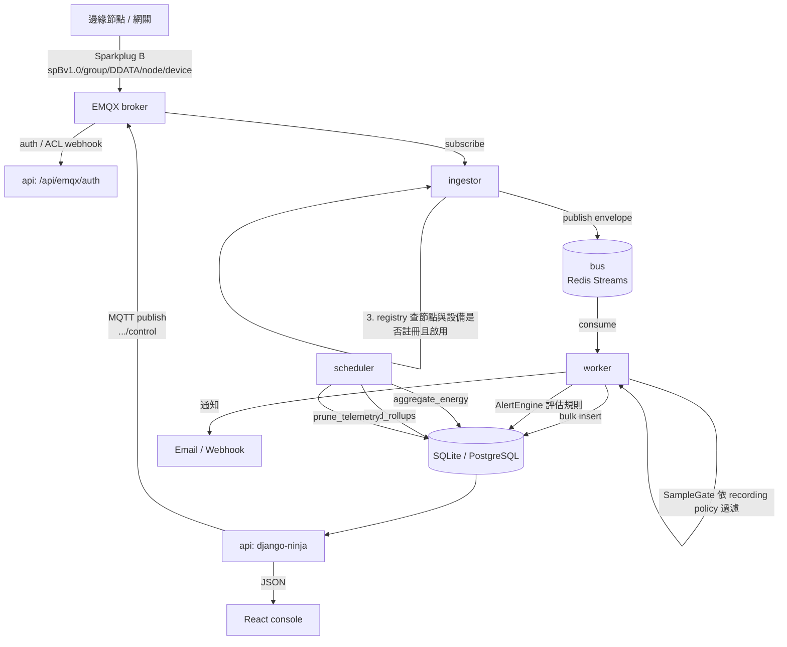
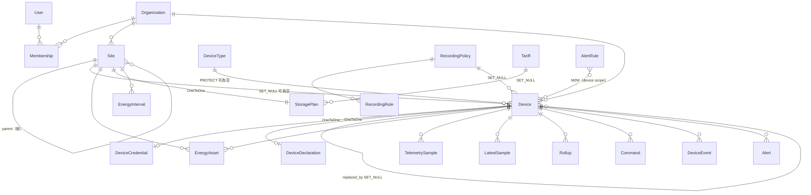

# 程式碼導覽

給要接手維護這個專案的人。目標是讓你**不必逐檔案讀原始碼**，就能知道「要改某
個東西該去哪裡改」。

內容反映的是**現在的程式碼**，不是理想狀態；還沒實作的東西會明講。行號會隨改
動漂移，所以優先用函式／類別名稱定位，行號只當粗略指引。

---

## 0. 文件地圖：先看哪一份

| 文件 | 用途 | 什麼時候看 |
| --- | --- | --- |
| [README.md](../README.md) | 專案是什麼、快速啟動、API 端點總表 | 第一次接觸 |
| [running-locally.md](running-locally.md) | 怎麼在本機跑起來、三種模式、疑難排解 | 要開始動手時 |
| **codebase-guide.md**（本文） | 資料夾結構、架構、該去哪裡改 | 要維護程式時 |
| [system-logic.md](system-logic.md) | 系統**行為規則**：分類怎麼判定、命令什麼時候被擋、哪些情況記 null | 要理解「為什麼是這樣」時 |
| [device-protocol.md](device-protocol.md) | **Sparkplug B** 通訊契約：三層位址、protobuf payload、生死流程、離線判定、憑證與 ACL。**這份是給設備開發商的** | 要寫設備端韌體時 |
| [device-test-harness.md](device-test-harness.md) | 設備連線測試工具：`scripts\test-device.ps1` 一鍵自我驗證＋設備驗收 | 要測設備端連線時 |
| [device-classification.md](device-classification.md) | 設備分類、session 與成本模型的**設計論述**（現已實作，此文說明為什麼這樣設計） | 要動 session／成本模型時 |
| [labview-integration.md](labview-integration.md) | LabVIEW 透過 Python Node 啟停服務 | 要從 LabVIEW 控制服務時 |

**建議順序**：README → running-locally → 本文 → system-logic。

---

## 1. 專案概觀

Django 5.1 + django-ninja 後端、React 19 + Vite 前端，資料從 MQTT 進來、存成
時序資料、彙總成能源報表、由 React console 呈現。

### 1.1 四個行程

| 行程 | 進入點 | 職責 | 可否多副本 |
| --- | --- | --- | --- |
| **api** | `manage.py runserver` / `gunicorn config.wsgi` | REST API、下行命令、EMQX webhook | 可（無狀態） |
| **ingestor** | `manage.py run_ingestor` | 訂閱 MQTT、驗證 payload、丟進 queue | 可（EMQX shared subscription） |
| **worker** | `manage.py run_worker` | 從 queue 取出、批次寫 DB、跑告警規則、發通知 | 可（同一 consumer group） |
| **scheduler** | `manage.py run_scheduler` | 週期性彙總：能源區間、rollup、資料清理 | **只能一個** |

開發時另有兩個行程，只為了讓上面這四個不必先裝 Docker 就能跑通：
`run_broker`（內建 MQTT broker）與 `run_pipeline`（ingestor + worker 同行程）。
兩者都不可用於正式環境，見 §8.11D。

### 1.2 為什麼要分開

**ingestor 完全不碰資料庫。** 這是整個架構最重要的一條線。資料庫變慢或被鎖住
時，MQTT 消費不會停下來，queue 會吸收突發流量——否則訊息會在 broker 端被丟棄。

ingestor 只做「解析 topic、驗證 payload、丟進 queue」，worker 才做「寫入、算
規則、發通知」。兩者是不同的行程，所以中間**必須**有真的 broker：
`BUS_BACKEND=memory` 是行程內的 queue，兩個行程看不到彼此的訊息。

---

## 2. 資料從設備到畫面



### 2.1 上行（設備 → 畫面）逐步

| 步驟 | 檔案 | 做什麼 |
| --- | --- | --- |
| 1 | `services/sparkplug/topics.py` | `parse()` 把 topic 拆成 `(group_id, 型別, edge_node_id, device_id)` |
| 2 | `services/sparkplug/payload.py` | 解 protobuf，攤平成 Python 值 |
| 3 | `services/ingestor/protocol.py` | 時鐘偏移檢查、大小與 metric 數量上限 |
| 4 | `apps/devices/registry.py` | TTL 快取查 `(group_id, node_id)` → `EdgeNodeRef`、`(node_pk, device_id)` → `DeviceRef`；未註冊或停用就丟棄 |
| 5 | `services/ingestor/main.py` | 組成 envelope，`bus.publish()` |
| 6 | `services/bus/redis_streams.py` | 寫進 Redis Stream（**單一 stream**，見 §2.2） |
| 7 | `services/worker/main.py` | `_consume_loop` 取批次 |
| 8 | `services/worker/processors.py` | `SparkplugProcessor`：檢查 `seq`、處理生死、用 `MetricAlias` 解析別名、再依 `profile.py` 的前綴分流成量測／警報／事件／命令回覆 |
| 9 | `apps/telemetry/policy.py` | `SampleGate` 依 recording policy 決定這筆要不要存（間隔、死區、心跳） |
| 10 | `apps/telemetry/repository.py` | `insert_samples()` / `upsert_latest()` 批次寫入 |
| 11 | `apps/alerts/engine.py` | `AlertEngine.evaluate()` 判斷是否觸發告警 |
| 12 | `apps/ems/aggregator.py` | （scheduler）`SiteAggregator` 積分成 `EnergyInterval` |
| 13 | `apps/*/api.py` | REST 端點查詢 |
| 14 | `frontend/src/lib/queries.ts` | TanStack Query 取資料 |

### 2.2 為什麼只有一條 stream

把上行拆成好幾條 stream（telemetry / status / event / alarm 各一條）看起來合理，
在 Sparkplug 下卻行不通：

- **一則訊息不再只是一種東西。** 單一 DDATA 可以同時帶讀值、警報與命令回覆，而且
  裡面的 metric 可能只有別名、沒有名稱——在查過出生表之前根本讀不出來。ingestor
  沒有資料庫連線，所以它分不了。
- **順序是有意義的。** `seq` 是主機發現訊息遺失的唯一依據，而且出生必須排在依賴
  那批別名的資料之前。兩條獨立消費的 stream 兩個保證都給不了；把 state 排在 data
  前面反而會主動製造亂序。

代價是一陣 telemetry 洪水現在會擋在狀態變更前面。這個取捨是對的：狀態晚一點顯示
只是畫面延遲，讀值記到錯誤的 metric 上則是歷史資料損毀。

### 2.2 下行（命令）

**只有一條路**：`POST /api/devices/{id}/commands` →
`apps/devices/services.py::dispatch_command()` → 直接 `publish_json()` 到 MQTT。

**不經過 bus。** 所以 `dispatch_command()` 是唯一的關卡——所有安全檢查都在那裡
（見 [system-logic.md](system-logic.md) §3）。

自動調度走的是**同一條路**：`apps/ems/dispatch.py` 把生效中的 `DispatchWindow`
算成設定值，然後呼叫同一個 `dispatch_command()`。它沒有任何特權旁路——能力檢查、
生命週期閘門、稽核紀錄，跟人操作時完全一樣。

---

## 3. 資料夾結構

```
ZQS-Cloud/
├── manage.py                     Django 進入點
├── requirements.txt              執行相依（Django、ninja、paho-mqtt、redis…）
├── requirements-dev.txt          + pytest、ruff
├── requirements-optional.txt     RabbitMQ (pika)、PostgreSQL (psycopg)
├── docker-compose.yml            postgres / redis / emqx / api / ingestor / worker / scheduler
├── Dockerfile
├── .env / .env.example           環境設定（.env 不進版控）
│
├── config/                       Django 專案設定與 API 組裝
│   ├── env.py                    輕量環境變數讀取器，import 時載入 .env
│   ├── settings/
│   │   ├── base.py               所有共用設定（DB、bus、MQTT、cache、logging）
│   │   ├── dev.py                DEBUG、ALLOWED_HOSTS=*、CORS 全開
│   │   └── prod.py               HSTS、SSL redirect、cookie secure
│   ├── api.py                    NinjaAPI 實例、所有 router 註冊、錯誤處理
│   ├── urls.py                   /healthz 與 /api/
│   ├── wsgi.py / asgi.py
│
├── apps/                         Django app（有 model 的都在這）
│   ├── core/                     跨 app 的基礎建設
│   │   ├── models.py             TimeStampedModel / UUIDPrimaryKeyModel / SoftDeleteModel
│   │   ├── errors.py             APIError 階層（狀態碼與 code）
│   │   ├── schemas.py            Page / PageParams / paginate / TimeRangeParams
│   │   ├── middleware.py         RequestContextMiddleware（request id、使用者）
│   │   ├── logging.py            結構化 logger
│   │   ├── throttle.py           以 Django cache 為底的固定視窗限流
│   │   ├── timeutils.py          now() / UTC / floor_to_interval / parse_timestamp
│   │   ├── system_api.py         /system/health、/system/capabilities、/system/fleet
│   │   └── management/commands/  bootstrap、seed_demo、generate_history、
│   │                             simulate_device、run_ingestor、run_worker、run_scheduler、
│   │                             run_broker（開發用 MQTT broker）、
│   │                             run_pipeline（ingestor + worker 同行程）
│   │
│   ├── accounts/                 租戶、使用者、角色、API key、JWT
│   │   ├── models.py             User / Organization / Membership / ApiKey / RefreshToken
│   │   ├── security.py           AuthContext、ApiAuth、role_required
│   │   ├── tokens.py             JWT 簽發與 refresh rotation
│   │   ├── permissions.py        role → permission 清單（前端用來隱藏按鈕）
│   │   └── api.py                登入、refresh、me、成員、API key
│   │
│   ├── devices/                  設備註冊表——整個系統的核心 app
│   │   ├── models.py    (935行)  Site / DeviceType / Device / DeviceCredential /
│   │   │                         DeviceDeclaration / DeviceStatusEvent / DeviceEvent / Command
│   │   ├── services.py  (699行)  dispatch_command、check_capabilities、set_lifecycle、
│   │   │                         replace_device、憑證發放
│   │   ├── api.py       (986行)  sites / blueprints / devices / commands 四個 router
│   │   ├── schemas.py            所有 ninja Schema
│   │   ├── registry.py           device_id → DeviceRef 的 TTL 快取（ingest 熱路徑）
│   │   └── emqx.py               EMQX auth / ACL webhook
│   │
│   ├── telemetry/                metric 目錄、記錄政策、時序資料
│   │   ├── models.py             Metric / RecordingPolicy / RecordingRule /
│   │   │                         TelemetrySample / LatestSample / Rollup
│   │   ├── repository.py (370行) 所有非 ORM 的 SQL（分桶、upsert、rollup）
│   │   ├── policy.py             PolicyResolver / SampleGate（決定哪筆樣本要存）
│   │   ├── catalog.py            metric 定義的 TTL 快取
│   │   ├── energy.py             GAUGE 積分 / COUNTER 差值 / counter reset（純函式）
│   │   ├── device_energy.py      單機耗能：挑序列、讀資料、呼叫 energy.py
│   │   └── api.py                metrics / recording-policies / telemetry 三個 router
│   │
│   ├── ems/                      表後儲能（BTM）
│   │   ├── models.py             EnergyAsset / StoragePlan / Tariff / EnergyInterval /
│   │   │                         EnergyIntervalCost / DeviceOperatingSession /
│   │   │                         DispatchWindow
│   │   ├── aggregator.py         SiteAggregator：功率積分 → EnergyInterval + 成本分項
│   │   ├── rollup.py             跨場域彙總（同時尖峰、加權比率、各場域成本）
│   │   ├── tariffs.py            時段電價解析
│   │   ├── sessions.py           運轉 session 判定與回算（遲滯、最短時長、中斷）
│   │   ├── dispatch.py           調度引擎 + StoragePlan 運轉限制的執行期強制
│   │   ├── costs/                可註冊的成本模型（市電、電池循環、柴發油耗）
│   │   └── api.py                資產、儲能策略、電價、概覽、區間、成本分項、
│   │                             session、調度、重算
│   │
│   ├── alerts/                   告警規則引擎
│   │   ├── models.py             AlertRule / Alert / AlertEvent / NotificationChannel
│   │   ├── engine.py     (491行) RuleCache、遲滯、持續時間、冷卻、自動解除
│   │   └── api.py                規則、告警生命週期、通知管道
│   │
│   └── audit/                    操作者稽核軌跡
│       ├── models.py             AuditLog / AuditAction（穩定的 action key）
│       ├── services.py           record() —— 唯一的寫入入口
│       └── api.py                查詢與可用 action 清單
│
├── services/                     非 Django 程式碼（常駐服務與抽象層）
│   ├── bus/                      訊息匯流排抽象
│   │   ├── base.py               MessageBus 介面、BusMessage、BusError
│   │   ├── factory.py            build_bus() 依 BUS_BACKEND 選後端、get_bus() 單例
│   │   ├── streams.py            stream 名稱與前綴
│   │   ├── redis_streams.py      預設後端（consumer group、claim、dead letter）
│   │   ├── rabbitmq.py           替代後端
│   │   └── memory.py             行程內佇列（開發用，跨行程無效）
│   ├── sparkplug/                Sparkplug B 協定層
│   │   ├── sparkplug_b.proto     規範的 payload schema（逐字取自 Eclipse Tahu）
│   │   ├── sparkplug_b_pb2.py    產生檔，已進版控（執行期不需要 protoc）
│   │   ├── topics.py             topic 文法——訂閱、發布、ACL 都以此為準
│   │   ├── datatypes.py          DataType 列舉與二補數的值轉換
│   │   ├── payload.py            protobuf 編解碼；上面全部是 Python 值
│   │   ├── profile.py            metric 命名約定：什麼是量測、什麼是警報
│   │   └── node.py               節點端用戶端（模擬器與參考設備共用）
│   ├── mqtt/
│   │   ├── client.py             會重連的 paho-mqtt 包裝
│   │   └── publisher.py          下行發布（行程層級單例）
│   ├── ingestor/
│   │   ├── main.py               訂閱、分派、統計、主機 STATE
│   │   └── protocol.py           時鐘偏移與大小上限
│   ├── worker/
│   │   ├── main.py               消費迴圈、批次分派、reclaim、維護與通知迴圈
│   │   ├── processors.py         SparkplugProcessor：序號、生死、別名、分流
│   │   ├── maintenance.py        離線判定、命令逾時
│   │   └── notifications.py      email / webhook 送出
│   └── labview/
│       └── labview_api.py        給 LabVIEW Python Node 的非阻塞行程控制
│
├── tests/                        後端測試（611 個）
│   ├── factories.py              organization / user / site / blueprint / device
│   ├── test_api.py               ApiTestCase 基底（登入、JSON 請求輔助）
│   └── test_*.py                 各主題
│
├── scripts/                      dev.ps1 / dev.sh / stop.ps1
├── deploy/emqx/                  EMQX webhook 設定說明
├── docs/                         本文與其他文件
├── locale/                       Django 翻譯（.po）
├── data/                         SQLite 檔（不進版控）
└── frontend/                     React console
```

### 3.1 前端

```
frontend/
├── package.json                  React 19 / Vite 6 / Tailwind 4 / TanStack Query
├── vite.config.ts                dev server host、/api proxy、build 分塊
├── tsconfig*.json                strict TypeScript，@/ 別名指向 src/
└── src/
    ├── main.tsx                  掛載、QueryClient、各 Provider
    ├── App.tsx                   所有路由定義（見 §5.2）
    ├── index.css                 Tailwind 與 CSS 變數（主題色）
    ├── lib/
    │   ├── api.ts       (229行)  fetch 包裝、token 存放、single-flight refresh
    │   ├── queries.ts   (760行)  所有 useQuery / useMutation
    │   ├── types.ts     (770行)  對應後端 Schema 的 TypeScript 型別
    │   ├── errors.ts             errorMessage() / fieldErrors()
    │   ├── format.ts             日期、數值、單位格式化
    │   └── useTimeRange.ts       時間視窗：滾動預設值 + 使用者自訂的固定區間
    ├── providers/
    │   ├── AuthProvider.tsx      me、can(permission)、登入登出
    │   ├── ThemeProvider.tsx     淺色／深色
    │   └── ToastProvider.tsx     全域提示
    ├── components/
    │   ├── ui/                   Button / Card / Field / Modal / Table / Badge /
    │   │                         SiteTreeSelect / DeviceIcon / TimeRangePicker…
    │   ├── layout/               AppShell / Sidebar / TopBar
    │   └── charts/               TimeSeriesChart / EnergyCharts / CostCharts /
    │                             PowerFlowDiagram
    ├── pages/                    每個路由一個檔案
    └── i18n/
        ├── index.ts              i18next 設定、語言代碼正規化
        └── locales/              en.ts / zh-Hant.ts / zh-Hans.ts（各約 610 行）
```

---

## 4. 後端逐層

### 4.1 `config/` —— 設定與環境變數

**分層**：`base.py`（共用）← `dev.py` 或 `prod.py`（覆寫）。
由 `DJANGO_SETTINGS_MODULE` 決定，`manage.py` 預設 `config.settings.dev`。

**環境變數載入順序（重要）**：

```python
# config/env.py
load_dotenv(BASE_DIR / ".env", override=False)
```

`override=False` 代表**已存在於 `os.environ` 的值優先**，`.env` 只補沒設的。
實務影響：

- `scripts/dev.ps1` 設 `$env:BUS_BACKEND='memory'` → 蓋過 `.env` 的 `redis`
- `.vscode/launch.json` 的 `env` 區塊同理（在 Python 啟動前就寫進行程環境）
- `dev.py` 裡「環境變數沒設就降成 memory」那段**不會生效**，因為 `.env` 明確
  寫了 `BUS_BACKEND=redis`

`dev.py` 另外做兩件事：`ALLOWED_HOSTS = ["*"]`、把本機所有 IPv4 加進
`CSRF_TRUSTED_ORIGINS`（讓手機用區網 IP 連進來時 admin 也能用）。

### 4.2 各 app 的職責與主要 model

#### `apps/core`

沒有自己的 model 表，提供基底類別與跨 app 工具：

| 東西 | 用途 |
| --- | --- |
| `TimeStampedModel` | `created_at` / `updated_at` |
| `UUIDPrimaryKeyModel` | UUID 主鍵 |
| `SoftDeleteModel` | `deleted_at` + `soft_delete()` / `restore()` |
| `errors.py` | `APIError` 子類，每個帶固定 `status_code` 與 `code` |
| `schemas.py` | `Page[T]` / `PageParams` / `paginate()` / `TimeRangeParams` |
| `timeutils.py` | `now()`、`UTC`、`floor_to_interval()`、`parse_timestamp()` |

#### `apps/accounts`

| Model | 說明 |
| --- | --- |
| `User` | 自訂 user model（`AUTH_USER_MODEL`），以 email 登入 |
| `Organization` | 租戶邊界。**每個 device / site / alert 都屬於恰好一個** |
| `Membership` | user × organization × role × **場域範圍**（`sites` M2M） |
| `UserPreference` | 純介面版面設定，`(user, key)` 唯一。後端只存不讀 |
| `ApiKey` | 機器帳號，前綴 + 雜湊 |
| `RefreshToken` | 支援 rotation 與重用偵測 |

`Role`：`owner`(40) > `admin`(30) > `operator`(20) > `viewer`(10)。
`permissions.py` 把 role 展開成 permission 清單，前端據以隱藏按鈕。

存取控制有**三個維度**，不是兩個：哪個租戶、什麼角色、以及組織的哪一部分。第三個
是 `Membership.sites`：

- **空清單代表整個組織**——這是每個既有 membership 的狀態，所以加上這個欄位沒有
  改變任何人的存取權。刻意不是空集合，因為空集合讀起來是「什麼都看不到」，那是
  某天有人搞混這兩者時會把所有人鎖在門外的差別。
- **指定一個場域等於連同它的整棵子樹**。負責一個廠的人就是負責廠裡的東西；要求
  管理員把每條產線列出來會讓這個功能無法使用，更糟的是——新增一條產線的那天它會
  安靜地出錯。
- **範圍不會提升權限**，只跟角色取交集。被限制在單一廠區的 viewer，在那裡仍然是
  viewer。

請求進來時在 `AuthContext.site_scope` 展開一次（`None` = 不受限），之後每個
queryset 用 `ctx.scope_queryset(...)` 收窄，單筆用 `ctx.allows_site(...)` /
`ctx.require_site(...)`。

**沒有場域的設備只有不受限的人看得到。** 被限制在某廠的人沒有理由看到還沒被放到
任何地方的設備——那正好是新設備在管理員指派之前所在的池子。

範圍外的**設備與告警回 404 而不是 403**：「它存在但不是你的」本身就是一則他們沒有
得到的資訊。場域本身回 403，因為請求者是拿著 id 直接問的。

#### `apps/devices` —— 核心

| Model | 說明 |
| --- | --- |
| `Site` | 場域，**自我參照樹**（`parent`，最深 6 層） |
| `DeviceType` | blueprint：型號、category、命令目錄、能力預設值 |
| `Device` | 設備本體。`device_id` **全平台唯一**（MQTT topic 區段） |
| `DeviceCredential` | MQTT 帳密（`OneToOne`），密碼只顯示一次 |
| `DeviceDeclaration` | 設備自報的屬性（`OneToOne`）。**不可信，不進控制判斷** |
| `DeviceStatusEvent` | 連線狀態轉換歷史 |
| `DeviceEvent` | 設備自報的操作／診斷記錄 |
| `Command` | 下行命令與其生命週期 |

關鍵函式都在 `services.py`：

| 函式 | 用途 |
| --- | --- |
| `dispatch_command()` | **唯一**的命令出口，所有安全檢查在此 |
| `check_capabilities()` | 依「命令名稱 + 參數值」判斷需要哪些能力 |
| `set_lifecycle()` | 切換生命週期，**同步 `is_enabled`** |
| `replace_device()` | 單一交易內完成設備替換 |
| `assert_free_of_energy_bindings()` | 退役／暫停前檢查能源綁定 |

#### `apps/telemetry`

| Model | 說明 |
| --- | --- |
| `Metric` | metric 定義：單位、`kind`(gauge/counter/state)、`aggregation` |
| `RecordingPolicy` / `RecordingRule` | 哪些 metric 要存、多久存一次、死區、保留期 |
| `TelemetrySample` | 長表：一列一個 device×metric×ts |
| `LatestSample` | 每個 device×metric 的當前值（儀表板熱路徑） |
| `Rollup` | 預聚合桶（device×metric×interval×bucket_start） |

`repository.py` 是**唯一有手寫 SQL 的地方**，依 `connection.vendor` 分支處理
SQLite 與 PostgreSQL 的差異（時間分桶、upsert）。

#### `apps/ems`

| Model | 說明 |
| --- | --- |
| `EnergyAsset` | **量測綁定**：哪台設備的哪個 metric 供應哪條能量流；另帶 session 門檻與成本模型參數 |
| `StoragePlan` | 每個場域一份（`OneToOne`）：策略、契約容量、SOC 界線、節費基準線、`enforce_limits` |
| `Tariff` | 時段電價 |
| `EnergyInterval` | 15 分鐘結算區間，**per Site**。`estimated_savings` 可為 null（沒有基準線時） |
| `EnergyIntervalCost` | 區間成本**分項**：market/battery/generator 各一列，可用 SQL 聚合 |
| `DeviceOperatingSession` | 一段連續的充電／放電／運轉，**per Device**，由排程回算 |
| `DispatchWindow` | 排程指令，由 `apps/ems/dispatch.py` 消費 |

`apps/ems` 底下另有幾個非 model 的模組值得知道（`taipower.py`：內建台電時間電價方案，`GET /ems/tariffs/presets`；`strategy.py`：儲能策略的實際計算——契約容量管理、TOU 套利、自發自用、備援保留——加上需量反應事件查詢與電池健康約束，由 `dispatch.py::decide()` 依「DR 事件 > 排程窗 > 策略 > 包絡+健康」的順序整合）：

| 模組 | 職責 |
| --- | --- |
| `costs/` | 可註冊的成本模型（`grid_tariff`、`battery_cycle`、`diesel_fuel`、`grid_export`） |
| `sessions.py` | 從功率樣本判定運轉 session：遲滯、最短時長、資料中斷 |
| `dispatch.py` | 把生效中的 `DispatchWindow` 變成命令，並強制執行 `StoragePlan` 的運轉限制 |

#### `apps/alerts`

`AlertRule`（scope: organization / site / device_type / device）→ `AlertEngine`
在 worker 裡逐筆評估 → `Alert` 生命週期（firing / acknowledged / resolved）→
`NotificationChannel` 送出。

`engine.py` 處理的細節：遲滯（`hysteresis`）、持續時間（`for_duration_seconds`）、
冷卻（`cooldown_seconds`）、自動解除、fingerprint 去重。

通知：`NotificationChannel`（webhook / email / **line** / mqtt）＋兩個訂閱開關
（`notify_alerts` 依 severity、`notify_events` 依設備事件層級）。送信在
`services/worker/notifications.py`（`queue_event_notifications` 由 ingest 在寫入
DeviceEvent 後呼叫；`dispatch_pending` 批次送＋重試）。SMTP 用 `EMAIL_*` 環境
變數，未設定時 email 走 console backend。LINE 用 Messaging API push。

#### `apps/audit`

`AuditLog` 記錄**操作者做了什麼**（不是設備做了什麼——那是 `DeviceEvent`）。
唯一寫入入口是 `apps/audit/services.py::record()`。
`AuditAction` 的註解寫得很明白：**action key 是穩定的，永遠不要就地改字**。

#### `apps/workflows`

畫布式控制流程（React Flow）。行為規則見 system-logic §1.11，這裡只講「改東西
去哪裡」：

| 檔案 | 內容 |
| --- | --- |
| `models.py` | `Workflow`（graph JSON + version）、`WorkflowRun`（status／wake_at／step_delay_seconds）、`WorkflowToken`（每條並行分支一顆，state 是它的暫存）、`WorkflowLog`；`RUNNABLE_STATUSES` vs `ACTIVE_STATUSES`（paused 占名額但引擎不推） |
| `engine.py` | `advance()` stepper、**抵達合流**(`_occupied`/`_move`:同節點僅容一個分支,防 Jump 迴圈指數分裂)：每輪輪替、步數預算、停止點（執行**前**暫停，`_bp` 標記讓 Resume 不重複觸發）、慢動作延遲（`_slowmo` 標記讓單步能無視它） |
| `runner.py` | `start_run`（併發上限在這裡、拒絕不排隊）、`stop_run`／`pause_run`／`resume_run`／`step_run`、`run_single_node`（單 Node 執行:只跑指名節點、忽略停用與停止點旗標、跑完就收）、`tick()`、`sweep_orphans()` |
| `nodes/base.py` | `Param`／`Handle`／`Result` 與 registry；**加節點型別只要在 `nodes/builtin.py` 註冊**，前端調色盤與表單從 `/workflows/node-types` 渲染 |
| `graph.py` | 存檔時驗證（jump 目標、note 不可連線、要有起點） |
| `management/commands/run_workflows.py` | 引擎行程，tick 預設 2 秒 |
| `stream.py` | 執行監看的 SSE 端點（`/api/workflow-runs/{id}/stream`，掛在 `config/urls.py`，token 走 query param 因為 EventSource 不能帶 header）|

前端：`pages/WorkflowEditorPage.tsx`（畫布＋控制列＋自動排列＋離開未存提醒）、
`components/workflow/`（節點卡片、Note、檢視面板、記錄面板）、
`lib/workflowValidation.ts`（參數防呆）。節點名稱／說明的翻譯在各語言檔的
`workflows.nodeTypes.*`，缺 key 時退回伺服器英文。

### 4.3 Model 關聯圖



**幾個容易搞錯的關聯**：

- `Device.site` 是 **nullable**（`SET_NULL`）→ 一定會有「未分組」設備
- `Device.device_type` 是 **nullable** → 可能沒有 blueprint、沒有命令目錄、
  沒有能力檢查
- `EnergyAsset` 同時指向 `Site` 與 `Device`，是三方綁定
- `Metric` 沒有 FK 指向 `TelemetrySample`——樣本只存 `metric_key` 字串，
  metric 定義是查表用的，刪掉定義不會影響已存的資料

### 4.4 API 怎麼組裝

**單一 `NinjaAPI` 實例**在 `config/api.py`，所有 router 在那裡註冊：

```python
api = NinjaAPI(auth=api_auth, renderer=ORJSONRenderer(), csrf=False)
api.add_router("/sites", sites_router)
api.add_router("/devices", devices_router)
...
```

Router 定義在各 app 的 `api.py`（`apps/core/system_api.py` 與
`apps/devices/emqx.py` 是例外，各自有 router）：

| Router 變數 | 掛載路徑 | 檔案 |
| --- | --- | --- |
| `router`(auth) / `org_router` / `member_router` / `apikey_router` | `/`、`/organizations`、`/members`、`/api-keys` | `apps/accounts/api.py` |
| `sites_router` / `blueprints_router` / `devices_router` / `commands_router` | `/sites`、`/blueprints`、`/devices`、`/commands` | `apps/devices/api.py` |
| `metrics_router` / `policies_router` / `series_router` | `/metrics`、`/recording-policies`、`/telemetry` | `apps/telemetry/api.py` |
| `rules_router` / `alerts_router` / `channels_router` | `/alert-rules`、`/alerts`、`/notification-channels` | `apps/alerts/api.py` |
| `router`(audit) | `/audit` | `apps/audit/api.py` |
| `router`(ems) | `/ems` | `apps/ems/api.py` |
| `router`(system) | `/system` | `apps/core/system_api.py` |
| `router`(emqx) | `/emqx` | `apps/devices/emqx.py` |

**認證**：`NinjaAPI(auth=api_auth)` 是全域預設，`api_auth` 是
`apps/accounts/security.py::ApiAuth`（Bearer JWT 或 `ApiKey` 前綴）。
成功後 `request.auth` 是 `AuthContext`（帶 `organization`、`user`、`role`）。

**權限**：端點層級用 `auth=role_required(Role.ADMIN)` 覆寫。
函式內臨時檢查用 `ctx.require(Role.OPERATOR)`。

```python
@devices_router.post("", response={201: s.DeviceCreatedOut}, auth=role_required(Role.ADMIN))
def create_device(request, payload: s.DeviceIn, issue_credential: bool = True):
    ctx: AuthContext = request.auth
```

**錯誤契約**：所有錯誤都經過 `config/api.py` 的 exception handler，輸出

```json
{"error": {"code": "site_in_use", "message": "...", "details": {...}}}
```

拋 `apps/core/errors.py` 的子類即可，狀態碼由類別決定。

**認證豁免**：`auth=None`（例如 `/system/health`、EMQX webhook）。

### 4.5 `services/` —— 非 Django 程式碼

放在 `apps/` 之外的理由：這些是**常駐行程與外部協定的抽象**，不是資料模型。
它們可以 import Django（都在 Django 環境下跑），但反向依賴應該避免。

**`services/bus/`** —— 訊息匯流排

```python
# services/bus/factory.py
build_bus()   # 依 settings.BUS_BACKEND 建立新實例（redis / rabbitmq / memory）
get_bus()     # 行程層級單例；memory 後端**必須**靠這個才能收發
```

`MessageBus` 介面（`base.py`）：`connect` / `publish` / `ensure_group` /
`consume` / `ack` / `nack` / `dead_letter` / `depth` / `health`。

要加新後端：實作介面 → 在 `factory.py` 加分支。

**`services/sparkplug/`** —— 協定層，分四層而不是一團：

| 檔案 | 邊界 |
| --- | --- |
| `topics.py` | topic 的唯一真相來源。ingestor 的訂閱、API 的發布、EMQX 的 ACL 都由它導出，所以三者不可能不一致 |
| `payload.py` | protobuf 的唯一出入口。這一層以上完全是 Python 值，換掉產生的 binding 只會動到這一個檔案 |
| `datatypes.py` | `datatype` 與 `oneof` 欄位的對應，含有號整數的二補數 |
| `profile.py` | metric 名稱的意義。Sparkplug 刻意不規定 metric 叫什麼，這個檔案就是那個決定寫下來的地方 |

`node.py` 是**節點端**（而非主機端）的用戶端，模擬器、測試工具的參考設備都用它。
放在這裡是刻意的：序號與別名的邏輯只該有一份實作，第二份一定會跟第一份漂移。

**`services/labview/labview_api.py`** 與其他不同：它是給 LabVIEW Python Node
呼叫的**行程管理器**，只用標準函式庫、不 import Django。詳見
[labview-integration.md](labview-integration.md)。

---

## 5. 前端

### 5.1 資料流

```
元件 → useXxx()（queries.ts）→ api.get/post（api.ts）→ /api/... → 後端
```

`api.ts` 負責：token 存 localStorage、每次請求帶
`Authorization` 與 `X-Organization`、401 時**single-flight refresh**（多個並行
請求只會觸發一次 refresh，否則會燒掉多個 refresh token 觸發重用偵測）。

### 5.2 路由

全部定義在 `frontend/src/App.tsx`。`RequireAuth` 包住所有需要登入的路由。
`MapPage` / `StoragePage` / `TelemetryPage` 用 `lazy()` 載入（Leaflet 與
Recharts 很重）。

| 路徑 | 頁面 |
| --- | --- |
| `/login` | LoginPage |
| `/` | DashboardPage |
| `/devices`、`/devices/:deviceId` | DevicesPage、DeviceDetailPage |
| `/map` | MapPage（lazy） |
| `/alerts` | AlertsPage |
| `/storage` | StoragePage（lazy） |
| `/telemetry` | TelemetryPage（lazy） |
| `/sites` | SitesPage |
| `/recording` | RecordingPage |
| `/rules` | RulesPage |
| `/tariffs` | TariffsPage |
| `/help` | HelpPage |
| `/audit` | AuditPage |
| `/settings` | SettingsPage |

### 5.3 TanStack Query 慣例

`queries.ts` 開頭有 `keys` 物件集中管理所有 query key，讓 mutation 能精準
invalidate：

```typescript
export const keys = {
  devices: (params: unknown) => ['devices', params] as const,
  device: (id: string) => ['devices', 'detail', id] as const,
  ...
}
```

Refetch 間隔依資料變動速度分兩級：

```typescript
export const LIVE_REFETCH_MS = 15_000   // 列表、統計
export const FAST_REFETCH_MS = 5_000    // 單一設備的即時值
```

註冊表類資料（sites、blueprints、metrics）不自動 refetch，只在 mutation 後
invalidate。

### 5.4 i18n

三個語言檔結構完全相同，**`en.ts` 是型別來源**——另外兩個少一個 key 就會
typecheck 失敗。這是刻意的，避免漏翻譯。

中文沒有複數形，但因為型別對齊，`_other` 這種 key 在中文檔也要有（值可以
一樣）。

### 5.5 共用元件

`frontend/src/components/ui/index.ts` 匯出全部：`Button` / `IconButton` / `Card` /
`CardHeader` / `CardBody` / `DetailRow` / `PageHeader` / `Badge` /
`ConnectionBadge` / `SeverityBadge` / `Field` / `TextInput` / `TextArea` /
`Select` / `Checkbox` / `SegmentedControl` / `Table` 系列 / `Modal` /
`ConfirmDialog` / `EmptyState` / `ErrorState` / `LoadingState` / `Skeleton` /
`StatTile` / `MeterBar` / `Pagination` / `SiteTreeSelect` / `DeviceIcon` /
`DeviceIconBadge` / `TimeRangePicker` / `MetricPicker`。

後面三個是後來加的，各自有一個「為什麼不用更簡單的作法」：

| 元件 | 取代了什麼 | 為什麼 |
| --- | --- | --- |
| `SiteTreeSelect` | 用兩個空白縮排的扁平 `<select>` | 清單一長到要捲動，樹的形狀就消失了——而那正是它最需要存在的時候。搜尋時會保留命中節點的**上層**，否則「產線 3」會被畫在最上層，那是對它位置的謊言 |
| `DeviceIcon` | 純文字的類型欄 | 依 **category** 而非藍圖：category 是平台真正拿來推理的東西，而且一台設備的 category 終生不變，所以圖示也不會在某次編輯後悄悄換掉 |
| `TimeRangePicker` | 只有捲動預設值的 `SegmentedControl` | 預設值回答「現在發生什麼事」；固定區間回答「上週二 03:40 發生了什麼」——後者用捲動視窗做不到，它會在你閱讀的時候從腳下移開 |

---

## 6. 常見維護任務：該去哪裡改

### 6.1 新增一個 API endpoint

1. `apps/<app>/schemas.py` — 定義 `XxxIn` / `XxxOut`
2. `apps/<app>/api.py` — 在既有 router 上加函式，需要權限就加
   `auth=role_required(Role.ADMIN)`
3. 若是全新的 router：在 `config/api.py` 加 `api.add_router(...)`
4. `tests/test_*.py` — 加測試（用 `tests/test_api.py::ApiTestCase` 當基底）
5. `frontend/src/lib/types.ts` — 加對應型別
6. `frontend/src/lib/queries.ts` — 加 hook
7. `README.md` 的端點總表（重要端點才需要）

### 6.2 新增一個 model 欄位

1. `apps/<app>/models.py` — 加欄位，**盡量 nullable 或有 default**
2. `python manage.py makemigrations <app>`
3. **把產生的檔名改成有意義的名字**（例如
   `0007_device_warranty.py`），既有的 migration 都是這樣命名的
4. 若既有資料需要轉換，在 migration 裡加 `migrations.RunPython`，
   並**同時寫 backwards 函式**（參考
   `apps/devices/migrations/0006_device_lifecycle.py`）
5. `apps/<app>/schemas.py` — 若要對外露出
6. `frontend/src/lib/types.ts` — 同步型別
7. `python manage.py makemigrations --check --dry-run` 確認沒有漏

### 6.3 新增一種設備類別

1. `apps/devices/models.py::DeviceCategory` — 加 choices 值
2. **同一檔案的 `CATEGORY_CAPABILITIES`** — 加四個能力旗標的預設值
   （漏了會 fallback 到 `OTHER`）
3. 若它是純量測用途，`is_metering_only()` 的集合也要加
4. `apps/core/management/commands/bootstrap.py` — 若要提供內建 blueprint，
   加進 `BUILTIN_DEVICE_TYPES`
5. `makemigrations`（choices 改變會產生 `AlterField`，不需要 data migration）
6. `frontend/src/lib/types.ts` 若有列舉型別
7. i18n 三個語言檔的類別名稱
8. `docs/device-protocol.md` §3.7 的 `category` 清單
9. `docs/system-logic.md` §1.1 的類別清單與 §1.2 的能力預設表

### 6.4 新增一個 metric

**內建 metric**（所有租戶共用）：

1. `apps/core/management/commands/bootstrap.py::BUILTIN_METRICS` — 加一列
   tuple（key、顯示名、單位、value_type、kind、aggregation、min、max、
   category、繁中、簡中）
2. `python manage.py bootstrap --update-existing`
3. 若是累計計數器且知道溢位上限，順便設 `Metric.counter_max`
4. `docs/device-protocol.md` §7 的內建 metric 表

**租戶自訂 metric**：不用改程式，走 `POST /api/metrics`。

### 6.5 新增一個前端頁面

1. `frontend/src/pages/XxxPage.tsx` — 新檔案
2. `frontend/src/App.tsx` — 加 `<Route path="xxx" element={<XxxPage />} />`
   （若相依很重就用 `lazy()`）
3. `frontend/src/components/layout/Sidebar.tsx` — 加導覽項目與圖示
4. i18n 三語加 `xxx.title` / `xxx.subtitle` 等
5. 需要新資料就先做 §6.1

### 6.6 新增一種告警規則條件

1. `apps/alerts/models.py::Operator` — 加運算子 choices
   （現有：`gt` / `gte` / `lt` / `lte` / `eq` / `neq` / `outside` / `inside` /
   `no_data` / `offline`）
2. `apps/alerts/engine.py::breaches()` 與 `clears()` — 加判斷分支
   （**兩個都要**，否則告警觸發後解不掉）
3. `apps/alerts/schemas.py` — 若參數形狀不同
4. `tests/test_alerts.py` — 加測試，含觸發與解除兩個方向
5. `frontend/src/pages/RulesPage.tsx` — 編輯器的選項
6. i18n 三語的運算子名稱

### 6.7 新增一個成本模型

設計背景見 [device-classification.md](device-classification.md) §3.12。註冊表已
經在了，所以新增一種成本只是加一個檔案，**不必動結算核心**：

1. 新增 `apps/ems/costs/<name>.py`，寫一個吃 `CostContext`、回 `CostResult` 的
   函式，用 `@register("key")` 掛上去
2. 在 `apps/ems/costs/__init__.py` 的 import 清單加上該模組（觸發註冊）
3. 需要新的預設對應時，改 `base.py` 的 `ROLE_DEFAULTS`
4. 參數放 `EnergyAsset.cost_parameters`（JSON），由 `context.parameter()` 取用

單位在 `CostModel` 的 docstring 裡寫死，不要讓呼叫端猜：能量一律 kWh、功率 kW、
油耗 L/kWh、油價 元/L。

三條規則不要破壞：

- **未知的 key 要 raise**（`UnknownCostModel`），不要靜默回 0。成本靜默歸零是最
  難發現的錯誤之一，而且會讓柴發看起來比市電便宜。
- **只讀 `EnergyAsset` 上的欄位，絕不讀 `DeviceDeclaration`。** 成本模型直接決定
  帳單數字，一台被入侵的設備若能自己宣告油耗，報表就會替錯誤的調度決策背書。
  `tests/test_cost_models.py` 有一個測試釘住這件事。
- **`EnergyInterval` 的總計欄位語意不變**（只算市電）。分項是新增的細節層，既有
  的儀表板與跨站 roll-up 完全不受影響。

### 6.7A 新增一種設備類型的 ICON

`frontend/src/components/ui/DeviceIcon.tsx`：

1. `CATEGORY_ICON` 加一筆 `category -> lucide 元件`
2. `CATEGORY_TONE` 加一個色調（可省略，會退回 `text-subtle`）
3. 地圖 marker 另外用一組**極簡的 SVG 路徑**（`MapPage.tsx::categoryPath()`），
   因為 lucide 的細節圖形縮到 13px 會糊成一團
4. `i18n` 三個語系檔的 `devices.categories.<key>`

依 **category** 而不是藍圖，理由是 category 是平台真正拿來推理的東西，而且一台設備
的 category 終生不變——所以圖示不會在某次編輯之後悄悄換掉。

### 6.7B 為一種資產開啟運轉 session

不需要改程式，改資料就好：

1. `EnergyAsset.session_tracking_enabled = True`
2. 需要時覆寫 `session_enter_kw` / `session_exit_kw` / `session_min_duration_s` /
   `session_gap_s`；留 `null` 會依 `rated_power_kw` 推算
3. 回算歷史：`manage.py rebuild_sessions --hours 720`

load 預設是關的：一條一直在耗電的迴路會產生一個永遠不結束的 session，沒有資訊量。
間歇運轉的設備（冰水機、空壓機）才值得開。

### 6.7C 加一個「跟著使用者走」的介面設定

不要在 `User` 上加欄位——那是後端自己會讀的偏好（主題、語言、時區），介面版面不是。

1. 前端用 `useUiPreference<T>(key, fallback)`，key 依功能命名空間，例如
   `device-metrics:<uuid>`、`dashboard-view`
2. 後端不需要任何改動：`/auth/me/ui/{key}` 是通用的鍵值儲存
3. 沒存過的 key 回空值而不是 404——第一次造訪是正常情況，不是錯誤

兩個上限在 API 層（`MAX_UI_PREFERENCES`、`MAX_UI_PREFERENCE_BYTES`），因為資料庫
約束表達不了它們。少了上限，這就是一個掛在每個 session 上、可以無限寫入的儲存。

### 6.8 加一個翻譯字串

1. `frontend/src/i18n/locales/en.ts` — 加 key（**先加這個**，它是型別來源）
2. `zh-Hant.ts` 與 `zh-Hans.ts` — 加同一個 key
3. `npm run typecheck` 會抓出漏掉的語言

後端訊息（Django `gettext`）走 `locale/*.po`，改完要
`manage.py compilemessages`。但**大部分使用者可見的字串都在前端**，後端只回
穩定的錯誤 `code`，由前端翻譯。

### 6.9 新增一個 UI 術語提示

介面上的專有名詞（SOC、契約容量、LWT…）滑鼠移上去或點一下會跳出說明氣泡。
全部詞條集中在**一個檔案**：

**`frontend/src/lib/glossary.ts`**

#### 加一個詞條

在 `GLOSSARY` 裡加一筆：

```ts
  myTerm: {
    abbr: 'DoD',                    // 可省略，只有縮寫才填
    expansion: 'Depth of Discharge', // 英文全名，永遠不翻譯
    unit: '%',                      // 可省略
    label: {
      en: 'Depth of discharge',
      'zh-Hant': '放電深度',
      'zh-Hans': '放电深度',
    },
    definition: {
      en: '…',
      'zh-Hant': '…',
      'zh-Hans': '…',
    },
  },
```

然後在**該名詞第一次出現的標籤**上包起來：

```tsx
import { Term } from '@/components/ui'

<DetailRow label={<Term id="myTerm">{t('storage.dod')}</Term>}>
<Th><Term id="myTerm">{t('storage.dod')}</Term></Th>
<Term id="myTerm" />   {/* 沒有 children 時直接顯示詞條名稱 */}
```

#### 為什麼術語不放在 `i18n/locales/`

其他字串都在 i18n 檔案裡，術語表刻意是例外。一個詞條不是三個獨立字串，是
**同一段解釋的三個語言版本**——放在一起才看得出來簡體版是不是把繁體版逐字轉
過去的（`光伏` 不是 `太陽光電`、`固件` 不是 `韌體`、`分时电价` 不是
`時間電價`）。拆成三個檔案，這種錯誤根本看不見。

#### 標註密度規則

**只標在「標籤」上，不標在「數值」上。**

- ✅ 表格欄位標題、`StatTile` 的 label、`Field` 的 label、卡片標題
- ✅ 分類型的狀態徽章（生命週期、能力旗標）——「suspended 是什麼意思」正是
  在那裡被問的
- ❌ 每一列的數值、內文敘述、同一頁重複出現的第二次以後

理由：使用者問的是「這個欄位是什麼」，不是「這個數字是什麼」。如果每一列都
加虛線底線，一個 50 列的表格就會有 50 條底線，提示就變成雜訊，真正需要看的
那一個反而被淹沒。

#### 有哪些檢查會擋下錯誤

| 檢查 | 誰做的 | 抓什麼 |
| --- | --- | --- |
| 三種語言都要有 | TypeScript | 少填一個語言就編譯不過 |
| `<Term id="…">` 的 id 存在 | TypeScript | 打錯字編譯不過 |
| 簡體版不是繁體版的複製 | `tests/test_glossary.py` | 兩邊定義字串完全相同 |
| 簡體版沒有台灣用語 | `tests/test_glossary.py` | 韌體／軟體／程式／資料… |
| 定義不是半成品 | `tests/test_glossary.py` | 太短的定義 |
| 沒有孤兒詞條 | `tests/test_glossary.py` | 加了詞條但沒有任何頁面用到 |

最後一項如果詞條**刻意**不出現在 UI（例如 `qos`、`retained` 只出現在設備
協定文件裡），把 id 加進 `tests/test_glossary.py` 的 `REFERENCE_ONLY`，並在
那裡說明原因。

---

## 7. 開發流程與慣例

### 7.1 跑起來

見 [running-locally.md](running-locally.md)。這裡不重複。

VS Code 一鍵啟動：`.vscode/launch.json` 的 compound
「ZQS: 全部啟動 (API + 前端)」。

### 7.2 測試、lint、typecheck

```bash
python manage.py test tests           # 611 個測試，約 75 秒
python -m ruff check apps/ services/ tests/
cd frontend && npm run typecheck
cd frontend && npm run e2e            # 36 個瀏覽器測試，約 4 分鐘
```

四個都要綠。CI 沒有設定，所以這是提交前的自檢清單。

E2E 需要**後端先跑著**（`.\scripts\dev.ps1`）；Vite 由 Playwright 自己啟動。它用
系統已安裝的 Chrome，不下載自己的瀏覽器。

### 7.2A E2E 抓的是哪一層

`tsc` 證明型別對得上，`vite build` 證明 import 解析得了。兩者都不會執行任何一行
render。條件式呼叫的 hook、render 時讀到 undefined、Leaflet 在容器還沒量到尺寸就
初始化——這些全部編譯得過，然後在畫面上變成一片空白加一則 console 錯誤。

所以每個測試都攔截 console 並斷言它是空的。這條斷言比任何一個個別檢查都有價值：
它不需要預先知道會壞在哪裡。

三個實務細節：

| 細節 | 為什麼 |
| --- | --- |
| 只登入一次（`auth.setup.ts` + `storageState`） | 登入限流是 10 次／5 分鐘。每個測試各登入一次，第 11 個開始會全部變成噪音——而那些失敗跟被測的程式無關 |
| 不斷言任何**即時數值** | 預設模式有模擬器每幾秒發布一次，釘住數字的測試從寫下去就是 flaky |
| 預期中的 404 要列白名單 | 瀏覽器不管應用程式預不預期都會把 4xx 記進 console。`/devices/{id}/declaration` 在設備從未宣告時回 404 是**設計如此**，不列出來就跟真的錯誤分不開 |

截圖存在 `frontend/e2e-results/`，失敗時另有 trace（`npx playwright show-trace`）。

測試用 `unittest.TestCase` 風格（Django test runner），不是 pytest fixture
風格——雖然 `requirements-dev.txt` 裝了 pytest，實際跑的是
`manage.py test`。共用建構器在 `tests/factories.py`。

### 7.3 命名慣例

| 對象 | 慣例 | 例 |
| --- | --- | --- |
| Model | 單數名詞 | `Device`、`EnergyInterval` |
| `db_table` | `<app>_<model_snake>` | `devices_site`、`ems_energy_asset` |
| Metric key | 小寫 snake_case，帶單位後綴 | `battery_power_w`、`pv_energy_kwh` |
| Schema | `XxxIn`（輸入）/ `XxxOut`（輸出） | `SiteIn` / `SiteSummaryOut` |
| Router 變數 | `<資源>_router` | `devices_router` |
| Service 函式 | 動詞開頭 | `dispatch_command`、`set_lifecycle` |
| Migration 檔名 | `NNNN_有意義的名字` | `0006_device_lifecycle` |
| 測試方法 | `test_<敘述句>` | `test_a_retired_device_refuses_dispatch` |

### 7.4 錯誤碼慣例

格式是 **`<名詞>_<狀態>`** 的 snake_case，穩定不改字（前端據以翻譯）：

```
site_in_use            場域仍有設備
site_has_children      場域仍有子場域
device_in_energy_model 設備仍被能源模型綁著
device_retired         設備已退役
capability_not_supported 設備沒有該能力
counter_reset          計數器倒退
```

`details` 放結構化資訊給前端用（例如是哪幾筆綁定），不要塞給人看的句子。

### 7.5 什麼時候要寫 audit log

寫入 `AuditLog` 的判準：**這是不是一個「人」做的、會改變狀態的決定。**

| 要寫 | 不要寫 |
| --- | --- |
| 建立／修改／刪除設備、場域、規則 | 查詢類操作 |
| 下發命令、取消命令 | 設備自己回報的事件（→ `DeviceEvent`） |
| 生命週期變更、接受宣告 | 排程器的例行彙總 |
| 成員與 API key 管理 | 告警觸發（→ `Alert` 自己有歷史） |

```python
from apps.audit.services import record
record(AuditAction.DEVICE_RETIRED, ctx=ctx, target=device, payload={...})
```

新增 action 就在 `AuditAction` 加值——**永遠不要改既有的字串值**，那是穩定
key（model 的註解也這麼寫）。

### 7.6 Migration 注意事項

- **新欄位盡量 nullable 或有 default**，這樣就不需要 data migration
- 需要轉換既有資料時用 `RunPython`，**一定要寫 backwards**
- 改 choices 只會產生 `AlterField`，不影響資料
- 產生後**改檔名**成有意義的名字
- 套用前先在資料庫副本上試跑一次
- 提交前跑 `makemigrations --check --dry-run` 確認 model 與 migration 同步

---

## 8. 容易踩的坑

這一節是踩過的坑，每一條都有實際的錯誤後果。

### 8.1 `device_id` 全平台唯一且不可重用

`Device.device_id` 是 `unique=True`，而且**不是 per-tenant**——因為 topic
Sparkplug topic 的第二層就是 `group_id`（組織代碼），所以租戶是從位址讀出來的，
不必再靠 id 反查。

這個唯一性是資料庫層級約束，**不看 `deleted_at` 也不看退役狀態**。所以退役的
設備永遠占著自己的識別碼，接替設備必須換新的。

### 8.2 `is_enabled` 不要手動設

它是 ingest 路徑（ingestor、worker、EMQX auth webhook）唯一讀的欄位。現在由
`apps/devices/services.py::set_lifecycle()` 依生命週期同步。手動改會讓
「已退役」和「可以連線」互相矛盾。

### 8.3 設備宣告不可信，不得進入控制判斷

`DeviceDeclaration` 是設備自報的。`check_capabilities()` **只讀 `Device` 上的
能力欄位**，絕不查宣告。`tests/test_device_declarations.py::TrustBoundaryTests`
就是釘住這件事的——有人把宣告值接進判斷式時它會失敗。

### 8.4 `include_in_balance` 與重複計算

一個 `EnergyAsset` 只有 `include_in_balance=True` 才進場域能量平衡。總表加分表
都設 `True` 會讓數字翻倍，而且**不會有任何錯誤訊息**。判準見
[system-logic.md](system-logic.md) §2.2。

### 8.5 跨場域尖峰不可相加

兩個場域各自尖峰 300 kW，不代表合起來 600 kW——除非它們同時尖峰。正確做法是
先在同一時間區間內相加，再取最大值。`apps/ems/rollup.py::coincident_peaks()`
就是做這件事，回應的 `peak_basis` 會標示。

比率（自用率、自給率、往返效率）同理：**分子分母各自加總後再除，不是平均**。

### 8.6 counter 倒退記 `null` 不記 0

累計計數器倒退可能是換表、韌體重置或溢位，三者無法從數字分辨。除非
`Metric.counter_max` 有值，否則 `apps/telemetry/energy.py::counter_delta()`
回 `None`。**把未知填成 0 會讓月報悄悄短少一段。**

### 8.7 memory bus 跨行程無效

`BUS_BACKEND=memory` 是行程內的 `deque`，producer 和 consumer 必須是同一個
Python 物件（靠 `get_bus()` 的單例）。`run_ingestor` 和 `run_worker` 是兩個
行程，用 memory 等於沒有 queue。`dev.ps1 -Full` 會強制切成 redis。

### 8.8 `.env` 與環境變數優先順序

`load_dotenv(override=False)`：**已設的環境變數優先**。所以
`$env:BUS_BACKEND='memory'` 或 launch.json 的 `env` 會蓋過 `.env`。

### 8.9 registry 是 TTL 快取

`apps/devices/registry.py` 快取 `device_id → DeviceRef`，TTL 是
`WORKER["REGISTRY_CACHE_TTL_S"]`（預設 30 秒）。**新建的設備在快取過期前是
看不見的**——所以建立、刪除、生命週期變更之後都要
`get_registry().invalidate()`。測試裡也要記得叫它。

### 8.10 積分是前值保持不是梯形法

`integrate_power()` 假設每個樣本的值保持到下一個樣本。對突變負載有系統性偏差。
`coverage` 欄位是品質指標，低於 0.8 的區間不該被當成確定的數字。

### 8.11 調度引擎只在目標值改變時送命令

`apps/ems/dispatch.py` 會算出每個場域此刻**應該**是什麼設定值，跟它上次送出的比
較，一樣就不送。這不是最佳化，是必要的：排程每 5 分鐘跑一次，每次重送同一個設定值
等於每 5 分鐘對實體硬體發一次 MQTT，命令紀錄也會被灌爆。

它靠 `idempotency_key` 的 `dispatch:` 前綴認出「上次是自己送的」，所以中間有人手動
下過命令時，下一輪會重新宣告排程——這是刻意的。

`StoragePlan` 的運轉限制現在是真的閘門，但**兩條路徑的行為不同**，而且必須不同：

| 路徑 | 行為 | 理由 |
| --- | --- | --- |
| 排程（`clamp_to_plan`） | **夾住** | 方案說 200 kW、時段說 500 kW，不是矛盾，是「跑 200」 |
| 手動（`assert_within_plan`） | **拒絕** | 人打了一個數字，安靜地執行另一個數字更糟 |

SOC 限制只在**讀得到即時 SOC** 時才套用。猜一個未知的 SOC 要嘛擋掉合法調度、要嘛
放行深度放電，兩個都不能接受，所以就不猜。

### 8.11A 能源資產綁定必須跟著設備走

`EnergyAsset` 同時有 `site` 與 `device` 兩個 FK，兩者**必須一致**。設備換了場域而
綁定留在原地時，不會有任何錯誤——原場域的能源平衡繼續依賴一台已經不在那裡的設備，
新場域則顯示「尚未綁定任何資產」。兩個數字都錯，而且都不會叫。

`update_device` 偵測到場域改變時會呼叫 `services.move_energy_bindings()`。設備被移出
所有場域時，綁定改為**停用**而不是刪除：它必須停止餵養一個它已經不屬於的平衡，同時
留下痕跡讓人看得出發生過什麼。

### 8.11B 「用不到的相依元件」不是故障

健康檢查的 `ok` 回答的是「這是不是問題」，不是「有沒有連上」。`MQTT_ENABLED=0` 會讓
MQTT 顯示 `state: "disabled"`、`required: false`，不計入整體判定。

這不是美化。把一個刻意不啟用的元件標成紅色，會訓練使用者忽略這張健康卡——而真正的
斷線正是會出現在同一張卡上。

啟用了卻連不上仍然是 `state: "error"`，照常拉低整體狀態。

**但這個三態不是「MQTT 連不上」的答案，只是把它說清楚的方式。** 預設模式現在會自己
起一個 broker（§8.11D），所以 `disabled` 只出現在使用者明確要求的時候——
`-NoBroker`，或部署本來就不接 broker。

### 8.11D 開發模式自己帶一個 broker

`manage.py run_broker` 用 [amqtt](https://github.com/Yakifo/amqtt) 起一個 MQTT
broker，`manage.py run_pipeline` 把 ingestor 與 worker 放進同一個行程。啟動腳本
預設會帶起這兩個，所以完整的即時路徑不需要 Docker、Redis 或 EMQX。

**它不是 broker 的替代品，是「沒有 broker」的替代品。** 它匿名、沒有 ACL、不呼叫
auth/ACL webhook——`deploy/emqx/README.md` 的設備身分模型它一項都沒執行；沒有
shared subscription、沒有持久化。這些都寫在指令的 docstring 裡。

三個牽連在一起的設定，改一個就要改另外兩個：

| 設定 | 內建 broker | EMQX |
| --- | --- | --- |
| `MQTT_PROTOCOL_VERSION` | `311`（它只講 3.1.1） | `5` |
| `MQTT_USE_SHARED_SUBSCRIPTION` | `0`（它沒有 `$share/`） | `1` |
| `BUS_BACKEND` | `memory`（配 `run_pipeline`） | `redis` |

平台預設 MQTT 5 是有理由的：它的 reason code 會說 publish 為什麼被拒絕，3.1.1 只會
說被拒絕了。降到 3.1.1 是為了讓筆電上有一條會動的路，值得。

`run_pipeline` 必須**注入同一個 bus**。`Ingestor` 與 `Worker` 各自 `build_bus()`，
這在分行程配 Redis 時是對的，在同行程配記憶體匯流排時是安靜的錯：兩個
`InMemoryBus` 就是兩條互不相通的佇列，ingestor 灌滿一條、worker 抽乾另一條，資料庫
一筆都不會進，而且沒有任何錯誤。

### 8.11C 序號空白不參與唯一性

`uniq_device_org_serial` 的條件是 `~Q(serial_number="") & Q(deleted_at__isnull=True)`。
兩個理由：驗收時序號經常還不知道，強迫填一個佔位字串會比允許空白更徹底地破壞這個
約束；而軟刪除的設備不該擋住重新登記。

API 層另外做一次檢查（`_assert_serial_free`），目的是把**already 在用的那一台設備的
名字**放進錯誤裡——「是哪一台？」是重複序號唯一會引發的問題，光一個 409 答不出來。

### 8.11F Sparkplug：三個會咬人的地方

實作這一層時踩到的坑，每一個都在測試裡釘住了。

**1. 序號的配置與送出必須在同一個鎖裡。**

只鎖住計數器不夠。兩個執行緒可以拿到 7 和 8，卻以 8、7 的順序抵達 socket，而主機
分不出這跟遺失訊息有什麼差別。任何「採集迴圈發 telemetry、網路執行緒回命令」的
設計都會立刻撞到——`EdgeNodeClient` 的每一個發布方法整段都在鎖裡，不是只有
`_next_seq`。

**2. 出生必須先於資料，而出生跑在另一個執行緒上。**

多數 MQTT 函式庫的「已連線」回呼在網路執行緒上執行。如果 run loop 一啟動就開始發
telemetry，第一則 DDATA 會跟 NBIRTH 搶跑，序號變成 0、0、1。參考設備用一個
`Event` 擋住 run loop 直到出生送出為止。

**3. 重生要求是唯一的復原路徑，所以它必須真的送出去。**

第一版的 worker 有計數 `unresolved_aliases`，註解也寫著「要求重生是唯一的辦法」
——但程式碼從來沒送出那個要求。症狀是：worker 比設備晚啟動時，別名永遠解不開，
每一則讀值被靜靜丟掉，而且**永遠不會自己好**，因為沒有東西會促使設備重新宣告。
`tests/test_ingest_pipeline.py::test_an_unresolved_alias_asks_for_a_rebirth` 釘住
這條路徑。

另外兩個容易照 MQTT 直覺寫錯的地方：**clean session 必須是 true**，
**遺言不可 retained**。理由見 device-protocol.md §2。

### 8.11E 幣別屬於組織，不屬於電價方案

`Organization.reporting_currency` 是整個租戶唯一的報表幣別。

原本幣別散在每個 `Tariff` 上，於是**還沒設定電價的場域根本沒有幣別**——它的成本
是 `0`，隔壁有電價的場域是 `$0`，同一欄兩種格式，看起來像壞掉。

三條規則：

- **沒有電價的場域退回組織幣別**，所以每一列都標得出來。
- **場域之間真的不一致時仍然回空字串。** 這不是可以粉飾的顯示缺口——把兩種幣別
  相加出來的數字沒有意義，空字串正是阻止前端把它格式化成金額的東西。
- **儲存電價時就擋下不一致**（`currency_mismatch`，422），不是等到出報表才發現。
  否則 `reporting_currency` 只是第三個會跟另外兩個矛盾的事實來源。

組織幣別留空代表「還沒決定」，此時不擋任何電價——設定過程不該被自己卡住。

**匯率換算明確不在範圍內。** 匯率有時間性、有買賣價差、有會計政策，那是另一個系統
的職責。這個欄位說的是「這些數字本來就是什麼幣別」。

### 8.11F2 預設的時間區間必須包含「現在」

`TimeRangeParams.normalized()` 回傳的是半開區間 `[start, end)`——這樣連續查詢才能
一格接一格而不會把同一筆算兩次。

但**沒有指定 end 的時候**，end 會稍微超過現在一點點。這看起來像在唬弄，其實不是：
如果排除性的上界剛好等於 `now()`，那麼與請求落在同一個時鐘刻度裡寫入的資料就看不
見了——而時鐘刻度並不小，Windows 大約 15 毫秒。症狀是「最近 24 小時」永遠少掉剛
進來的那一筆，而且完全不會報錯。

半開區間的好處來自「這一格後面還有下一格」；「最新」這一格沒有下一格，所以排除
當下這一瞬間只會掉資料，換不到任何東西。

事件紀錄與稽核紀錄都踩過這個坑，`tests/test_event_log.py::WindowBoundaryTests`
兩個方向都釘住了：預設區間看得到當下寫入的事件，明確指定的區間仍然維持半開。

### 8.11G 自動註冊 metric 的兩條界線

`apps/telemetry/autoregister.py` 讓一台沒設定過的設備從 DBIRTH 把自己的 metric
建進目錄。這是便利功能，而便利功能最容易變成漏洞，所以兩條界線寫在程式碼裡：

**永遠不覆蓋既有定義。** 一次韌體更新不該能悄悄改掉一堆告警規則依賴的 metric 的
單位或範圍。

**不建立會遮蔽內建 metric 的租戶複本。** `battery_soc` 有兩份定義，等於一個全平台
共用的 metric 從此分裂成兩個。

還有一條不在程式碼裡、但同樣要記住的：**註冊 metric 不授予任何權限**。它產生的是
座標軸上的標籤，不是能力旗標。能力仍然走 `DeviceDeclaration`。

單位到 `kind` 的推論（`kWh` → counter）看起來像猜測，但那是出生宣告裡唯一的線索，
而猜錯的代價是能量數字整個錯掉——設備可以用 `kind` property 明確推翻它。

### 8.11H 工作流程引擎踩過的三個坑

實測抓出來的，都有測試釘住：

**1. 迴圈變成 busy-wait。** 第一版的 Jump 立刻繼續執行，實測 12 秒燒掉 1,200 步
——步數上限約 100 秒就會到，記錄也被灌爆。改成讓出當前 tick（見 system-logic
§1.11），語意反而更對。

**2. 一條忙碌的分支餓死其他分支。** 引擎原本每次都取「最舊的」ready token，於是
迴圈分支重複被選中直到單次呼叫預算用完，另一條分支完全不動。改成每輪每個 token
一步。注意限制的粒度是**輪**不是**呼叫**——後者公平但慢到直線五節點要五個 tick。

**3. 計時節點睡過整段等待。** 第一版停在「條件成立」後直接睡到 hold 時間結束再看
一次，分不出「一直成立」和「中間掉過又回來」。
`test_a_condition_that_comes_back_does_not_count_as_having_held` 釘住這條。

**4. 單步被慢動作卡死。** 節點間延遲把 token 的 wake_at 排到未來,單步（按一次
走一步）醒不了它——按第二下毫無反應。修法:慢動作設定的 wake 在 token state 標
`_slowmo`,`step_run` 先清掉這種 wake 再推進;Wait 節點自己的計時**不受影響**,
單步永遠不能縮短真正的等待。
`test_single_step_sees_through_the_delay_but_not_a_wait` 釘住。

另外一條寫給之後加節點型別的人：`Result.level = "debug"` 的記錄**只在 dry run
保留**。每 tick 都會執行的節點（Jump、Waypoint）要用 debug，否則正式執行的迴圈
一秒寫三列記錄，寫到沒有人讀得動。

### 8.11I Modal 的焦點竊取：表單打字被打斷的真正元兇

症狀:在任何編輯視窗打字,每隔幾秒游標就跳掉、文字順序被打亂。先前把表單的
`useEffect` 依賴從整個查詢物件改成 `id` 修掉了「state 被重設」那一類,但問題
仍在——因為真正的元兇在 `Modal.tsx`:

```js
useEffect(() => { ...; panelRef.current?.focus() }, [open, onClose])
```

每個呼叫端都寫 `onClose={() => setOpen(false)}`——每次渲染都是新函式——而頁面
每 5 秒隨輪詢重渲染一次,於是這個 effect 每 5 秒重跑一次,`focus()` 把焦點從
正在打字的欄位搶到對話框上。

修法:`onClose` 走 ref 讀取(effect 只依賴 `open`),而且只在對話框**內部沒有
任何元素持有焦點時**才 focus——搶焦點這件事只有在剛開啟那一刻是對的。

抓法值得記下來:先用 Playwright 以**鍵盤層級**慢速打字跨過輪詢邊界重現(用
locator 打字會每鍵重新聚焦,正好把要抓的問題藏掉),再在瀏覽器裡標記 DOM 節點
確認是「節點還在但焦點跑到 DIV」,直接指向焦點管理而不是重繪。回歸測試:
`interactions.spec.ts` 的「typing in an edit dialog survives the polling cycle」。

### 8.12 前端 `en.ts` 是型別來源

三個語言檔的結構必須完全相同。少一個 key 就 typecheck 失敗——這是刻意的。

### 8.13 示範帳號的密碼寫在版控裡

`admin@example.com` / `ChangeMe-2026!` 出現在 `seed_demo.py`、`README.md`、
`docs/running-locally.md`、`scripts/dev.ps1`、`scripts/dev.sh`。本機開發沒問題，
但如果這台機器對外開放，那就是一個公開已知帳密的 owner 帳號。

---

## 9. 目前的已知缺口

誠實列出，免得你以為某個東西已經能用：

| 東西 | 狀態 |
| --- | --- |
| CI | 沒有設定，靠人工跑 §7.2 那四個指令 |
| `Tariff.demand_charge_per_kw` 的實際計費 | 欄位在、UI 在，但**月尖峰需量費沒有進入任何結算**——`EnergyInterval` 是 15 分鐘粒度，需量費是月粒度，兩者需要一張月結算表 |
| 油價的時間性 | `EnergyAsset.cost_parameters.fuel_price_per_litre` 是**單一當前值**，所以重算三個月前的區間會套用今天的油價。正確作法是帶生效期間的 `CostParameterSet`，見 device-classification.md §3.12 |
| 停電偵測 | 「這個區間沒有基準線」目前用**「有發電機輸出」當近似**。真正的停電訊號會更準，但還不存在 |
| 多電池場域的調度 | `dispatch.py` 一個場域只驅動**一台**電池。多顆電池需要一台把它們呈現為單一設備的控制器——在平台這一層拆分設定值沒有通用解 |
| `Metric.counter_max` 的來源 | 設備宣告可以帶，但**不會自動採用**（刻意的）。目前只能由 ADMIN 手動填 |
| 設備成本的時間性 | `Device.capital_cost` 是單一值，沒有處分、重估或殘值。折舊是直線法、不折現——折現率是財務政策，不是平台預設值 |
| `UserPreference` 的清理 | 設備被刪除時，指向它的 `device-metrics:<id>` 不會一併刪除。無害（讀不到就用預設），但會慢慢累積 |
| 內建 broker 不執行設備身分模型 | 匿名、無 ACL、不呼叫 webhook。刻意的——重寫一份安全模型只會多一份可能和 EMQX 不一致的實作。要驗證身分模型請用 `-Full` 或 `test-device.ps1` |
| 內建 broker 沒有 shared subscription | 所以本機只能跑一個 ingestor。要驗證多副本分流必須用真 EMQX |

### 9.1 已經補上的（之前列在這裡）

| 東西 | 現在在哪 |
| --- | --- |
| 自動調度引擎 | `apps/ems/dispatch.py` + `manage.py run_dispatch`，排程每輪執行 |
| `StoragePlan` 運轉限制的執行期強制 | `dispatch.assert_within_plan()`，掛在 `dispatch_command()` 的能力檢查之後 |
| 運轉 session | `apps/ems/sessions.py` + `DeviceOperatingSession` + `manage.py rebuild_sessions` |
| 多來源成本模型 | `apps/ems/costs/` 註冊表 + `EnergyIntervalCost` 分項表 |
| 個別設備耗能的 API 端點 | `GET /api/devices/{id}/energy`（`apps/telemetry/device_energy.py`） |
| 權限綁場域 | `Membership.sites` + `AuthContext.site_scope`，見 §4.2 `apps/accounts` |
| MQTT 缺席被誤報成故障 | `MQTT_ENABLED` + 健康檢查的三態，見 §8.11B |
| 預設模式根本沒有 broker | `run_broker` + `run_pipeline`，啟動腳本預設帶起，見 §8.11D |
| `run_worker` 一啟動就當掉 | `extra={"name": ...}` 覆寫 LogRecord 保留欄位；worker 在消費第一筆訊息前就死了 |
| 設備換場域後能源資產留在原地 | `services.move_energy_bindings()`，見 §8.11A |
| 設備序號重複 | 組織內的部分唯一索引 + API 層的具名衝突，見 §8.11C |
| 幣別散落在各 Tariff 上 | `Organization.reporting_currency`，見 §8.11E |
| 前端沒有任何執行期測試 | Playwright E2E，見 §7.2A |
