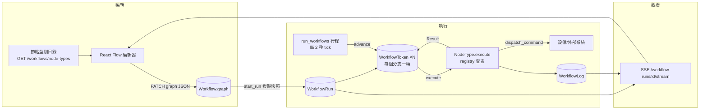

# 工作流程引擎設計手冊

> 給下一個要做「畫布式控制流程」的專案看的。目標是讓人在一天內把同樣的架構搬到另一個 Django + React 專案，並且**不要再踩一次我們踩過的坑**。
>
> 對應程式：後端 `apps/workflows/`（`models.py`、`graph.py`、`engine.py`、`runner.py`、`nodes/base.py`、`nodes/builtin.py`、`api.py`、`schemas.py`、`stream.py`），前端 `frontend/src/pages/WorkflowEditorPage.tsx`、`frontend/src/components/workflow/*`、`frontend/src/lib/workflowTypes.ts`、`workflowValidation.ts`、`runStream.ts`。測試 `tests/test_workflow_engine.py`（69 項）、`tests/test_showcase.py`。範例流程 `apps/core/showcase_workflows.py`。

---

## 0. 一頁總覽



核心思想只有四句：

1. **圖是一份 JSON**，存在一個欄位，編輯器整份存、引擎整份讀。
2. **執行是資料庫裡的 token**，不是執行緒。一個 token = 一個分支停在某個節點。行程重啟後照常繼續。
3. **引擎是 stepper**：被呼叫 → 把所有能動的 token 各推一步（多輪）→ 寫回 → 返回。沒有人在 Python 堆疊上等待。
4. **節點型別是 registry**：引擎不知道任何節點是什麼；前端的調色盤與參數表單從 registry 產生。加節點不用改引擎、不用改前端。

---

## 1. 資料模型（`models.py`）

### 1.1 `Workflow` — 操作者畫的那張圖

| 欄位 | 用途 | 設計理由 |
| --- | --- | --- |
| `organization` | 租戶 | 多租戶隔離，所有查詢都帶 |
| `site`（可空） | 綁定場域 | 綁了場域的流程只能命令該場域設備（`_dispatch` 內檢查）；這是能把流程交給現場人員的前提 |
| `name`、`description` | | 同一租戶內名稱唯一（排除軟刪除） |
| `graph` JSONField | `{"nodes": [...], "edges": [...]}` | 整份存，含畫布座標；存檔時過 `validate_graph` |
| `is_enabled` | 停用可編輯但不可啟動 | 「關兩週」比「刪掉」常見；刪掉會失去圖 |
| `version` | 每次存圖 +1 | run 記錄啟動時的版本；幾個月後讀記錄不會被改過的圖誤導 |
| `created_by` | | |

**為什麼不用 node / edge 資料表？** 沒有任何查詢需要「單一節點」；編輯器是整張存。關聯式存法只會多 join 與失去一次原子存檔。

### 1.2 `WorkflowRun` — 一次執行

| 欄位 | 用途 |
| --- | --- |
| `graph`、`workflow_version` | **啟動當下的快照**。執行中改圖不影響進行中的 run |
| `status` | `pending / running / waiting / paused / succeeded / failed / cancelled` |
| `trigger` | `manual / api / workflow / storage_plan` — 誰啟動的 |
| `parent_run` | 由其他流程啟動時指回去，可追鏈 |
| `context` JSON | run 層級共享變數；節點可讀寫（`Result.context`） |
| `dry_run` | **欄位不是參數**：事後讀記錄仍知道當時有沒有碰硬體 |
| `wake_at`（索引） | 引擎下次該看它的時間；`null` = 馬上 |
| `steps_taken` | 步數（節點轉移次數），防 runaway |
| `step_delay_seconds` | 慢動作，0–30 秒；屬於「這次觀看」不屬於邏輯 |
| `error`、`started_at`、`finished_at` | |

狀態語意（很重要，後面所有邏輯都依賴它）：

- `WAITING` ≠ `RUNNING`：停在計時器上是健康的，不該算「卡住」，也不該看起來在忙。
- `PAUSED` ≠ `WAITING`：暫停的 run 不管時鐘走多久都不動；但它**仍占並行名額**（有 token、隨時可恢復），否則暫停會變成無限堆疊 run 的後門。
- 三組常數：`RUNNABLE_STATUSES`（引擎會撿）、`ACTIVE_STATUSES`（占名額，= runnable + paused）、`TERMINAL_STATUSES`。

### 1.3 `WorkflowToken` — 一個分支的位置

| 欄位 | 用途 |
| --- | --- |
| `run`、`node_id` | 停在哪 |
| `state` JSON | **token 私有的暫存**。IF-End Timer 的「從何時開始成立」、Wait 的到期時間、`_bp`（停止點已觸發）、`_slowmo`（慢動作停車）都在這 |
| `wake_at` | `null` = 可動；未來時間 = 停車到那時 |

分岔 = 多一顆 token；分支結束 = 刪一顆；最後一顆刪掉 = run 完成。**沒有可達終點的圖永遠不會自己結束**——這是刻意的，由操作者停止或步數上限處理，而不是靜默洩漏。

### 1.4 `WorkflowLog` — 逐步記錄

`run / ts / node_id / node_label / level / message / branch / detail`。寫給「在 debug 自己圖」的人看：哪個節點、判斷了什麼、為什麼走那條線。`branch` 記錄離開的把手，前端用它畫走過的路徑。`debug` 等級只在 dry run 保留（正式迴圈每秒三行寫到天荒地老沒人會讀）。

### 1.5 graph JSON 的形狀

```jsonc
{
  "nodes": [
    {
      "id": "if_end-1",            // ^[A-Za-z0-9][A-Za-z0-9_-]{0,63}$，jump 用它當目標
      "type": "if_end",            // registry key
      "label": "需量超過契約",     // 操作者取的名字（note 的標題）
      "description": "…",          // 操作者的備註（note 的內文）
      "enabled": true,             // false = 引擎跳過但路徑仍通
      "breakpoint": false,         // true = 執行前暫停
      "color": "#…",               // 卡片顏色，文字自動對比
      "params": { "device_id": "…", "metric_key": "grid_power_w", "operator": "gt", "threshold": 680000 },
      "position": { "x": 40, "y": 220 },
      "width": 320, "height": 140  // 可縮放節點（note）才有
    }
  ],
  "edges": [
    { "id": "e-…", "source": "if_end-1", "target": "set_data-1", "source_handle": "true" }
  ]
}
```

`source_handle` 空白代表「單一輸出」，引擎把空白視為任意把手相符，所以三個節點的草圖不用填任何東西就能跑。

---

## 2. 節點框架（`nodes/base.py`）

### 2.1 物件一覽

```python
@dataclass(frozen=True) class Param:    # 參數表單的一個欄位
    key, label, kind, required, default, help_text, options, unit, minimum, maximum
    # kind ∈ text | number | boolean | select | device | metric | command | workflow | duration | node

@dataclass(frozen=True) class Handle:   # 一個輸出把手
    key, label, tone   # tone ∈ neutral | ok | warn | critical（畫布上的顏色）

@dataclass class NodeContext:           # 節點「被允許看到的一切」
    run, token, node, organization, site, context, moment, dry_run, log
    .params / .param(key, default)      # "" 與 None 都視為未填，回 default

@dataclass(frozen=True) class Result:   # 節點做了什麼、token 接下來去哪
    branch="out"        # 走哪個把手；該把手有幾條線就分幾支
    message, level="info", detail={}
    wait_until=None     # 停車到某時刻（引擎睡，不自旋）
    goto=None           # 直接跳到某節點（jump 用）
    token_state=None    # 併入 token.state
    context=None        # 併入 run.context
    stop=False          # 結束這個分支

class NodeType(Protocol):
    key, label, description, category, icon, params: list[Param], handles: list[Handle]
    def execute(self, ctx: NodeContext) -> Result
```

registry：`register(node_type)`（重複 key 直接 RuntimeError——那是程式錯誤不是合併）、`get(key)`（查無 → `UnknownNodeType`，錯誤訊息附上所有可用 key）、`catalogue()`（前端調色盤吃的 JSON）。`register_builtins()` 在 `AppConfig.ready()` 呼叫，因為節點 `execute` 內部會 import model。

### 2.2 `Param.kind` 為什麼是封閉集合而不是 JSON Schema

編輯器必須能渲染每一種 kind；一種它畫不出來的型別等於一個沒人能設定的節點。所以 kind 的集合 = 前端 `NodeInspector.ParamField` 的 `switch` 分支，**兩邊同時加**才算新增一種。`device / metric / command / workflow` 四種是「查資料庫的下拉」：`device` 列出設備，`metric` 依所選設備列出指標，`command` 依所選設備類別列出可用命令，`workflow` 列出流程。

### 2.3 安全邊界放在框架，不放在節點

- `dry_run` 的判斷在 `_dispatch()`（所有送命令的節點共用的那一道門）與 `RunWorkflowNode` 裡各一處，**不在每個節點自己判斷**——忘記判斷的節點型別不該有辦法從測試執行送出真命令。
- 動作一律走 `apps.devices.services.dispatch_command()`：能力檢查、方案包絡、稽核軌跡和人手操作完全相同。**工作流程不是特權路徑**。
- 綁定場域的流程命令其他場域設備 → `failed` 分支、記錄 `outside_workflow_site`。

### 2.4 內建節點（`nodes/builtin.py`）

| key | 類別 | 參數 | 把手 | 行為要點 |
| --- | --- | --- | --- | --- |
| `start` | flow | — | out | 一張圖可多個 start，每個各一分支 |
| `end` | flow | — | — | `stop=True` |
| `node`（Waypoint） | flow | — | out | 什麼都不做；當跳轉目標、讓線轉彎 |
| `jump` | flow | `target`（kind=`node`，前端渲染為節點下拉） | — | `goto=target` **並讓出一個 tick**（`wait_until = now + TICK`） |
| `wait` | flow | `seconds` | out | 第一次：把到期時間寫進 `token.state["_wait_until"]` 並停車；到期後清掉並走 out。被提早叫醒不重算時鐘 |
| `if_end` | condition | device/metric/operator/threshold | true / false / **unknown** | 沒讀值或讀值過舊（`MAX_READING_AGE_SECONDS`）走 unknown，**不猜** |
| `if_end_timer` | condition | 上述 + `hold_seconds` | true / false / unknown | 條件要**連續**成立 N 秒；每 tick 重新取樣，中途掉就重計（`token.state["held_since"]`） |
| `condition_wait` | condition | 條件 + `timeout_seconds` | met / timeout | 等到條件成立；沒讀值 = 還沒成立但繼續等；逾時是接住永遠不回來的設備的出口 |
| `if_end_time` | condition | `days`, `start_time`, `end_time`, `wait_for_window` | true / false | 以**場域時區**（場域→組織→UTC）判斷；支援跨午夜；`wait_for_window=True` 時在窗外停車到下一次開窗 |
| `send_action` | action | device, command, params(JSON 字串) | sent / failed | 走 `_dispatch` |
| `set_data` | action | device, command, param_name, value | sent / failed | 單一參數的便捷版 |
| `run_workflow` | flow | workflow_id | started / refused | 啟動子流程**不等待**；受同一並行上限，超過走 refused |
| `note` | decoration | — | — | 便利貼；永不執行；不能被連入 |
| `arrow` | decoration | direction | — | 指示箭頭；沒有把手 |

條件三兄弟共用 `_CONDITION_PARAMS` / `_CONDITION_HANDLES` 與 `_read_condition()`；`_latest_value()` 讀 `LatestSample`，**查無回 `None` 不回 0**（0 會讓 `power < 100` 對一台停止回報的設備成立——安全聯鎖想要的正好相反）。

### 2.5 新增一個節點型別：完整範例

假設要加「發通知」節點：

```python
# apps/workflows/nodes/builtin.py
class NotifyNode:
    key = "notify"
    label = "Notify"
    description = "Send a message to a notification channel."
    category = "action"          # 調色盤分組：flow / condition / action / decoration
    icon = "Bell"                # Lucide 圖示名，前端 ICONS 表找不到就退回預設
    params = [
        Param("channel_id", "Channel", kind="select", required=True,
              options=[{"value": "oncall", "label": "On-call"}]),
        Param("text", "Message", kind="text", required=True),
    ]
    handles = [Handle("sent", "Sent", tone="ok"), Handle("failed", "Failed", tone="critical")]

    def execute(self, ctx: NodeContext) -> Result:
        text = ctx.param("text", "")
        if ctx.dry_run:                      # 有副作用的節點一定要處理 dry_run
            return Result(branch="sent", message=f"Would notify: {text}", detail={"dry_run": True})
        try:
            send(ctx.organization, ctx.param("channel_id"), text)
        except Exception as exc:             # 失敗走 failed 分支，不要 raise——raise 會讓整個 run FAILED
            return Result(branch="failed", message=str(exc)[:300])
        return Result(branch="sent", message="Notified")

# register_builtins() 的 tuple 加進 NotifyNode()
```

然後：

1. 前端**不用改**——調色盤、參數表單、把手顏色全部從 `/workflows/node-types` 來。
2. 想要本地化的名稱與說明：在 `i18n/locales/*.ts` 的 `workflows.nodeTypes.notify` 加 `label / description`（沒有就退回伺服器英文）。
3. 要新的 `Param.kind`（例如 `channel` 下拉）：後端 `Param` 註解加一種，前端 `NodeParamKind` 聯合型別加一種，`NodeInspector.ParamField` 加一個 `case`。
4. 寫測試：`tests/test_workflow_engine.py` 的 `EngineTestCase.run()` helper 可以用 dry run 推進一張小圖並斷言走了哪個把手（見 §9）。

節點撰寫規則（血淚）：

- **永遠回 `Result`，不要 raise**。引擎會把例外記成 error 並讓整個 run `FAILED`；那是給「程式 bug」的出口，不是給「設備不在」的。
- **不要在節點裡 sleep**。要等就回 `wait_until`。
- **需要跨 tick 記住東西就用 `token_state`**，不要用 Python 變數（下一個 tick 可能在另一個行程）。
- 計時一律用 `ctx.moment`，不要 `timezone.now()`——測試會把時鐘往前撥，引擎也靠同一個 moment 判斷 wake。
- `message` 寫給人看（「288810.5 gt 250000 is True」比「ok」有用一百倍）；機器要的放 `detail`。

---

## 3. 圖驗證（`graph.py`）

`validate_graph(graph)` 在**存檔時**跑（PATCH），也在 `start_run` 再跑一次。檢查：

- 形狀：`nodes`/`edges` 是 list；節點數 ≤ 200、邊數 ≤ 400。
- 節點有 id、不重複、`type` 在 registry（錯誤訊息列出可用 key）。
- 邊的兩端存在；**不能連進 note / arrow**（畫布上看起來像流程、引擎當死路——圖與行為不可以不一致）。從 note 連出去的虛線「註解箭頭」允許。
- `jump.target` 必須存在（打錯字要在畫布上就看到，不是凌晨三點觸發時）。
- 至少要有一個起點（`entry_nodes()`）。

`entry_nodes()`：有 `start` 節點就用它們；否則「沒有任何線連進來的節點」都是起點（三個節點的草圖不必知道 Start 是什麼）。note/arrow 永遠不是起點，被 note 的註解箭頭指到也不影響起點判定。

**不檢查**的：是否會終止。`jump` 迴圈是合法的圖（「守住設定值直到條件解除」本來就是迴圈）。

---

## 4. 引擎（`engine.py`）

### 4.1 `advance(run, *, moment, step_budget) -> StepReport`

一次呼叫把 run 盡可能往前推，流程：

```
若 run 終態 / paused → 直接返回
載入 graph、node_map、context；status=RUNNING
lap = set()
while steps < per_call:
    若 per_run 上限 > 0 且 steps_taken >= per_run → FAILED "Step limit reached"
    token = 下一顆「可動（wake_at 空或已過）且本輪未輪到」的 token（按 created_at 排序）
    若沒有：lap 為空 → break（全部都在等）；否則清空 lap、下一輪
    node 不在圖裡 → 記 error、刪 token、continue
    enabled is False → 記 debug「Skipped」，沿所有出邊前進（走哪條本來就無從得知）
    breakpoint 且 token.state["_bp"] != node_id → 寫 _bp、run=PAUSED、返回（執行「前」暫停）
    取得 NodeType（查無 → FAILED）
    result = node_type.execute(ctx)（例外 → FAILED，記錄 repr）
    steps_taken += 1；合併 result.context / token_state；寫 log
    goto      → 目標不存在：記 error 刪 token；目標已有分支：合流（刪自己）；否則改 node_id 並帶上 wait_until
    wait_until→ token.wake_at = wait_until（清 _slowmo）
    stop      → 刪 token
    否則      → _move(token, 該把手的所有目標, wake_at=慢動作延遲)
run.context = context；_settle()
```

`_settle()`：沒 token → `SUCCEEDED`；有 token 可動（預算用完）→ `RUNNING`, `wake_at=now`；全部在等 → `WAITING`, `wake_at = min(token.wake_at)`。

### 4.2 三條防 runaway 規則

| 規則 | 設定 | 為什麼 |
| --- | --- | --- |
| 每次呼叫步數上限 | `MAX_STEPS_PER_CALL=200` | 一個忙碌的 run 不能吃掉整個 tick，餓死其他 run |
| 每次執行步數上限 | `MAX_STEPS_PER_RUN=0`（預設無上限） | 以**步數**計不以時間計：緊迴圈燒步數不燒牆鐘。預設關閉，因為「永遠守住設定值」是合法流程，固定上限殺掉的正是引擎存在要服務的東西 |
| 阻塞即阻塞 | — | 無路可走的 token 結束；最後一顆結束 run 完成；永不結束的圖由操作者停——看得見，不是靜默洩漏 |

### 4.3 公平輪轉：以「輪」為單位

每個 token 每一輪走一步，一輪走完才開下一輪。限制在「輪」而不是「每次呼叫」：後者公平但慢到直線五個節點要五個 tick（每 tick 2 秒 → 10 秒）。

### 4.4 抵達即合流（`_move` / `goto`）

分支移動到「同一 run 已有分支停駐」的節點時**併入**（刪掉自己），不重複。沒有這條規則，`jump` 跳回一個會分岔的節點就每圈重新分岔：2、4、8…（實測 12 圈 472 顆 token，直到步數上限殺掉 run）。一個節點同時只有一個分支，是這張圖的 PLC 讀法；分岔後再匯聚的共用尾段也因此只執行一次。

### 4.5 Jump 讓出 tick

往回跳就是迴圈；全速執行的迴圈是 busy-wait——幾秒燒光預算、灌爆記錄、重複讀一個幾秒才變一次的值。`JumpNode` 回 `goto` + `wait_until = now + TICK_SECONDS`，語意正好是操作者畫的「持續檢查」。引擎把 goto 與 wait_until **一起**處理（先前版本 goto 分支先 return，wait 被默默丟掉）。

### 4.6 慢動作與單步如何不互相打架

- 慢動作（`step_delay_seconds`）在 `_move` 時給 token 一個 `wake_at`，並在 `token.state` 打 `_slowmo=True` 標記。
- 單步（`step_run`）把有 `_slowmo` 的 token 的 `wake_at` 清掉（看穿觀賞延遲），**但不動** Wait 節點自己的計時；然後 `advance(step_budget=1)`，跑完再壓回 `PAUSED`。
- 沒有這個標記，單步會把 30 秒的 Wait 縮短成 0 秒——一個會改變邏輯的除錯器。

### 4.7 停止點（breakpoint）

在節點**執行前**暫停（操作者要檢查的是「它即將依據的狀態」）。`token.state["_bp"] = node_id` 標記已觸發；Resume 後執行一次就清掉，不會重複在同一節點暫停。

---

## 5. Runner（`runner.py`）——生命週期與並行上限

| 函式 | 做什麼 | 注意 |
| --- | --- | --- |
| `start_run(workflow, trigger, started_by, parent_run, dry_run, context, step_delay_seconds, start_paused)` | 驗圖、查上限、建 run（graph 快照）、每個起點放一顆 token、寫第一筆 log | `@transaction.atomic`；停用的流程 → `Conflict(workflow_disabled)`；超過上限 → `ConcurrencyLimit`（**拒絕不排隊**） |
| `stop_run` | `CANCELLED`、刪所有 token、記 warning | 終態不動 |
| `pause_run` / `resume_run` | 改狀態；token、計時、context 全保留 | |
| `step_run` | 見 §4.6 | |
| `run_single_node(workflow, node_id)` | 只跑指定那個節點一次就結束；忽略該節點的 enabled/breakpoint（操作者指名要它） | note 不可跑；仍占 1 名額 |
| `due_runs(moment)` | `RUNNABLE` 且 `wake_at` 空或已過 | paused 不在內 |
| `tick(moment, limit=50)` | 對每個 due run 呼叫 `advance`，一個壞掉不影響其他 | `run_workflows` 每 `TICK_SECONDS` 呼叫一次 |
| `sweep_orphans(older_than)` | 狀態 active 但沒 token 的 run 標 FAILED | 「不應該發生」的保險；否則名額永遠回不來 |

**並行上限的單位是分支（token），不是 run**：上限保護的是每 tick 的引擎工作量，而那跟分支數成正比。啟動時檢查「現有 active token 數 + 這張圖的起點數 ≤ 上限」。檢查**只在這一處**（API、`run_workflow` 節點、儲能規劃全走 `start_run`）。它是**伺服器設定**（`WORKFLOW_MAX_CONCURRENT_RUNS`），不是租戶設定：操作者不能調高，因為它保護的是共用的那台機器。`GET /workflows/capacity` 列出是誰在占名額，因為「我都停了為什麼還是 1/5」必須答得出來（通常是一筆停在計時節點上的舊執行）。

**引擎行程只能有一個**（`run_workflows`）。兩個行程同時 `advance` 同一個 run 會重複執行節點。要水平擴展需要加 row lock（`select_for_update(skip_locked=True)`），目前刻意沒做。

---

## 6. API（`api.py`）與 SSE（`stream.py`）

```
GET    /workflows/node-types            registry catalogue（前端調色盤 + 表單）
GET    /workflows/capacity              上限、占用分支數、誰在占
GET    /workflows?site_id=              列表（含 active_run_count）
POST   /workflows                       建立（operator）；驗圖
GET    /workflows/{id}
PATCH  /workflows/{id}                  存圖 → version+1（operator）
DELETE /workflows/{id}                  軟刪除（admin）；進行中的 run 先被 stop_run（被刪的流程不能還在指揮設備）
POST   /workflows/{id}/runs             啟動 {dry_run, context, step_delay_seconds, start_paused} → 202
POST   /workflows/{id}/run-node         單 Node 執行 {node_id, dry_run}
GET    /workflow-runs?workflow_id=&status=
GET    /workflow-runs/{id}              含 active_nodes（畫布亮燈用）
GET    /workflow-runs/{id}/logs
POST   /workflow-runs/{id}/stop|pause|resume|step
GET    /api/workflow-runs/{id}/stream?token=   SSE（在 config/urls.py，不經 ninja）
```

SSE 事件：`run`（整份 run payload，狀態或 active_nodes 變了才送）、`logs`（新增的 log 陣列）、`done`（終態）、`gone`（run 被刪）、`: ping` 心跳。每條串流 55 秒自行關閉、client 重連（重連時重新驗證短效 token；也綁住 dev server 執行緒被占用的時間）。**誠實說明**：伺服器端仍每 1 秒查資料庫（引擎在另一個行程、SQLite 沒有 notify）；省的是 HTTP 層（一條連線、只送變化），不是查詢。要真推播 = Redis pub/sub + ASGI，是文件化的正式環境升級路徑。

權限：讀 = 任何成員；啟動/停止/存圖 = operator；刪除 = admin。`EventSource` 不能帶 header，所以 token 走 query string。

---

## 7. 前端（React Flow）

### 7.1 檔案分工

| 檔案 | 職責 |
| --- | --- |
| `lib/workflowTypes.ts` | TS 型別：`NodeTypeDef / NodeParam / NodeHandle / GraphNode / GraphEdge / WorkflowGraph / WorkflowRun / WorkflowRunLog / WorkflowCapacity`。**目錄不在這裡宣告**，是抓來的 |
| `lib/workflowValidation.ts` | 前端參數防呆：必填、數值範圍、HH:MM。`nodeProblems(node, def)` / `graphProblems(graph, defs)`，錯誤標在節點與檢視面板 |
| `lib/runStream.ts` | `useRunStream(runId, enabled)`：SSE → 直接寫進 TanStack Query cache；斷線時原本的輪詢自動接手 |
| `pages/WorkflowsPage.tsx` | 列表、新增、刪除、容量顯示 |
| `pages/WorkflowEditorPage.tsx` | 編輯器本體（~1,000 行）：React Flow 狀態、payload 表、undo、剪貼簿、鍵盤、執行控制列、自動排列 |
| `components/workflow/WorkflowNode.tsx` | 三種 React Flow 節點元件：`WorkflowNode`（一般卡片，依 handles 畫輸出把手、依 tone 上色、執行中 loading 樣式、失敗紅框）、`NoteNode`（可縮放、自由箭頭）、`ArrowNode` |
| `components/workflow/FlowEdge.tsx` | `AnimatedFlowEdge`：執行中走過的邊用 SVG `<animateMotion>` 讓小點沿線移動（只動「有東西經過」的線，不是全部閃爍） |
| `components/workflow/NodeInspector.tsx` | 右側面板：名稱/說明/顏色/停用/停止點 + **由 `NodeTypeDef.params` 產生的表單**（`ParamField` 依 kind switch） |
| `components/workflow/RunPanel.tsx` | 執行狀態、記錄列表 |
| `components/workflow/ZoomSlider.tsx` | 縮放滑桿 |

### 7.2 React Flow 與 graph JSON 的映射

- `toFlowNodes(graph, definitions)`：graph node → React Flow `Node`，`type` 映射為 `workflow | note | arrow`（`NODE_TYPES`），`data` 帶原 payload 與 definition。
- `toFlowEdges(graph)`：`source_handle` → `sourceHandle`；來源是 note 的邊畫成虛線無動畫（註解），其餘 `type: 'flow'` 有動畫與箭頭。
- `graphFrom(flowNodes, flowEdges)`：反向；座標取整數；note 的 width/height 一起存。
- **payload 表**（`payloads` ref，id → GraphNode）是「編輯器自己那份真相」；React Flow 的 `data` 只是投影。所有修改先改 payload 再 `setNodes`。

### 7.3 幾個不直覺但必要的做法

- **哪些變更算「編輯」**（`isEdit`）：React Flow 在 mount 時會對每個節點送一次 `dimensions` change；把它當編輯會讓剛打開的頁面就警告「有未儲存變更」。只有 `resizing: true`（操作者真的在拉）才算。
- **圖只在 workflow version 變時重載**（`loadedFor` ref）：每次 refetch 都重載會在操作者拖曳時把節點搬回去——跟「正在打字的欄位被輪詢重設」同一類 bug。
- **文件層級鍵盤監聽用 ref 讀最新狀態**（`nodesRef / edgesRef`）：否則 closure 捕到舊 state，Ctrl+Z 會 undo 到錯的地方。
- **Undo 歷史放 ref 不放 state**（50 步上限）：它不是渲染狀態，放 state 每次快照都多一次 render。
- **刪除由編輯器自己做**（React Flow `deleteKeyCode={null}`）：payload 表與 undo 歷史要同步更新；讓 React Flow 也刪一次會留下 undo 後重新出現的幽靈節點。
- **任何表單欄位有焦點時快捷鍵一律不動作**（`isTypingTarget`）。
- **複製貼上**：只帶選取範圍內部的邊；貼上的 `jump.target` 若指向範圍內的節點就改指複本。
- **插入/貼上節點時的型別映射要包含裝飾型別**（`DECORATION_TYPES`）：漏掉 `arrow` 的結果是箭頭被當成一般卡片畫出來。
- **執行前確認**：「執行」（非乾跑）先彈 `ConfirmDialog`，列出會送命令的節點數（`ACTION_TYPES`）、有未儲存變更就先存再跑——操作者看著的那一版才是執行的那一版。「測試」不需確認。
- **跳轉目標是節點下拉**（`Param.kind="node"`）：前端從同一張圖的可執行節點產生選項；`workflowValidation` 另外擋「目標不存在／是註解／指向自己」。檢視面板列出**未連線的輸出把手**（不擋存檔，但說出來——這是流程默默不動的第一名原因）。
- **自動排列**：按「距起點最長路徑」分層（鬆弛法、以 |V| 與層數上限防 jump 迴圈無限轉）、每層按父節點平均欄位排序；**note 不動**——整理流程不該打亂別人的註解。
- **執行中的 SSE 與輪詢互補**：`useRunStream` 連上時 run/logs 查詢的 `refetchInterval` 關掉；斷線時恢復。新開的 tab 若沒指定 run 就跟最新那筆。

### 7.4 i18n

節點顯示名與說明用 `workflows.nodeTypes.<key>.label/description`，沒有翻譯退回 `NodeTypeDef` 的英文。參數 label 目前用伺服器字串（想本地化就在同一命名空間加 `params.<key>`）。

---

## 8. 設定值（`config/settings/base.py` → `WORKFLOWS`）

| 環境變數 | 預設 | 意義 |
| --- | --- | --- |
| `WORKFLOW_MAX_CONCURRENT_RUNS` | 5（展示環境 12） | 每租戶同時分支數上限 |
| `WORKFLOW_MAX_STEPS_PER_RUN` | 0 | 每次執行步數上限；0 = 無上限 |
| `WORKFLOW_MAX_STEPS_PER_CALL` | 200 | 每次 `advance` 步數上限 |
| `WORKFLOW_MAX_READING_AGE_S` | 300 | 讀值多舊就拒絕判斷 |
| `WORKFLOW_TICK_SECONDS` | 2 | 引擎週期 = 所有計時器的解析度 |

---

## 9. 測試策略

`tests/test_workflow_engine.py` 的 `EngineTestCase`：

```python
def run(self, workflow, *, passes=20, step_seconds=5, dry_run=True, moment=None):
    run = start_run(workflow, dry_run=dry_run)
    clock = moment or timezone.now()
    for _ in range(passes):
        advance(run, moment=clock)          # 直接呼叫引擎，不起行程
        run.refresh_from_db()
        if not run.is_active: break
        clock += dt.timedelta(seconds=step_seconds)   # 時鐘一定要往前走！
    return run
```

**時鐘一定要往前走**：jump 讓出一個 tick、計時器每 tick 重取樣；同一瞬間重複呼叫 `advance` 只會「什麼都不到期」地空轉——那是引擎正確的行為，不是測試需要更多 pass。

dry run 為預設：測試斷言的是「走了哪個把手」，而逐步 debug 記錄只有 dry run 保留；也保證測試碰不到設備。

涵蓋的面向（69 項）：基本流程、條件三分支、timer 重計時、jump 迴圈與步數上限、並行上限以分支計、Wait 不被提早叫醒縮短、condition_wait 逾時、if_end_time 跨午夜與時區、note/arrow 不執行不當起點、pause/resume/step、breakpoint 只觸發一次、step delay 與單步互動、單 Node 執行、迴圈的拜訪順序、分支合流。另外 `tests/test_showcase.py` 以引擎乾跑六個範例流程、斷言無 error。

e2e：`interactions.spec.ts`（開編輯器、畫布、測試執行、拖曳/Delete/複製貼上/Undo）、`deep.spec.ts`（建立→連線→存檔→刪除）、`buttons.spec.ts`（編輯器每個按鍵）。

---

## 10. 踩過的坑（照時間順序，含症狀→原因→修法）

| # | 症狀 | 原因 | 修法 |
| --- | --- | --- | --- |
| 1 | Jump 迴圈每圈分支數翻倍（2→4→8…472），最後撞步數上限 FAILED | 跳回一個會分岔的節點，每次抵達都重新分岔 | **抵達即合流**：`_move` 與 `goto` 都先查目標是否已有本 run 的 token，有就併入（刪自己） |
| 2 | 「守住設定值」的合法迴圈跑幾分鐘就被步數上限殺掉 | 每執行步數上限 10,000 | 預設改為 0（無上限）；每呼叫上限仍綁住每 tick 工作量 |
| 3 | 迴圈幾秒內灌爆記錄、燒光預算 | jump 全速執行 = busy-wait | jump 回 `wait_until = now + tick`；引擎把 goto 與 wait 一起處理（早先 goto 分支先 return 把 wait 丟了） |
| 4 | 執行中顯示「執行緒 3/5」但只有一個 run | 名額以 run 計、UI 以分支計，兩邊不一致 | 統一以 token 計；`/capacity` 列出占用者 |
| 5 | 暫停所有 run 後還能無限啟動新 run | paused 不算 active | `ACTIVE_STATUSES` 含 paused |
| 6 | 單步除錯把 30 秒 Wait 縮成 0 秒 | 單步清掉所有 `wake_at` | 慢動作停車打 `_slowmo` 標記，單步只清有標記的 |
| 7 | 停止點每次 Resume 又停在同一節點 | 沒記錄「已觸發」 | `token.state["_bp"]` |
| 8 | 安全聯鎖在設備斷線時反而觸發 | 沒讀值當 0，`power < 100` 成立 | `_latest_value` 回 `None`、條件節點走 `unknown` 分支；過舊讀值同樣處理 |
| 9 | 穩定不變的 SOC 被判 stale，條件節點拒絕判斷 | 記錄策略的死區把值未變的樣本整筆丟掉，連 `LatestSample.ts` 都不更新 | 最新值表永遠更新；死區只決定歷史密度（`services/worker/processors.py`） |
| 10 | IF-End Timer 被「中途掉一下又回來」的訊號觸發 | 睡到時間到才看一眼 | 每 tick 重取樣，掉了就重計（PLC on-delay 語意） |
| 11 | 09:00–18:00 的時間窗一年有兩次變成夜班 | 用 UTC 判斷 | 場域時區 → 組織時區 → UTC |
| 12 | 測試裡 `advance` 怎麼呼叫都不動 | 同一 `moment` 重複呼叫，沒有任何 wake 到期 | 測試時鐘每次往前撥 |
| 13 | 箭頭節點被畫成一般卡片 | 插入/貼上的型別映射漏了 `arrow` | `DECORATION_TYPES = {note, arrow}` 在所有建立節點的路徑共用 |
| 14 | 剛打開編輯器就警告「有未儲存變更」 | React Flow mount 時的 `dimensions` change 被當編輯 | `isEdit()` 只認 `resizing: true` |
| 15 | 拖曳節點時被搬回原位 | 每次 refetch 重載圖 | 只在 `version` 變時重載 |
| 16 | Ctrl+Z 復原到錯的位置 | document 監聽器 closure 捕到舊 state | `nodesRef / edgesRef` |
| 17 | Undo 後出現幽靈節點 | React Flow 與編輯器各刪一次 | `deleteKeyCode={null}`，刪除只由編輯器做 |
| 18 | 名稱欄按 Delete 把節點刪了 | 快捷鍵沒判斷焦點 | `isTypingTarget()` |
| 19 | 編輯器觀看執行很卡、dev server 負載高 | 每秒輪詢 run + logs | SSE；輪詢降級為 fallback |
| 20 | Vite dev server 隨機整個死掉 | 瀏覽器關分頁時 SSE 經 proxy 的 `ECONNRESET` 未處理 | `vite.config.ts` proxy `error` handler；排除測試輸出目錄的檔案監看 |
| 21 | 六個範例流程只啟動得了四個 | 上限 5 分支，其中一張圖占 2 | 展示環境調到 12；**範例要先算過分支數** |
| 22 | 迴圈流程每 2 秒重送同一個設定點，指令列表洗版 | 迴圈沒有節奏控制 | 迴圈裡放 `wait` 節點（需量 15 分鐘計費，30 秒一輪已足夠） |
| 23 | 流程與調度引擎互相覆寫同一顆電池的設定點 | 兩個控制者 | 儲能規劃有 `workflow` 策略：把場域控制權交給流程，引擎不再算設定點；展示時二擇一 |
| 24 | 註解卡與節點重疊 | 手排座標 | 範例用 280×200 網格，註解放右欄（x ≥ 640） |
| 25 | `if_end_time` 在窗外時分支「消失」 | `wait_for_window` 預設 True，token 停車到下次開窗（正確但不直觀） | 註解寫清楚；要「窗外走 False」就設 `wait_for_window: false` |
| 26 | 流程不能結束、名額永遠占用 | 沒有可達終點的圖 | 設計如此；`sweep_orphans` 只處理「沒 token 卻 active」的異常；正常的無限迴圈靠操作者停止，UI 要把「誰在占名額」講清楚 |
| 27 | 同一行程內第二次 `bootstrap`（seed 前先 bootstrap）KeyError | 內建表被 `pop` 改壞 | 迭代時複本 |
| 28 | `tsc --noEmit -p .` 在 project-references 設定下**什麼都不檢查**（`files: []`），綠燈是假的 | 根 tsconfig 只有 references | 一律用 `npm run typecheck`（`tsc -b --noEmit`）或 `-p tsconfig.app.json` |

---

## 11. 搬到另一個專案：步驟清單

引擎本身對「設備」與「讀值」的依賴只有三個接縫，換掉它們就能用在任何領域（IoT、審批流程、資料管線…）：

| 接縫 | 在哪 | 換成什麼 |
| --- | --- | --- |
| 讀值來源 | `nodes/builtin.py::_latest_value()` | 你的「最新狀態」查詢（任何回 `(value, ts)` 或 `None` 的函式） |
| 動作出口 | `nodes/builtin.py::_dispatch()` → `dispatch_command()` | 你的副作用 API；保留 dry_run、site/範圍檢查、失敗走 `failed` 分支 |
| 身分與範圍 | `NodeContext.organization / site`、`AuthContext` | 你的租戶/範圍模型；沒有多租戶就傳 `None` |

步驟：

1. **複製** `apps/workflows/`（含 migrations 重建）、`config/settings` 的 `WORKFLOWS` 區塊、`run_workflows` 命令、`config/urls.py` 的 SSE 路由。
2. **改三個接縫**（上表）。條件節點的 `Param(kind="device"/"metric")` 若你沒有設備概念，改成 `select` 或新 kind。
3. **前端複製** `lib/workflowTypes.ts`、`workflowValidation.ts`、`runStream.ts`、`components/workflow/*`、`pages/WorkflowEditorPage.tsx`、`pages/WorkflowsPage.tsx`、`queries.ts` 裡 `useWorkflow*` 那組 hook、i18n `workflows.*` 命名空間。`NodeInspector.ParamField` 的 `device / metric / command / workflow` 四個 case 換成你的資料來源。
4. **保留**：token 模型、合流規則、jump 讓 tick、per-call 上限、paused 占名額、dry_run 在框架層、note/arrow 不可連入、`isEdit / loadedFor / refs / deleteKeyCode` 那幾個前端規則。這些每一條都對應上面一個坑。
5. **一個引擎行程**。要多個就加 `select_for_update(skip_locked=True)` 在 `due_runs`。
6. **測試先搬** `test_workflow_engine.py`，它不依賴設備（dry run + LatestSample 可換成你的讀值表）。跑綠再改節點。
7. **範例流程**：用 `apps/core/showcase_workflows.py` 的 `_node / _edge / _note` helper 程式化產生，經 `validate_graph` 後寫入；範例要涵蓋每種節點、每個把手都接線（`unknown / failed / timeout / refused` 不接會變成靜默死路）。

最小可行版本（如果只要核心）：`models.py` + `graph.py` + `engine.py` + `runner.py` + `nodes/base.py` + 四個節點（start / end / if / action）+ `run_workflows`。前端可以先只做「看記錄」，畫布之後再補——API 與 graph JSON 不會因此改變。

---

## 12. 名詞對照

| 中文（UI） | 程式 | 說明 |
| --- | --- | --- |
| 流程 | `Workflow` | 圖的定義 |
| 執行 | `WorkflowRun` | 一次執行 |
| 分支 / 執行緒 | `WorkflowToken` | 並行的單位，也是並行上限的單位 |
| 記錄 | `WorkflowLog` | |
| 把手 | `Handle` | 節點的輸出點 |
| 條件判斷 / 條件持續判斷 / 條件等待 / 時間區間判斷 | `if_end` / `if_end_timer` / `condition_wait` / `if_end_time` | |
| 傳送命令 / 寫入資料 | `send_action` / `set_data` | |
| 跳轉 / 等待 / 一般節點 / 開始 / 結束 / 執行工作流程 | `jump` / `wait` / `node` / `start` / `end` / `run_workflow` | |
| 註解 / 箭頭 | `note` / `arrow` | 裝飾，不執行 |
| 測試（乾跑） | `dry_run=True` | 評估一切、不送命令 |
| 單 Node 執行 | `run_single_node` | |
| 停止點 | `breakpoint` | 執行前暫停 |
| 節點間延遲 | `step_delay_seconds` | 慢動作 |
